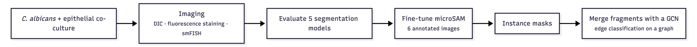
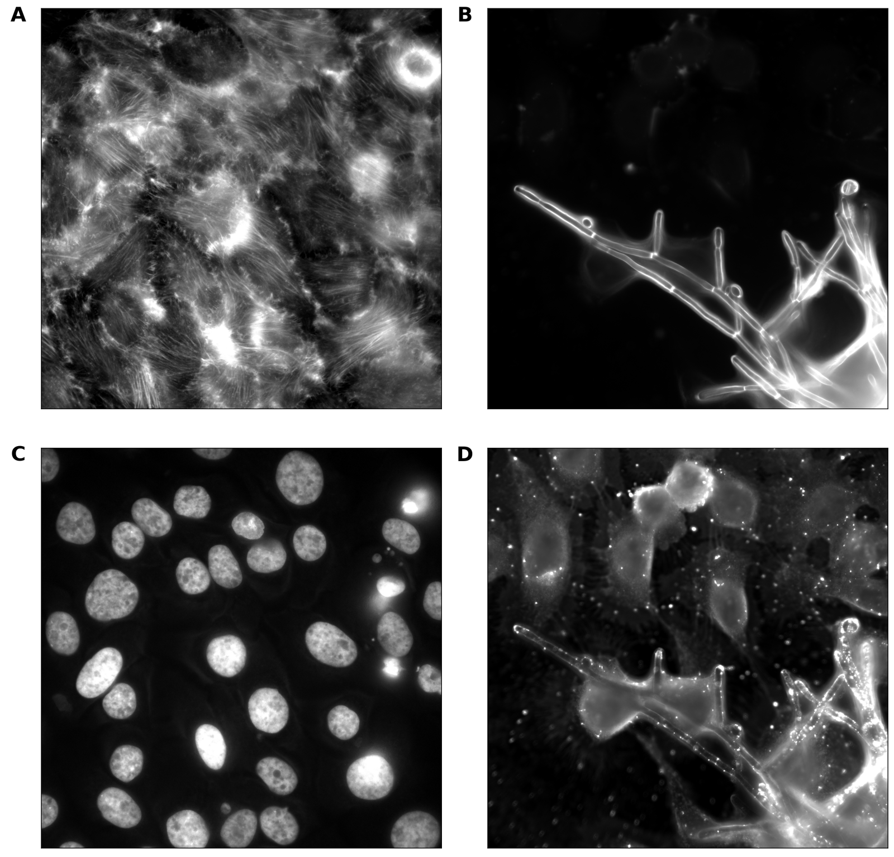
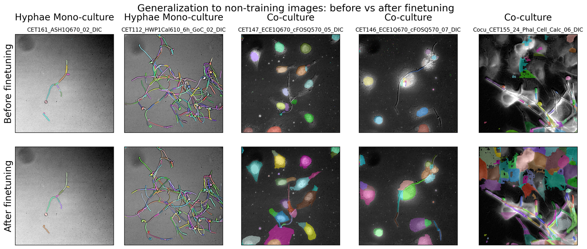
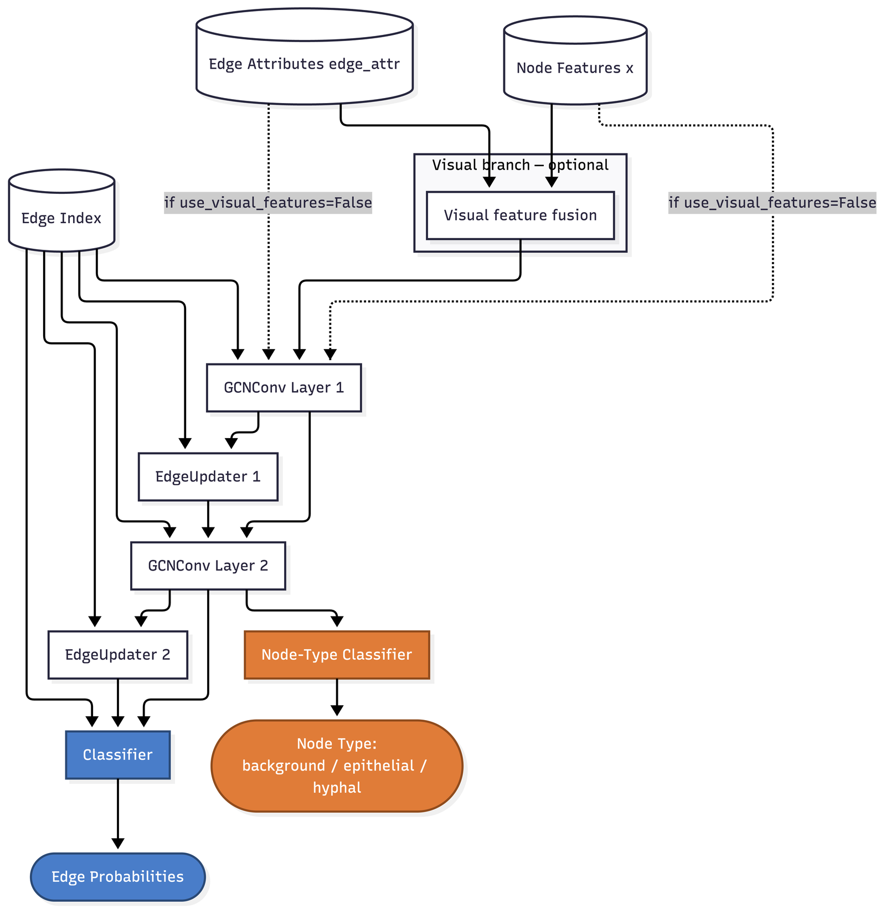
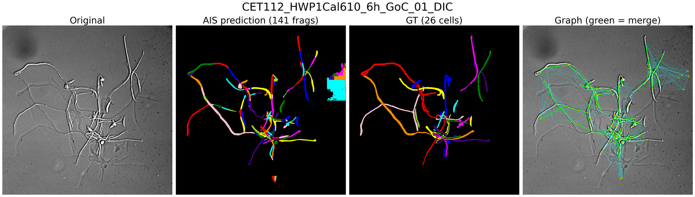
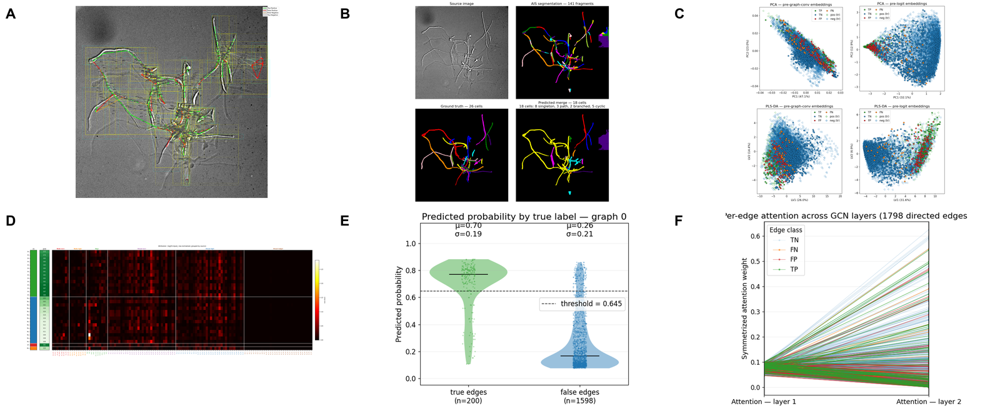
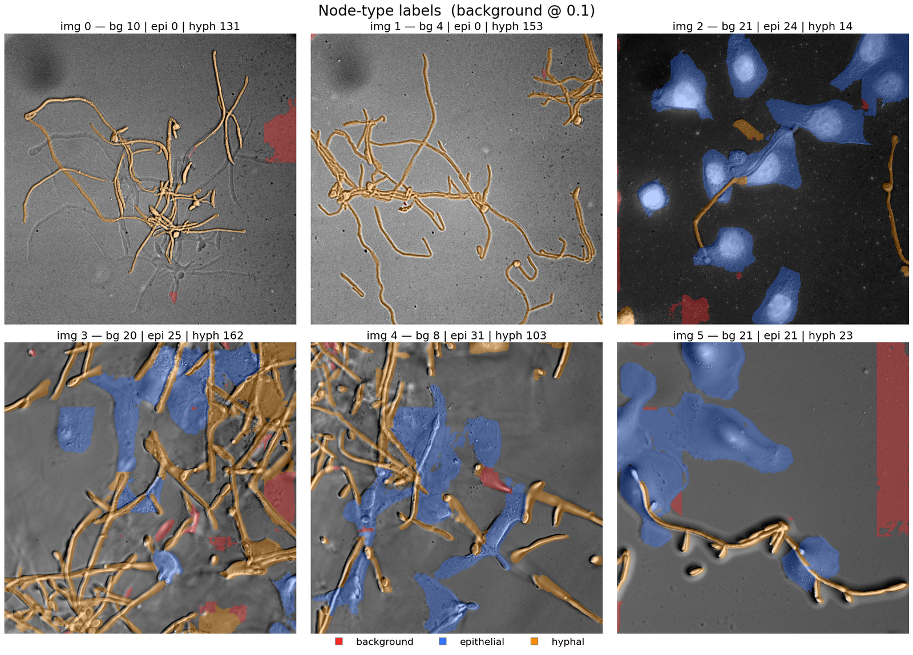
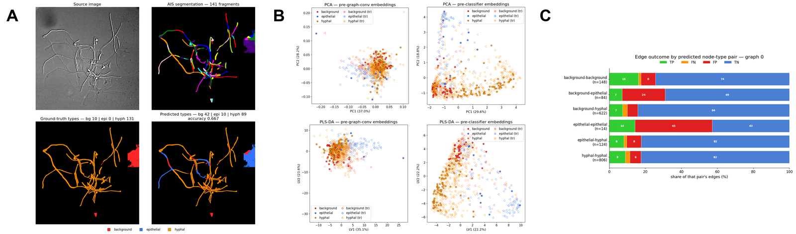

# *Candida albicans* Invasion Imaging & Analysis

Code for my Master's thesis studying *C. albicans* invasion of epithelial cell layers.
The pipeline segments cells and hyphae from co-culture microscopy images, fine-tunes a
foundation segmentation model on manually annotated data, and uses graph neural
networks to merge oversegmented cell fragments and classify node types (background /
epithelial / hyphal) directly on the resulting instance graphs.

## Installation

The code used in this project is bundled as a local Python library. To use them, `git clone` the repository. Then in the cloned folder, run:

```bash
pip install .
```

## Usage

This package provides command-line tools for preparing TIFF data:

```bash
process-tiffs --help       # Batch TIFF processing
tiff-to-omezarr --help     # Convert TIFF stacks to OME-Zarr
```

The bulk of the analysis (segmentation evaluation, finetuning, GNN training and
interpretation) lives in the numbered notebooks under `notebooks/`, run in order.

## Repository structure

```text
.
├── src/image_processing_tools/     # Installable Python package
│   ├── image_class/                 # microSAM pipeline wrapper (ImageContainer, MicroSAMPipeline)
│   ├── scene_graph_network/          # GNN models: training, interpretation, node/edge embeddings
│   ├── dapi_tracing/                 # Nuclei detection + hyphal network tracing (deprecated/ holds the earlier approach)
│   ├── rf_nuclei/                    # Random-forest nuclei classifier
│   ├── intensity_profiling/          # Kymograph / intensity-profile tools
│   └── util/                         # CLI entry points (process-tiffs, tiff-to-omezarr)
├── notebooks/                       # Analysis notebooks, numbered by pipeline stage
│   ├── 1. Qualitative Evaluation/    # Cellpose / Omnipose / SAM / microSAM comparisons
│   ├── 2. Data Processing/           # Phalloidin processing, wavelet transform, nuclei fitting
│   ├── 3. GNN/                       # microSAM finetuning + evaluation, cell-merge and node-type GNNs
│   └── 4. Intensity Profile/         # Kymograph skeletonization
├── thesis_figures/                  # Figure-generation scripts (rendered output is gitignored, regenerable)
├── tests/                           # Test suite
└── master_thesis.tex                # The thesis document itself (not tracked in this repo)
```

## Pipeline overview



1. **Imaging** — DIC, fluorescence staining, and smFISH microscopy of *C. albicans* +
   epithelial co-cultures.
2. **Evaluate 5 segmentation models** — qualitative comparison of Cellpose, Omnipose,
   SAM, Cellpose-SAM, and microSAM on the raw images.
3. **Fine-tune microSAM** — adapt the best-performing model to this data using a small
   set of manually annotated images.
4. **Instance masks** — apply the fine-tuned model to produce per-cell/hyphal instance
   segmentations.
5. **Merge fragments with a GNN** — build a graph over the instance masks and learn
   edge classification (merge / don't-merge) and node-type classification on it.

## Results at a glance

**Raw data.** Fluorescence stainings used for cell/hyphal wall staining, nuclei
labeling, and combined imaging. (A) Phalloidin. (B) Calcofluor white. (C) DAPI. (D) CellBrite.



**microSAM finetuning generalizes to unseen images.** Instance masks before (top) and
after (bottom) fine-tuning, on images held out of the fine-tuning set.



**Merging oversegmented fragments with a GNN.** The base segmentation model
oversegments hyphae and cells into fragments (AIS prediction). A GNN was developed and trained to
merge fragments back into the ground-truth objects. A shared graph convolutional backbone (GCNConv + EdgeUpdater
layers) feeds two heads: edge classification (merge / don't-merge) and node-type
classification (background / epithelial / hyphal).



**Edge-type prediction.** Training targets were generated from the over-segmented masks and the ground truth labels. Here shows one of the training graphs:



**Edge-prediction results (leave-one-out cross-validation).** On a held-out image, the
model predicts which fragments to merge (leftmost panel), reaching a mean edge AUC of
0.912 across the six folds. The remaining panels interpret the prediction: PCA/PLS-DA
projections of the edge embeddings, a feature-attribution heatmap, the predicted
probability split between true and false edges, and the per-edge attention weights
across the two GCN layers.



**Node-type classification.** The same graph structure is also labeled with a
ground-truth node type per fragment (background, epithelial, or hyphal), used as the
training target for the second classification head.



**Node-type prediction results.** The same held-out image's predicted node types
against ground truth, PCA/PLS-DA projections of the node embeddings, and the edge
outcome (true/false positive/negative) grouped by predicted node-type pair. The
node-type head was intended to regularize the edge predictions but showed little
correlation with them.



## Conclusion and Future Work

Cross-validation showed the model memorizes any single graph almost perfectly but
generalizes poorly across folds, and the interpretation figures trace this to the
diversity of imaging modalities across the six training images rather than a lack of
model capacity. Future work:

- Generate synthetic over-segmentation data by cutting ground-truth masks into new
  fragmentations, multiplying training graphs without new microscopy.
- Augment the source images by re-running microSAM on rotated, flipped, and rescaled
  versions to sample its real fragmentation errors.
- Collect more data, both matched-condition images to reduce confounds and diverse
  images to broaden generalization.
- Move node-type classification into the microSAM decoder itself to avoid information
  loss from RoIAlign feature sampling.
- Close the loop with a human-in-the-loop pipeline, where expert corrections feed back
  into fine-tuning both microSAM and the GCN.
- Extend node types to include invaded epithelial cells and model hypha-epithelial
  contact as a dynamic invasion network.
