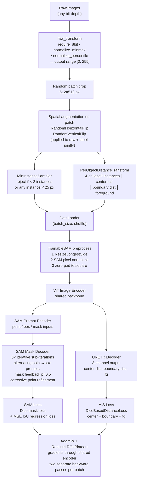

# micro-SAM Fine-tuning Pipeline

A complete technical reference for how `micro_sam` fine-tunes a SAM image encoder and an Automatic Instance Segmentation (AIS) UNETR decoder jointly on custom microscopy data.

> **What this project fine-tunes.** The Candida pipeline fine-tunes the **`vit_b_lm`** model — the light-microscopy specialist — updating **both its ViT-B image encoder and its AIS (UNETR) decoder** on the labeled Candida DIC data. The interactive SAM prompt encoder / mask decoder are not the target here: the production path uses `train_instance_segmentation` (encoder + AIS decoder only, §7.3), and the exported artifact is a drop-in `vit_b_lm` / `vit_b_lm_decoder` pair (§7.7). Wherever this doc says "the encoder" and "the decoder", read *the `vit_b_lm` ViT-B encoder* and *the `vit_b_lm` AIS decoder*.

> **Note on code citations.** Line numbers into `micro_sam` and `torch_em` (e.g. `training.py:693`) are pinned to the versions currently vendored under `7. Data/microsam_finetune/`. They are accurate against those checkouts but will drift silently if either package is upgraded — treat the surrounding symbol name (function / class) as the durable anchor.

---

## 1. Model Architecture

### 1.1 SAM Backbone Components

| Component | Role |
|---|---|
| **Image Encoder** (ViT: `vit_t/b/l/h`) | Extracts dense image embeddings from the preprocessed input |
| **Prompt Encoder** | Encodes point, box, and mask prompts into sparse/dense embeddings |
| **Mask Decoder** | Attends image embeddings with prompt embeddings; outputs masks + IoU scores |

### 1.2 AIS UNETR Decoder

When `with_segmentation_decoder=True` (the default), a **UNETR** convolutional decoder is attached on top of the same image encoder:

```
UNETR(
    backbone    = "sam",
    encoder     = sam.image_encoder,  # shared with SAM
    out_channels= 3,                  # center distance, boundary distance, foreground
    use_sam_stats      = True,
    final_activation   = "Sigmoid",
    use_skip_connection= False,
    resize_input       = True,
)
```

The encoder is **shared** — both the interactive SAM decoder and the UNETR decoder receive embeddings from the same ViT backbone.

### 1.3 Trainable Parameter Sets

| Training mode | What is updated |
|---|---|
| `train_sam` (interactive only) | Encoder + Prompt Encoder + Mask Decoder |
| `train_sam` (with AIS decoder) | All of the above + UNETR decoder weights (encoder weights excluded from UNETR's own parameter list to avoid double-counting) |
| `train_instance_segmentation` | Encoder + UNETR decoder only (prompt encoder and mask decoder are not trained) |

Selective freezing is possible via the `freeze` argument (`"image_encoder"`, `"prompt_encoder"`, `"mask_decoder"`).

---

## 2. Data Loading and Patch Sampling

### 2.1 Dataset Construction (`default_sam_dataset`)

- Accepts HDF5, Zarr, image folders, or in-memory numpy/torch arrays.
- Uses `torch_em.default_segmentation_dataset` under the hood.
- **Patch shape**: 512 × 512 pixels (default). A singleton z-dimension is automatically prepended for volumetric inputs.
- **ndim forced to 2**: even for 3D volumes the dataset samples 2D slices.
- **Minimum samples per epoch**: `max(len(loader), 100)` for training, `max(len(loader), 5)` for validation.
- **Validation split**: if no explicit val set is provided, 10 % of the training data is held out (minimum 1 image).

### 2.2 Batch Sampler

```python
MinInstanceSampler(min_num_instances=2, min_size=25)
```

- Rejects any sampled patch that does not contain **at least 2 distinct object instances** each larger than 25 pixels.
- This prevents training on empty or trivial crops.
- **Not a default in AIS-only mode**: when `train_instance_segmentation_only=True` and no sampler is passed, `default_sam_dataset` does **not** auto-apply this sampler (`training.py:693`: `if sampler is None and not train_instance_segmentation_only`). It is *not* disabled, though — a sampler you pass explicitly is still used in full (the multi-GPU and overfit scripts pass `MinInstanceSampler(2, min_size=25)` and it runs normally).

---

## 3. Data Transforms

### 3.1 Raw Image Transforms

Applied to the raw image **before** it enters the model:

| Transform | Trigger | What it does |
|---|---|---|
| `require_8bit` (default) | Always | If `max(x) < 1`, multiplies by 255; ensures data is in `[0, 255]` |
| `normalize_minmax` | `--preprocess normalize_minmax` | Min-max normalizes to `[0, 1]`, then scales to 255 |
| `normalize_percentile` | `--preprocess normalize_percentile` | 1st–99th percentile normalization → clipped to `[0, 1]` → scaled to 255 |

### 3.2 Model-internal Preprocessing (`TrainableSAM.preprocess`)

Happens inside the forward pass, on the GPU, **after** the raw transform:

1. **Resize**: `ResizeLongestSide` — the longer spatial dimension is resized to `img_size` (e.g. 1024 for `vit_h`), preserving aspect ratio.
2. **Normalize**: subtract `pixel_mean`, divide by `pixel_std` (SAM's own ImageNet-style statistics).
3. **Pad**: zero-pad height and width to produce a square `[img_size × img_size]` tensor.

> **Warning**: The trainer checks **once, at the start of training** (`_check_loader`, `training.py:279-280`), that input data is **not** already normalized to `[0, 1]`. If it is, a warning is raised because SAM's internal normalization step assumes `[0, 255]` input.

### 3.3 Label Transforms

#### With AIS decoder (`with_segmentation_decoder=True`)

```python
PerObjectDistanceTransform(
    distances          = True,   # distance to object center
    boundary_distances = True,   # distance to object boundary
    directed_distances = False,
    foreground         = True,   # binary foreground mask
    instances          = True,   # raw instance IDs (channel 0)
    min_size           = 25,     # objects smaller than this are dropped
)
```

This produces a **4-channel label tensor** per sample:

| Channel | Content |
|---|---|
| 0 | Instance ID map (integer labels) — used for interactive SAM training |
| 1 | Per-object distance to instance center (normalized) |
| 2 | Per-object distance to instance boundary (normalized) |
| 3 | Binary foreground probability mask |

Channels 1–3 are the regression targets for the UNETR decoder.

When using `train_instance_segmentation` (encoder + AIS decoder only, no interactive SAM), pass `train_instance_segmentation_only=True` to the loader. This sets `instances=False` in the transform, dropping channel 0 and producing a **3-channel tensor** `[center_distances, boundary_distances, foreground]` — no instance ID channel is needed since the prompt encoder and mask decoder are not trained.

#### Connected component re-labeling (`apply_label=True`)

Before computing any distance maps, `PerObjectDistanceTransform` always runs:

```python
labels = skimage.measure.label(labels).astype("uint32")
```

`skimage.measure.label` performs **connected component labeling** — every spatially disconnected region is assigned a unique integer ID regardless of the original label value. This has an important consequence: if you label two physically separated fragments of the same cell with the same integer (e.g. a cell divided by a hyphal cell), the transform will automatically split them into two independent objects and compute separate distance maps for each. You do **not** need to manually assign distinct IDs to disconnected fragments — the transform handles it.

#### Without AIS decoder

```python
MinSizeLabelTransform(min_size=25)
```

Filters out objects smaller than 25 pixels; outputs a single-channel instance label map.

---

## 4. Prompt Generation and Augmentation

### 4.1 Prompt Type Selection (alternating)

During **training**, the prompt type alternates every iteration:

| Iteration parity | Prompt | `multimask_output` |
|---|---|---|
| Even | 1 positive point per object | `True` (3 mask candidates) |
| Odd | 1 bounding box per object (distorted) | `False` (1 mask) |

During **validation**, prompts cycle across 4 modes to cover a wider range: single point → single box → random multi-point → box + random multi-point.

### 4.2 Bounding Box Distortion (Augmentation)

When box prompts are used, each GT bounding box `[y0, x0, y1, x1]` is randomly perturbed:

```python
box_distortion_factor = 0.025  # default

y0 -= Uniform(0, factor) * height
y1 += Uniform(0, factor) * height
x0 -= Uniform(0, factor) * width
x1 += Uniform(0, factor) * width
```

This adds up to ±2.5% noise on each box edge, making the model robust to imprecise bounding box inputs.

### 4.3 Point Prompt Sampling

Uses `PointAndBoxPromptGenerator` with a **dilation_strength of 10 pixels**. Points are sampled from a morphologically dilated erosion of the object mask, creating a "safe zone" away from object boundaries to avoid sampling ambiguous prompts near touching or overlapping objects.

### 4.4 Object Subsampling per Batch

```python
n_objects_per_batch = 25  # default
```

If a patch contains more than `n_objects_per_batch` instances, a random subset is drawn without replacement. This bounds memory usage for images with many small objects.

---

## 5. Spatial Augmentations

### 5.1 What the library applies automatically

`default_sam_dataset` delegates to `torch_em.default_segmentation_dataset`, which always wires in a default augmentation pipeline when no `transform` argument is given. For 2D data (which micro-SAM always forces via `ndim=2`) the default pipeline is:

```python
# torch_em/transform/augmentation.py — DEFAULT_2D_AUGMENTATIONS
KorniaAugmentationPipeline(
    kornia.augmentation.RandomHorizontalFlip(),
    kornia.augmentation.RandomVerticalFlip(),
)
```

**That is all.** Rotation, scaling, and any intensity/illumination changes are **not applied by the library**.

The augmentation transform receives the raw patch and all label channels **together** via `KorniaAugmentationPipeline`, so flips are applied identically to both image and label — spatial consistency is guaranteed.

### 5.2 Where augmentations are applied (patches, not full images)

The pipeline always works on patches, not full images:

1. A **random 512×512 crop** is extracted from the source image (via `torch_em.data.SegmentationDataset`).
2. The `MinInstanceSampler` checks the crop; if it fails the instance count threshold the crop is rejected and a new one is drawn.
3. The **accepted patch** is then passed through `raw_transform` (8-bit cast) and then through the augmentation `transform` (horizontal/vertical flip).

Full-image tiling for training does **not** happen. The `patch_shape` parameter controls how large each randomly drawn crop is.

### 5.3 Adding your own augmentations

Because `default_sam_dataset` passes `**kwargs` through to `torch_em.default_segmentation_dataset`, you can override the `transform` argument with any `KorniaAugmentationPipeline`:

```python
from torch_em.transform.augmentation import KorniaAugmentationPipeline
import kornia.augmentation as K

custom_transform = KorniaAugmentationPipeline(
    K.RandomHorizontalFlip(),
    K.RandomVerticalFlip(),
    K.RandomRotation(degrees=90),              # rotation
    K.RandomAffine(degrees=0, scale=(0.8, 1.2)),  # scaling
    K.RandomGaussianBlur(kernel_size=(3, 3), sigma=(0.1, 2.0)),  # blur
    K.ColorJitter(brightness=0.3, contrast=0.3),  # illumination changes
)

dataset = default_sam_dataset(
    ...,
    transform=custom_transform,   # passed through **kwargs
)
```

`KorniaAugmentationPipeline.forward(*tensors)` applies every augmentation in its list to **every tensor it receives**, using the same randomly drawn parameters across all of them. This is correct for geometric transforms: the same flip or rotation is applied to both the raw patch and all label channels, so spatial correspondence is preserved.

For **photometric transforms** (brightness, contrast, blur) this is a problem. The label channels contain distance values, foreground probabilities, and integer instance IDs — applying colour jitter or Gaussian blur to them corrupts the training targets. Because the pipeline gives no built-in way to mark augmentations as "raw only", you must handle the split yourself:

```python
import torch
from torch_em.transform.augmentation import KorniaAugmentationPipeline
import kornia.augmentation as K

class SplitPhotometricPipeline(torch.nn.Module):
    """Apply geometric augmentations to raw+label jointly,
    photometric augmentations to raw only."""
    def __init__(self, geometric_augs, photometric_augs):
        super().__init__()
        self.geometric = KorniaAugmentationPipeline(*geometric_augs)
        self.photometric = KorniaAugmentationPipeline(*photometric_augs)

    def forward(self, raw, labels):
        raw, labels = self.geometric(raw, labels)      # flips + scale: both tensors
        k = torch.randint(0, 4, (1,)).item()
        raw    = torch.rot90(raw,    k, dims=[-2, -1]) # 90° rotation: both tensors,
        labels = torch.rot90(labels, k, dims=[-2, -1]) # same k → no corner fill
        raw, = self.photometric(raw)                   # intensity: raw only
        return raw, labels

train_transform = SplitPhotometricPipeline(
    geometric_augs=[
        K.RandomHorizontalFlip(p=0.5),
        K.RandomVerticalFlip(p=0.5),
        # RandomRotation is intentionally excluded — arbitrary angles produce
        # zero-filled corners that have no real counterpart in microscopy data.
        # 90°-only rotation is handled via torch.rot90 in forward() above.
        K.RandomAffine(degrees=0, scale=(0.85, 1.15), p=0.5),
    ],
    photometric_augs=[
        K.RandomGaussianBlur(kernel_size=(3, 3), sigma=(0.1, 1.0), p=0.5),
        # ColorJitter is intentionally excluded — brightness/contrast shifts
        # caused extreme clipping on narrow-range fluorescence images.
    ],
)

train_loader = default_sam_loader(
    ...,
    transform=train_transform,
    raw_transform=require_8bit,
)
```

> **Note — numpy arrays not supported**: `ImageCollectionDataset` always calls `load_image(path)` internally and cannot accept in-memory arrays. Pass the processed arrays as tif files via `tifffile.imwrite` to a `tempfile.mkdtemp()` directory, then use those file paths as `raw_paths` and `label_paths`.

### 5.4 Complete Augmentation-to-Weight-Update Flow

The steps below describe what happens for every iteration when using `train_instance_segmentation` with a custom `transform` and `raw_transform`:

**Inside the DataLoader (per iteration):**

| Step | What runs | Input → Output |
|---|---|---|
| 1 | **Random 512×512 patch crop** | Full-size CHW array → `(C, 512, 512)` patch. `MinInstanceSampler` rejects crops with < 2 instances; a new crop is drawn until one passes. |
| 2 | **`raw_transform`** (numpy) | Raw patch numpy array → normalized numpy array. Runs `require_8bit` (ensures `[0, 255]`). Operates on numpy arrays — no tensors yet. |
| 3 | **`label_transform`** | Raw integer label patch → `(3, 512, 512)` float tensor: `[center_distances, boundary_distances, foreground_mask]`. (`train_instance_segmentation_only=True` → 3 channels, no instance ID channel.) |
| 4 | **Tensor conversion** | Both raw and label arrays are cast to torch tensors. |
| 5 | **`transform`** (`SplitPhotometricPipeline`) | (a) `KorniaAugmentationPipeline` applies flips and random scale to both raw and label tensors with the same spatial parameters. (b) `torch.rot90` rotates both tensors by the same random multiple of 90° — no corner fill artifacts. (c) `KorniaAugmentationPipeline` applies Gaussian blur to raw only. |
| 6 | **Batch** | Loader collects `batch_size` samples → `x: (B, C, 512, 512)`, `y: (B, 3, 512, 512)`. |

**Inside `train_instance_segmentation` (per batch):**

| Step | What runs | Detail |
|---|---|---|
| 7 | **SAM ViT encoder** | `x (B, C, 512, 512)` → `TrainableSAM.preprocess` (resize, normalize, pad) → ViT → multi-scale feature maps |
| 8 | **UNETR decoder** | Feature maps → 3-channel prediction `(B, 3, 512, 512)`: center distances, boundary distances, foreground |
| 9 | **Loss** | `DiceBasedDistanceLoss` between prediction and `y`. Dice computed per channel on sigmoid-activated outputs against the distance transform targets. |
| 10 | **Backprop** | Gradients flow through UNETR decoder → shared ViT encoder. Prompt encoder and mask decoder are not in this graph and receive no gradient updates. |
| 11 | **Optimizer step** | `AdamW` updates encoder + UNETR decoder weights. `ReduceLROnPlateau` adjusts lr if val loss stalls. |

**Val loader** follows steps 1–6 with `raw_transform=require_8bit` only and no `transform`, so evaluation is on unperturbed patches.

---

## 6. Multi-channel Input Data

### 6.1 What channel counts the library accepts

`microsam.train._check_loader` enforces this hard constraint at the start of training:

```python
n_channels = x.shape[1]
if n_channels not in (1, 3):
    raise ValueError(...)
```

**1 channel and 3 channels are the only valid inputs.** 2-channel data (cytoplasm + nuclear) will immediately raise a `ValueError`.

### 6.2 How 1-channel input is handled internally

When x has shape `(B, 1, H, W)`, `TrainableSAM.preprocess` subtracts `pixel_mean` of shape `(1, 3, 1, 1)`:

```python
x = (x - self.sam.pixel_mean.unsqueeze(0)) / self.sam.pixel_std.unsqueeze(0)
# (B, 1, H, W) − (1, 3, 1, 1)  →  (B, 3, H, W)  via broadcasting
```

PyTorch broadcasting silently **expands the single channel into 3 channels**, each normalized with a different RGB mean/std (`[123.675, 116.28, 103.53]` and `[58.395, 57.12, 57.375]`). The ViT patch embedding then receives a `(B, 3, H, W)` tensor. The three channels contain the same intensity values, just normalized differently — the encoder can learn from the single-channel signal.

**The library does not reorder channels at any point.** Whatever order you supply is the order the encoder sees after this normalization step.

### 6.3 Auto-detection failure for 2-channel data

`_determine_dataset_and_channels` recognises only three cases:

| Data shape | Detected as | `with_channels` |
|---|---|---|
| `(H, W)` | grayscale | `False` |
| `(H, W, 3)` | RGB channels-last | `False` (transposed internally) |
| `(3, H, W)` | RGB channels-first | `True` |
| `(2, H, W)` | **misread as 3D volume** (z=2) | `False` — wrong |

For 2-channel data you must pass `with_channels=True` explicitly, otherwise the loader treats z as the channel axis and draws 1-slice patches from a 2-slice "volume".

### 6.4 Converting 2 channels to a valid input

Since only 1 or 3 channels are accepted, you must merge or pad in a custom `raw_transform`. Three practical options:

**Option A — combine into 1 channel (simplest)**

```python
def cyto_nuc_to_grayscale(image):
    # image: (2, H, W), values in [0, 255]
    merged = np.max(image, axis=0, keepdims=True)   # max projection
    return merged  # (1, H, W)
```

Broadcasting in `preprocess` then expands this to 3 identical (but differently normalized) channels before the encoder.

**Option B — pack into 3 channels with a zero plane**

```python
def cyto_nuc_to_rgb(image):
    # image: (2, H, W)
    zeros = np.zeros((1, *image.shape[1:]), dtype=image.dtype)
    return np.concatenate([image, zeros], axis=0)  # (3, H, W): [cyto, nuc, 0]
```

Each channel is normalized independently with its own RGB mean/std, so the encoder receives distinct representations of each fluorescence channel. The zero plane carries no signal.

**Option C — repeat one channel to fill the third slot**

```python
def cyto_nuc_to_rgb(image):
    # image: (2, H, W)
    return np.concatenate([image, image[:1]], axis=0)  # (3, H, W): [cyto, nuc, cyto]
```

Pass whichever transform you choose as `raw_transform` to `default_sam_dataset`, and set `with_channels=True`:

```python
dataset = default_sam_dataset(
    raw_paths=...,
    raw_key=...,
    label_paths=...,
    label_key=...,
    patch_shape=(512, 512),
    with_segmentation_decoder=True,
    raw_transform=cyto_nuc_to_rgb,   # converts 2ch → 3ch, also handles 8-bit range
    with_channels=True,              # must be set explicitly for 2-channel data
)
```

> For Option A, `require_8bit` (the default raw transform) checks `max(x) < 1` on the merged array and multiplies by 255 if needed, so you can chain the two: `lambda x: require_8bit(cyto_nuc_to_grayscale(x))`.

---

## 7. Training Loop

### 7.1 Single-pass (SAM only, `SamTrainer`)

```python
for x, y in train_loader:
    optimizer.zero_grad()
    loss = _interactive_train_iteration(x, y)
    loss.backward()
    optimizer.step()
```

### 7.2 Dual-pass (SAM + AIS decoder, `JointSamTrainer`)

Per batch, **two separate forward-backward passes** are performed:

```python
for x, y in train_loader:
    labels_instances = y[:, 0]          # channel 0: instance IDs
    labels_for_unetr = y[:, 1:]         # channels 1-3: distance maps

    # Pass 1: interactive segmentation
    optimizer.zero_grad()
    sam_loss = _interactive_train_iteration(x, labels_instances)
    sam_loss.backward()               # gradients flow through shared encoder
    optimizer.step()

    # Pass 2: automatic instance segmentation
    optimizer.zero_grad()
    unetr_loss = _instance_iteration(x, labels_for_unetr)
    unetr_loss.backward()             # gradients flow through shared encoder again
    optimizer.step()
```

The shared encoder accumulates gradient signal from **both tasks** in each training step.

### 7.3 Encoder-frozen AIS decoder only (`train_instance_segmentation`)

When training only the AIS decoder (UNETR) while keeping the encoder frozen, use `train_instance_segmentation` with `freeze=["image_encoder"]`. Load the pre-trained SAM encoder and AIS decoder from separate checkpoint files via `checkpoint_path` and `decoder_path`:

```python
from micro_sam.training import train_instance_segmentation
from micro_sam.models.peft_sam import ClassicalSurgery
from pathlib import Path

encoder_path = Path("~/path/to/models/vit_b_lm").expanduser()
decoder_path = Path("~/path/to/models/vit_b_lm_decoder").expanduser()
save_root    = Path("~/path/to/finetune_output").expanduser()

train_instance_segmentation(
    name="microsam_candida",
    model_type="vit_b_lm",
    train_loader=train_loader,
    val_loader=val_loader,
    checkpoint_path=encoder_path,
    decoder_path=decoder_path,    # passed via **model_kwargs → get_sam_model
    n_epochs=100,                 # early_stopping=10 acts as the real ceiling
    save_root=save_root,
    device=device,
    freeze=["image_encoder"],     # encoder weights frozen; only UNETR decoder updated
)
```

`decoder_path` is a `get_sam_model` argument forwarded via `**model_kwargs`. Internally, when `return_state=True`, it does `state["decoder_state"] = torch.load(decoder_path)` (`util.py:467-468`), which seeds the UNETR decoder with pre-trained weights rather than random initialization. Without it, the decoder falls back to random initialization and must be learned from scratch, discarding the pre-trained AIS weights.

Checkpoints are saved to `save_root/checkpoints/<name>/best.pt` (best validation metric) and `latest.pt`. TensorBoard logs go to `save_root/logs/<name>/`.

### 7.4 Reading the Training Progress Log

Each line printed during training looks like:

```
Epoch 1: average [s/it]: 0.930072, current metric: 0.425924, best metric: 0.425924:   3%|▎  | 152/5250 [02:33<1:36:39, 1.14s/it]
```

| Field | Example | Meaning |
|---|---|---|
| `Epoch N` | `Epoch 1` | Most recently **completed** epoch. The prefix is updated after each epoch's validation finishes. |
| `average [s/it]` | `0.930072` | Mean wall-clock seconds per training iteration, averaged over the epoch that just finished. |
| `current metric` | `0.425924` | Validation `DiceBasedDistanceLoss` at the end of that epoch. **Lower is better.** |
| `best metric` | `0.425924` | Lowest validation metric seen so far across all epochs. Triggers saving `best.pt` whenever it improves. |
| `N/M` | `152/5250` | Total iterations done (`N`) out of the training budget (`M = n_epochs × iterations_per_epoch`). |
| `[elapsed<remaining` | `[02:33<1:36:39` | Wall-clock time elapsed and estimated time remaining. |
| `X s/it` | `1.14s/it` | TQDM's recent moving-average speed — slightly different from `average [s/it]`, which is the completed epoch's mean. |

**Interpreting the metric value**

`DiceBasedDistanceLoss` **sums** three per-channel `DiceLoss` terms (foreground, center-distance, boundary-distance): `overall_loss = fg_loss + cdist_loss + bdist_loss` (`torch_em/loss/distance_based.py:58`). Each `DiceLoss` is `~[0, 1]`, so the total is bounded approximately in **`[0, 3]`** — not `[0, 1]`:

- `0.0` — perfect prediction on all three channels
- `3.0` — completely wrong on all three channels
- `~1.5` — roughly random

> Note: this is the un-normalized value `DefaultTrainer` logs as `validation/metric`. The `JointSamTrainer` divides it by 3 to bring it to `[0, 1]` before combining with the SAM metric (§9.3) — so the same quantity appears on a `[0, 3]` scale here but a `[0, 1]` scale there.

`best metric: inf` at the very start indicates no validation epoch has completed yet. Values should decrease steadily; if they plateau or rise, check for learning rate issues or data problems. (In one observed run with a pre-trained decoder the metric was `~0.43` after epoch 1, but this is a single data point, not a guaranteed starting value — it depends on the dataset and the `[0, 3]` scale above.)

**Early stopping and checkpoint saving**

- `best.pt` is overwritten whenever `current metric < best metric`.
- `latest.pt` is overwritten after every epoch.
- Early stopping fires after `early_stopping=10` consecutive epochs (default) without `best metric` improving.

### 7.5 TensorBoard Scalar Tags

Which scalars appear in TensorBoard depends on the trainer. All tags are plotted against the global **iteration** count (not epoch count).

#### `train_instance_segmentation` — `DefaultTrainer` + `TensorboardLogger`

| Tag | Logged at | Value |
|---|---|---|
| `train/loss` | every iteration | `DiceBasedDistanceLoss(pred, y)` on the training batch |
| `train/learning_rate` | every iteration | current LR |
| `validation/loss` | end of each epoch | mean `DiceBasedDistanceLoss` over val set |
| `validation/metric` | end of each epoch | mean `DiceBasedDistanceLoss` over val set |

`validation/loss` and `validation/metric` carry **identical values** by default because `train_instance_segmentation` passes `metric=loss` when no explicit metric argument is given (`default_trainer.py:_validate_impl` calls `self.loss(pred, y)` for loss and `self.metric(pred, y)` for metric; both resolve to the same object). The split matters only if you pass a custom metric — then `validation/loss` stays as the training loss value and `validation/metric` reflects the custom function used to select `best.pt`.

#### `train_sam` without decoder (`with_segmentation_decoder=False`) — `SamTrainer`

| Tag | Logged at | Value |
|---|---|---|
| `train/loss` | every iteration | `mask_loss + iou_regression_loss` on training batch |
| `train/mask_loss` | every iteration | Dice loss on predicted masks |
| `train/iou_loss` | every iteration | MSE between predicted and true IoU |
| `train/model_iou` | every iteration | mean predicted IoU score |
| `train/learning_rate` | every iteration | current LR |
| `validation/loss` | end of each epoch | mean `mask_loss + iou_regression_loss` over val set |
| `validation/mask_loss` | end of each epoch | mean Dice loss on masks |
| `validation/iou_loss` | end of each epoch | mean IoU regression MSE |
| `validation/model_iou` | end of each epoch | mean predicted IoU |
| `validation/metric` | end of each epoch | mean `mask_loss` (Dice loss only) — drives `best.pt` |

`validation/metric` equals `validation/mask_loss`, not `validation/loss`. The IoU regression component is included in the training gradient but excluded from the checkpoint selection criterion; only mask prediction quality determines which checkpoint is "best".

#### `train_sam` with decoder (`with_segmentation_decoder=True`) — `JointSamTrainer`

| Tag | Logged at | Value |
|---|---|---|
| `train/loss` | every iteration | SAM + UNETR combined loss on training batch |
| `train/mask_loss` | every iteration | SAM Dice mask loss |
| `train/iou_loss` | every iteration | SAM IoU regression MSE |
| `train/model_iou` | every iteration | mean predicted IoU |
| `train/instance_loss` | every iteration | UNETR `DiceBasedDistanceLoss` on training batch |
| `train/learning_rate` | every iteration | current LR |
| `validation/loss` | end of each epoch | mean interactive SAM loss (`mask_loss + iou_regression_loss`) over val set; UNETR loss **not** included |
| `validation/mask_loss` | end of each epoch | mean SAM mask Dice loss |
| `validation/iou_loss` | end of each epoch | mean SAM IoU regression MSE |
| `validation/model_iou` | end of each epoch | mean predicted IoU |
| `train/instance_loss` † | end of each epoch | mean UNETR `DiceBasedDistanceLoss` over val set |
| `validation/metric` | end of each epoch | `SAM_dice_metric + UNETR_metric / 3` — drives `best.pt` |

† `JointSamLogger.log_validation` writes the UNETR validation loss to the `train/instance_loss` tag — the same tag used for training. Both training and validation UNETR loss values are interleaved in that single TensorBoard series.

### 7.6 Multi-GPU (DDP) Training with k-fold Cross-Validation

For machines with more than one GPU (e.g. Kaggle's 2× T4), the encoder + AIS decoder can be trained in parallel via `torch_em.multi_gpu_training.train_multi_gpu`. The script `candida_multigpu_ais.py` wraps this for the Candida data.

#### DDP, not DataParallel

`train_multi_gpu` uses **DistributedDataParallel (DDP)**, *not* `torch.nn.DataParallel`:

| | `nn.DataParallel` (not used) | DDP via `train_multi_gpu` (used) |
|---|---|---|
| Processes | 1 process, N threads | N processes (`torch.multiprocessing.spawn`, one per GPU) |
| Batch handling | Splits **one** batch across GPUs | Each GPU draws its **own** batch via `DistributedSampler` |
| Gradients | Gathered to a master GPU | **All-reduced** across ranks (synchronous) |
| Model replica | Re-broadcast every step | Built once per rank, kept in sync by gradient all-reduce |

Each rank builds the model on CPU (`build_unetr_model`), then `_train_impl` calls `.to(rank)` and wraps it in `DistributedDataParallel`.

#### Batch size is per-GPU

```python
loader_kwargs = {"batch_size": args.batch_size, ...}   # PER process
```

`--batch-size` is the batch each GPU draws, so the **effective batch = `batch_size × num_GPUs`**. On 2× T4, `--batch-size 2` trains on an effective batch of 4 (gradients are all-reduced across the two ranks). Raise `--batch-size` to use the extra VRAM the second GPU provides; the learning rate may need scaling accordingly.

#### Iterations are per-rank, *not* split across GPUs

`iterations` is passed to **each** spawned process unchanged (`multi_gpu_training.py:181`) and every rank calls `trainer.fit(iterations=iterations)` (`:102`). So with `--iterations 1200` on 2 GPUs, **each GPU's progress bar counts to 1200** — which looks like the budget doubled. It hasn't. Because the ranks are wrapped in `DistributedDataParallel` (`:79`), their gradients are **all-reduced (averaged) on every `backward()`**, so the two ranks run in lockstep: each optimizer step is one synchronized update built from *both* GPUs' batches.

What scales with GPU count is the **effective batch (data per step)**, not the number of weight updates:

| | 1 GPU, 1200 iters | 2 GPUs, 1200 iters |
|---|---|---|
| Optimizer steps (weight updates) | 1200 | **1200** (synchronized, *not* 2400) |
| Samples per step | `batch_size` | `batch_size × 2` |
| Total crops seen | `1200 × batch_size` | `2400 × batch_size` |
| Wall-clock | T | ≈ **T** (both GPUs compute in parallel per step) |

The two progress bars both reaching 1200 are each rank reporting its own copy of the *same* synchronized steps — not 2400 independent updates.

**Consequence for wall-clock.** At a *fixed* iteration count, DDP doesn't finish faster — it keeps the step count and processes 2× the data per step ("more data in the same time," not "the same work in half the time"). To actually halve wall-clock, **halve the iterations** so total work stays constant: `--iterations 600` on 2 GPUs ≈ the same 1200 crop-batches of training as 1 GPU at 1200, in ~half the time. (The 2× effective batch smooths gradients slightly, so loss may need a touch more iterations/lr to reach the same point.) For full CV runs the larger effective batch is a benefit; for the single-image overfit probe it's mostly redundant, which is exactly why halving iterations there is the right speedup.

#### Model setup reuses micro_sam internals

`build_unetr_model` is a thin factory around the exact two functions `train_instance_segmentation` calls internally (`get_trainable_sam_model` + `get_unetr`), so no model code is duplicated. It is passed to `train_multi_gpu` as the `model_callable`; the optimizer (`AdamW`), scheduler (`ReduceLROnPlateau`), loss/metric (`DiceBasedDistanceLoss`) and trainer (`DefaultTrainer`) are passed as callables + kwargs so each spawned child instantiates its own copy.

#### Preprocessing is decoupled from training

Spawned DDP children **re-import the module**, so notebook-cell-defined classes (e.g. `ImageContainer`) do not survive the spawn. To avoid this, all `ImageContainer` work (DIC-shift correction, rescaling, quantization, channel merge) runs **once** in the notebook's main process, which writes channels-first `.tif` files to `--raw-dir` / `--label-dir`. The DDP children only ever read those tifs:

```
notebook (1 process)  ──ImageContainer──►  preprocessed/{raw,labels}/img_NNN.tif
                                                      │
                            train_multi_gpu spawn ────┼──► rank 0 reads tifs
                                                      └──► rank 1 reads tifs
```

Only module-level definitions (the augmentation pipeline `SplitPhotometricPipeline`, `build_unetr_model`) survive the re-import, which is why the augmentation lives at module scope in the script rather than in a notebook cell.

#### k-fold cross-validation

`train_multi_gpu` is a single training session, so cross-validation runs it **once per fold**:

- `make_fold(raw_paths, label_paths, n_folds, fold)` selects the validation indices; the rest are training. The split is **deterministic** — `_discover_pairs` sorts the files (`sorted(glob.glob(...))`) and `make_fold` uses contiguous index arithmetic: `val_idx = list(range(fold, n, n_folds)) if n_folds < n else [fold]`. When `--n-folds` equals the number of images this is **leave-one-out** (fold `k` holds out image index `k`), reproducible across runs and resumes.
- `--fold K` runs a single fold only — useful to fit inside Kaggle's session time limit and resume the remaining folds in a later session.

> **One fold per process (NCCL).** The script's `main()` *can* loop over all folds in one process (sequential `mp.spawn`, each fold tearing down its process group before the next). In practice this **leaked GPU/NCCL resources across folds** and the 3rd fold hung on an `ALLREDUCE` collective until the 600 s watchdog fired (`Watchdog caught collective operation timeout` + leaked-semaphore warnings). The fix is to launch **each fold as its own subprocess** (the notebook runs `subprocess.run(["python", SCRIPT, ..., "--fold", str(k)])` in a loop), so every fold starts from a clean process and a fresh CUDA context. The hard-coded `MASTER_PORT` is safe because only one DDP session is alive at a time. To resume after a crash, start the loop at the failed fold (`START_FOLD`), e.g. `range(2, n_folds)` skips the two completed folds.

**Validation = whole-image tile grid.** Each fold validates on the held-out image(s) split into **all full, non-overlapping `patch_shape` tiles** (`tiled_val_dataset`) — background-heavy, cell-heavy and balanced regions alike — with augmentation disabled (`transform=_no_augmentation`) and the DDP loader's `shuffle` off, so every tile is visited exactly once per validation pass. The metric is therefore representative of every region type and reproducible (unlike a single fixed crop, whose loss is confounded with *which* crop got drawn). The `MinInstanceSampler` is dropped on the val set so empty/background tiles are kept (they test the model's ability to predict empty masks).

> **Validation metric is synchronized across ranks (`SyncedValTrainer`).** Disabling augmentation and random sampling makes the tile grid *deterministic*, but it does **not** make the validation metric identical across GPUs. `train_multi_gpu` wraps *every* loader — including validation — in a `DistributedSampler` (`multi_gpu_training.py:34`), which **partitions** the grid by rank: rank 0 validates on tiles 0, 2, 4, …, rank 1 on tiles 1, 3, 5, …. `DefaultTrainer._validate_impl` then averages the metric over **that rank's shard only** — there is no cross-rank reduction (`default_trainer.py:853`) — so the two ranks compute *different* metrics from disjoint tiles. Each rank then makes its own early-stopping / `best.pt` / `ReduceLROnPlateau` decision from its own value, so the ranks can hit the early-stopping patience on **different epochs**: the first rank to `break` leaves the epoch loop while the other enters the next training step, whose gradient all-reduce now has no partner and **dead-locks until the 600 s NCCL watchdog aborts the process** (a *second*, distinct `ALLREDUCE` watchdog timeout — unrelated to the cross-fold resource leak above; this one strikes even in a clean per-fold subprocess, and is data-dependent, so it surfaces on whichever fold splits the two shards' difficulty far enough apart). The fix is `SyncedValTrainer`, a thin `DefaultTrainer` subclass in `candida_multigpu_ais.py` (used by both multi-GPU scripts) that all-reduces the validation metric to the **mean over the full grid** so every rank computes the same value → identical decisions → lock-step early stopping, no deadlock. It also corrects a quieter bug: the reported/saved `best_metric` was previously only rank 0's half of the tiles, and `ReduceLROnPlateau` was stepping on a different metric per rank (ranks drifting to different learning rates).

**Per-fold held-out before/after comparison.** After each fold's DDP workers exit, the main process runs `compare_held_out` on the held-out image(s) (unless `--no-comparison`):

- Exports the fold's `best.pt` to an AIS-ready model. Because `train_multi_gpu` trains a `DistributedDataParallel`-wrapped model, the `model_state` keys are prefixed `module.` (e.g. `module.encoder.pos_embed`); `export_instance_segmentation_model` filters for keys starting with `encoder` and would miss them, so `_strip_ddp_prefix` rewrites a temporary checkpoint with the prefix removed first.
- Runs **whole-image tiled AIS** (`--comparison-tile-shape`, default `512 512`; `--comparison-halo`, default `64 64`) with both the **original** model (saved encoder + decoder weights) and the **fine-tuned** model (the exported `best.pt`).
- Scores both instance maps against the ground truth with `elf.evaluation.mean_segmentation_accuracy` (mSA — an object-level segmentation metric, defined in §9.4).
- Saves a **2×6 figure** `comparison_<stem>.png` into the fold's log dir — rows = (Original, Fine-tuned); columns = Raw, Ground truth, Instances, Foreground prob, Center distance, Boundary distance (the decoder's three output channels), with each row's mSA in the y-label.

**Checkpoints are deleted by default.** Since the CV's purpose is to *estimate* generalization (not produce a deployable model — `candida_finetune_all.py` does that), each fold's `checkpoints/<name>_fold<K>/` dir is removed after the comparison figure is made, keeping only `logs/` and the figures. Pass `--keep-checkpoints` to retain them.

**Summary.** `main()` prints a per-fold table of **held-out mSA (original → fine-tuned)** and the tiled-val loss, then the mean ± std of the fine-tuned mSA. mSA is the interpretable headline metric (**higher is better**); the tiled-val loss (a `DiceBasedDistanceLoss`, lower is better) is the quantity that selected each fold's `best.pt`:

```
Cross-validation summary (6 folds)
  fold   mSA original  mSA finetuned  tiled-val loss
     0         0.1234         0.5678        0.842301
     ...
  held-out mSA (higher is better): original 0.12 -> finetuned 0.57 +/- 0.04
```

**Results are also persisted to CSV.** The printed summary only covers the folds run in *this* process, so under the one-fold-per-subprocess workflow each subprocess prints just its own single-fold table. To keep a durable, machine-readable record, `run_fold` also appends a row to `<save-root>/<name>_cv_results.csv` (`_write_cv_result`) the moment each fold finishes — columns `fold, val_images, msa_original, msa_finetuned, tiled_val_loss`. Because every fold writes its own row, the table survives a later fold crashing; re-running a fold **replaces** its row (matched on the fold index) rather than duplicating it, and folds run sequentially so there is no write race. Missing values (mSA under `--no-comparison`, or the loss when no `best.pt` was produced) are left blank. Note this is the **only** durable home for the mSA numbers — `best.pt` stores `best_metric` (the tiled-val `DiceBasedDistanceLoss`), not mSA, and the checkpoints are deleted by default; the comparison PNGs carry mSA only as y-label text.

This contrasts with the original single-GPU setup, which used a **static last-image holdout** (no CV) and never trained on the full labeled set.

#### Mixed precision

`train_multi_gpu` uses fp16 autocast (`mixed_precision=True`). On T4 (Turing TU104, **has** Tensor Cores → fp32 accumulation) this is stable **at the normal learning rate** (`1e-5`) — the single-T4 stock runs are the evidence — so the bf16 work-around from §10.1 is not applied here. ⚠️ It is **not** unconditionally safe: at a *pathological* learning rate (`1e-2`, 100× the overfit probe's `1e-4` default and 1000× the normal `1e-5`) fp16 was observed to diverge to NaN even on a T4, while fp32 at the *same* lr stayed stable — a controlled experiment confirming the failure is a high-lr/fp16 interaction, not fp16 alone (§10.1). At the probe's `1e-4` default and the real run's `1e-5`, fp16 is stable. The bf16 patch remains the fallback for Tensor-Core-less GPUs (e.g. GTX 16xx) and for cases where fp16 overflows.

#### Logging

The TensorBoard schema is identical to the `DefaultTrainer` table in §7.5 (`train/loss`, `train/learning_rate`, `validation/loss`, `validation/metric` + image grids).

**Checkpoints are rank-0-only; logs are per-rank.** `DefaultTrainer.save_checkpoint` is gated on `rank == 0` (`default_trainer.py:598-600`), so only rank 0 writes `best.pt`/`latest.pt`. The **logger is not rank-gated**, though: every rank instantiates its own `TensorboardLogger` (`:548-554`) and calls `log_train`/`log_validation` (`:817-818`, `:855-856`), and the default log dir has no rank component (`log_dir = save_root/logs/<name>`, `tensorboard_logger.py:103-104`). Left as-is, both ranks write to the *same* directory and TensorBoard merges their event files into one noisy run — even though each rank trains/validates on its **own random crops** (the crop window is re-sampled on every `__getitem__` via `np.random.randint`, `raw_image_collection_dataset.py:104-107`), so the per-rank loss/metric series genuinely differ.

To keep them separate, both candida scripts pass a small `RankTensorboardLogger` (in `candida_multigpu_ais.py`) that redirects each rank to a **`logs/<name>/rank<K>/` subfolder**, so TensorBoard shows `<name>/rank0` and `<name>/rank1` as distinct runs. It works by temporarily suffixing `trainer.name` only while the parent derives `log_dir`, then restoring it so the checkpoint path is unchanged. Single-GPU runs (`rank is None`) are unaffected. Net layout: logs in `--save-root/logs/<name>_fold<K>/rank<K>/`, checkpoints in `--save-root/checkpoints/<name>_fold<K>/` (rank 0 only).

`RankTensorboardLogger` also captures **loss-spike images** (`--spike-image-threshold`), described under §7.8, *Diagnosing loss spikes*. (Validation crop selection: the CV run uses the whole-image tile grid `tiled_val_dataset` described above; the overfit probe and the final all-data script instead use a single fixed cell-rich patch `fixed_crop_val_dataset`, §7.8.)

### 7.7 Final All-Data Fine-tune (`candida_finetune_all.py`)

Once the CV results are satisfactory, `candida_finetune_all.py` trains the **production model on every labeled image** (no held-out fold). It reuses the CV building blocks directly — `build_unetr_model`, `RankTensorboardLogger`, `SyncedValTrainer`, `fixed_crop_val_dataset`, `build_train_transform` and `_discover_pairs` are imported from `candida_multigpu_ais`, so there is no duplicated model / augmentation / logger / trainer / discovery code — and runs through the same `train_multi_gpu` DDP path (§7.6).

**All images train; validation is fixed crops of the *same* images.** Every discovered pair goes into the training set (augmented via `build_train_transform`). The trainer still needs a `val_loader` to select `best.pt` and drive `ReduceLROnPlateau`, but there is no held-out data, so validation uses one fixed, cell-rich patch per image (`fixed_crop_val_dataset`, see §7.8) with augmentation disabled. The val metric here is therefore a **checkpoint selector / plateau signal on the training data, not a generalization estimate** — the CV script already provided that. This run uses `SyncedValTrainer` too (§7.6): with one fixed patch *per image*, the `DistributedSampler` still hands each rank a different subset of images' patches, so the same per-rank metric divergence (and early-stopping deadlock) would occur without the cross-rank all-reduce.

**Auto-export (split encoder/decoder pair).** After training, `best.pt` (a DDP checkpoint with `module.`-prefixed keys) is exported via `_export_final_model`, which strips the `module.` prefix (same reason as `_strip_ddp_prefix`, §7.6), runs `export_instance_segmentation_model` to a temporary combined file (keeping the `image_encoder.* ← encoder.*` remap in micro-sam), then **splits it into two standalone files** matching the pretrained layout:

- `<save-root>/<name>` — the full SAM `state_dict` (`image_encoder.*` / `prompt_encoder.*` / `mask_decoder.*`), same format as `vit_*_lm`; pass as `--encoder` / micro-sam `checkpoint=`.
- `<save-root>/<name>_decoder` — the AIS decoder `state_dict` (`decoder.*` / `deconv*` / …), same format as `vit_*_lm_decoder`; pass as `--decoder`.

The `_decoder` suffix mirrors the pretrained naming so the pair is a drop-in replacement for `vit_*_lm` / `vit_*_lm_decoder`. Note a *custom* `checkpoint_path` is **not** auto-paired with its `_decoder` sibling by `get_sam_model` — load the pair explicitly (e.g. `get_sam_model(checkpoint_path=<name>, decoder_path=<name>_decoder)` or the repo helper `_load_predictor_and_segmenter`). Override the encoder path (decoder follows as `<path>_decoder`) with `--export-path`, or skip with `--no-export`.

**Per-image diagnostics are persisted (`<save-root>/<name>_final_results.csv`).** After export, the main process writes one row per image with columns `image, val_patch_loss, msa_original, msa_finetuned`:

- **`val_patch_loss`** — the fine-tuned model's `DiceBasedDistanceLoss` on *that image's* fixed validation patch. Because the trainer only reports the *mean* over the N per-image patches, `_val_patch_losses` recomputes each patch's loss individually from `best.pt` (rebuilding the UNETR, loading the DDP-stripped weights, running each single-image `fixed_crop_val_dataset` patch exactly as `_validate_impl` would, in fp32 to avoid the decoder-NaN issue of §10.1). The mean of this column therefore reproduces the saved `best_metric`.
- **`msa_original` / `msa_finetuned`** — a before/after whole-image AIS comparison (`compare_all_images`) on **every** image, reusing the §7.6 helpers (`_load_predictor_and_segmenter`, `_run_ais`, `_save_comparison_figure`, `mean_segmentation_accuracy`). It loads the original (encoder/decoder) and fine-tuned (the exported split encoder/decoder pair) models **once each** — not per image — and writes a 2×6 `comparison_<stem>.png` per image into `logs/<name>/`, the same figure the CV run produces.
  > ⚠️ **These images were all used for training.** This mSA is an optimistic **fit / sanity check** on the training data — it shows the fine-tune actually improved segmentation on your own images — **not** a generalization estimate. The CV run (§7.6, `<name>_cv_results.csv`) is the only generalization number. The figure titles are tagged `(train-set)` to keep this distinction visible.

Skip the comparison (and its inference cost) with `--no-comparison`; the `val_patch_loss` column is still written. If `--no-export` is set, the comparison transiently re-exports the model to a temp encoder/decoder pair (deleted afterwards) so it can still run. Tune the tiled inference with `--comparison-tile-shape` / `--comparison-halo` (same defaults as the CV script). The aggregate (mean val-patch loss, mean before/after mSA) is also printed to stdout.

Notable CLI differences from the CV script: no `--fold` / `--n-folds` (no folds — every image trains); `--batch-size` defaults to `2` (no held-out memory to reserve). `--early-stopping` defaults to `10` here too — the **same** as the CV script, *not* disabled — since the fixed-crop val metric still selects `best.pt`; pass `0` (or `None`) to disable it and run the full `--iterations` budget. The comparison flags (`--no-comparison`, `--comparison-tile-shape`, `--comparison-halo`) mirror the CV script, but here they score **training** images (see the warning above).

### 7.8 Single-Image Overfit Sanity Check

`candida_overfit_debug.py` is a **debugging tool, not a training script**. It trains the UNETR on a *single* image with augmentation disabled (training draws random crops; validation uses one fixed patch of that same image), then checks whether the loss collapses toward ~0. If the model cannot memorize one image, the bug is in the data / model / loss wiring (channel order, label transform, checkpoint loading, learning rate) rather than in generalization — and there is no point debugging the full run until this passes.

#### Why it reuses `DefaultTrainer`

The probe deliberately builds the same `torch_em.trainer.DefaultTrainer` the real multi-GPU run uses (via `train_multi_gpu`). By default it runs on a single GPU with no DDP, so it exercises the **real per-rank training step** — identical forward pass, loss application and logging — and the TensorBoard output has the same schema as the CV runs (`train/loss`, `validation/loss`, `validation/metric` + raw/target/prediction grids). Reusing the trainer also means the image grids and curves come for free, with no custom logging loop to maintain. (The CV and final-run scripts use the `SyncedValTrainer` *subclass* of `DefaultTrainer`, §7.6; the probe uses the base class because its single fixed validation patch is already identical on every rank, so there is no per-rank metric to reconcile — see *Optional multi-GPU* below.)

#### Optional multi-GPU (`--multi-gpu`)

When a single T4 is already VRAM-bound at batch size 1 (vit_b at fp32 uses ~14.4 GB), you can't grow the batch on one card — the only way to a larger effective batch is a second GPU. `--multi-gpu` routes the probe through the **same `train_multi_gpu` DDP path** the CV uses (§7.6), reusing `build_unetr_model` from `candida_multigpu_ais.py` so no model code is duplicated. Both ranks overfit the **same** single image — training draws different random crops per rank, while validation uses one **fixed patch** (see *Diagnosing loss spikes* below). `DistributedSampler` splits the `n_samples` indices across them, so each optimizer step consumes one crop per GPU — an **effective batch of 2** (`batch_size × num_GPUs`). Note this does **not** by itself shorten the run: at a fixed `--iterations` both GPUs run the *same* number of synchronized updates, each just processing 2× the data (see §7.6, *Iterations are per-rank, not split across GPUs*). To actually halve the wall-clock, **halve `--iterations`** so the total work matches the single-GPU budget. Because it uses `mp.spawn`, it must be launched as a script (`!python ...`), not called inline. Since validation is now a fixed patch, the `validation/metric` is computed on the *same* input on every rank, so the per-rank curves (written to separate `rank<K>/` subfolders, §7.6) agree — only the *training* crops differ between ranks.

#### How to read the result

- Watch `validation/metric` (a `DiceBasedDistanceLoss`, which sums three per-channel Dice losses) **collapse toward 0** in TensorBoard, and watch the prediction grid converge to the target.
- The script prints **PASS** when `best.pt["best_metric"] < --pass-threshold` (default `0.1`), else **SUSPECT**. This is a heuristic only — the live curve is the real evidence; the threshold just flags an obviously-broken run.
- A **SUSPECT** result (metric never drops) points back at the data/model/loss wiring, not at the optimizer.
- After training, the probe also exports `best.pt` (stripping the DDP `module.` prefix when `--multi-gpu` was used) and runs whole-image AIS on the same image with the **original** vs **overfitted** model, saving the same **2×6 before/after figure** as the CV run (rows = Original, Overfitted; columns = Raw, Ground truth, Instances, Foreground prob, Center distance, Boundary distance). On a successful overfit the bottom row should reproduce the ground truth almost exactly, including the center/boundary distance maps.

#### Diagnosing loss spikes

Two diagnostics (both defined in `candida_multigpu_ais.py`) help explain spikes in the train/val loss curves:

- **Loss-spike images (`--spike-image-threshold`, default `1.0`).** Shared by the probe, the CV run and the final all-data run. `DefaultTrainer` only writes prediction images on the periodic `log_image_interval`, so a spike *between* intervals is never imaged. `RankTensorboardLogger` additionally logs input/target/prediction to a dedicated **`train_spike/`** or **`validation_spike/`** tag whenever the loss exceeds the threshold (`DiceBasedDistanceLoss` ranges ~0–3, so `1.0` flags a clearly-elevated step). Scrub these tags in TensorBoard to see exactly *what* the model was predicting when the loss jumped. (Off-interval frames carry no gradient overlay — the trainer only `retain_grad()`s the prediction at the periodic interval.)
- **Fixed validation patch (`fixed_crop_val_dataset`).** Used by the **overfit probe** and the **final all-data run** (§7.7) — *not* the CV run, which validates on the whole-image tile grid `tiled_val_dataset` (§7.6). Validation uses one **deterministic, cell-rich patch per image** and reuses it every validation. The patch is chosen by tiling each image into non-overlapping `patch_shape` windows and picking the **highest-variance** tile — bright cells over dark background produce a large intensity spread, so the max-variance tile is likely to contain cells (a blind center crop can land on empty background). With the crop held fixed, a **val-loss spike now means model state**, not which crop got drawn. (The instance `MinInstanceSampler` is dropped on the val set; against a fixed patch its rejection loop would otherwise re-request the same crop until `max_sampling_attempts`.) The CV run drops the sampler on its tile grid for the same reason — and to keep empty/background tiles, which test the model on regions with no cells.

#### Settings that differ from the real run

| Setting | Overfit probe | Real CV run | Why |
|---|---|---|---|
| Learning rate | `1e-4` (default) | `1e-5` | Memorize one image fast |
| Augmentation | None | `SplitPhotometricPipeline` | Memorize the *exact* image |
| Training crops | random windows of the one image | random windows of fold images | The point is to overfit |
| Validation data | one fixed cell-rich patch of the one image | whole held-out image as a tile grid (`tiled_val_dataset`) | Probe: consistent input → spikes reflect model state. CV: representative of every region type, not one patch |
| Mixed precision | `True` (fp16, default) | `True` (fp16) | fp16 lowers VRAM and is stable at the `1e-4` default (controlled experiment, §10.1). Only a pathological lr (`1e-2`, 100× higher) made fp16 diverge to NaN on a T4 while fp32 at the same lr survived — if you crank the lr that high, use `--no-mixed-precision` (fp32), which fits a single card here anyway |
| Early stopping | Disabled | `10` epochs | Watch it overfit, don't stop early |

---

## 8. Iterative Prompting (Sub-iterations)

Each training step runs `n_sub_iteration=8` (default) rounds of iterative refinement within a single image forward pass:

```python
image_embeddings = encoder(x)   # computed once per step

for i in range(n_sub_iteration):
    masks, iou_preds = decode(image_embeddings, current_prompts)
    loss += dice_loss(masks, targets) + mse_loss(iou_preds, true_iou)

    if i < n_sub_iteration - 1:
        # Select best-IOU mask prediction per object
        # Sample new corrective point prompts where model was wrong
        # Accumulate: new points appended to existing prompt list
        current_prompts = update_prompts(current_prompts, masks, targets)
```

Key behaviours:

- The image encoder runs **once** per batch item; decoder and prompt encoder run `n_sub_iteration` times.
- Multi-mask output (`multimask_output=True`) is only enabled on **sub-iteration 0** (when only a single prompt is given); subsequent sub-iterations use single-mask output.
- After each sub-iteration, the best mask (by predicted IoU) is selected to drive the next prompt update via `IterativePromptGenerator`.
- Losses are averaged over all sub-iterations.

### 8.1 Mask Input Prompts (`mask_prob=0.5`)

With 50% probability per top-level iteration, the previous sub-iteration's low-resolution mask prediction (`256×256` logits) is fed back as a **mask input prompt** to the next sub-iteration. This teaches the model to refine from prior predictions. For multi-GPU training, the sampling decision is broadcast from rank 0 to ensure consistency.

---

## 9. Loss Functions

### 9.1 Interactive SAM Loss

```python
total_loss = mask_loss + iou_regression_loss
```

**Mask Loss** — Dice loss per predicted mask per object (`DiceLoss(reduce_channel=None)`):

- For multi-mask output (3 candidates): compute dice for all 3, take the **minimum** (best-matching candidate).
- Averaged over all objects in the batch.

**IoU Regression Loss** — MSE between predicted IoU score and actual IoU (`MSELoss`):

- Actual IoU computed with `torch.no_grad()` from binarized mask predictions vs. ground truth.

### 9.2 AIS Decoder (UNETR) Loss

```python
DiceBasedDistanceLoss(mask_distances_in_bg=True)
```

Operates on the 3 predicted output channels (center distance, boundary distance, foreground). Dice loss is computed per channel on the sigmoid-activated predictions against the `PerObjectDistanceTransform` targets.

### 9.3 Validation Metric (for early stopping)

The formula differs by trainer:

| Trainer | `validation/metric` formula | Source |
|---|---|---|
| `DefaultTrainer` (`train_instance_segmentation`) | `DiceBasedDistanceLoss(pred, y)` | `default_trainer.py:_validate_impl` |
| `SamTrainer` (`train_sam`, no decoder) | `mask_loss` (Dice on SAM masks only) | `sam_trainer.py:_interactive_val_iteration` |
| `JointSamTrainer` (`train_sam`, with decoder) | `SAM_dice_metric + unetr_metric / 3` | `joint_sam_trainer.py:_validate_impl` |

The `/3` in the joint formula normalises the UNETR `DiceBasedDistanceLoss` (which sums three per-channel Dice losses, so its natural range is `[0, 3]`) to `[0, 1]`, making it commensurable with the SAM Dice metric before summing.

Early stopping triggers after `10` epochs (default) without improvement in this combined metric.

### 9.4 Held-out Evaluation Metric — mSA (mean Segmentation Accuracy)

The losses above are **pixel/distance-level** quantities used *during* training (to compute gradients and select `best.pt`). They are not directly interpretable as "how good is the segmentation." For reporting the quality of the final instance masks — and for the CV held-out before/after comparison (§7.6) — the pipeline uses **mean Segmentation Accuracy (mSA)**, an **object-level** metric:

```python
from elf.evaluation import mean_segmentation_accuracy
score = mean_segmentation_accuracy(predicted_instances, gt_instances)
```

How it is computed:

1. **Match** each predicted instance to a ground-truth instance by **IoU** (intersection over union of their pixel masks).
2. At a given IoU threshold `t`, a matched pair with IoU ≥ `t` is a **true positive (TP)**; an unmatched prediction is a **false positive (FP)**; an unmatched GT object is a **false negative (FN)**. The segmentation accuracy at that threshold is:

   ```
   SA(t) = TP / (TP + FP + FN)
   ```

3. **mSA** averages `SA(t)` over a sweep of IoU thresholds (typically `0.5 → 0.95`).

| Property | Value |
|---|---|
| Range | `[0, 1]` — **higher is better** |
| Level | per-**object** (not per-pixel) |
| Penalizes | merges, splits, missed cells, spurious detections |
| Equivalent to | the DSB-2018 / Cellpose / StarDist "average precision" metric |

Because it counts whole objects rather than pixel overlap, mSA is the right headline number for Candida work (counting and separating individual cells). It is **not** used for early stopping or checkpoint selection — those use the per-pixel `DiceBasedDistanceLoss` above; mSA is computed only afterwards on whole held-out images.

#### 9.4.1 Two subtleties about the matching (verified against `elf.evaluation.matching`)

AIS does **not** predict object masks directly — it reconstructs them from the foreground / center-distance / boundary-distance channels via a seeded watershed, which assigns integer labels in whatever order seeds are found. Two questions follow naturally; both are answered by reading the actual implementation in `elf/evaluation/matching.py` (`mean_segmentation_accuracy` → `_compute_scores` → `_compute_tps`).

**Q1: The reconstructed label IDs don't match the GT's. Even if a predicted mask is pixel-identical to a GT cell, it may be numbered differently. Does that hurt the score?**

No — mSA is **invariant to label permutation**. It never compares ID values; it compares *pixel sets*.

- `label_overlap` builds a contingency table of pixel overlaps and remaps every object ID to a contiguous `0..N` index. Its own docstring notes *"indices in the returned matrix may not correspond to object ids anymore"* — the original IDs are discarded.
- The IoU of a predicted object `p` and a GT object `g` is purely `|p ∩ g| / |p ∪ g|` (`intersection_over_union`), a function of which pixels belong to each object, not of their labels.

So a reconstructed mask that is pixel-for-pixel identical to a GT cell scores IoU = 1.0 regardless of its number, and **no relabeling / ID-harmonization step is needed before calling `mean_segmentation_accuracy`**. The only requirement is a valid instance map: distinct cells get distinct positive labels, background stays `0` (passed as `ignore_label=0` and deleted from the score matrix).

**Q2: What if one predicted mask has similar IoU with several GT masks? How is it matched to the right cell?**

Two layers answer this.

1. **It's a global one-to-one assignment, not per-object greedy.** `_compute_tps` builds the full IoU matrix and calls `scipy.optimize.linear_sum_assignment` (Hungarian) with cost

   ```python
   costs = -(scores >= threshold).astype(float) - scores / (2 * n_matched)
   ```

   The **primary** objective is to maximize the *number of eligible (IoU ≥ t) matched pairs* — i.e. the TP count. The `- scores/(2·n_matched)` term is only a **tie-breaker**: its total magnitude is `< 0.5`, so it can never flip an eligibility decision; among assignments with the same TP count it simply prefers the one with higher summed IoU. So a "similar-IoU" tie between `p`, `g_A`, `g_B` is resolved by what is globally best — if `g_B` has a strong match with some other prediction `q`, the solver pairs `q↔g_B` and `p↔g_A`. After assignment, only pairs with `scores[pred, true] >= threshold` are kept as TPs; leftovers become FP (prediction) or FN (GT).

2. **At the thresholds mSA actually uses (≥ 0.5), the contention essentially cannot arise.** The sweep is `np.arange(0.5, 1.0, 0.05)` = `0.5 … 0.95`. At any threshold strictly above 0.5, a single prediction can be eligible for **at most one** GT, by pigeonhole: `IoU(p, g) > 0.5` forces `|p ∩ g| > 0.5·|p|` (the prediction spends over half its own pixels inside `g`); two disjoint GT cells can't both claim more than half of `p`. So the eligibility graph is already a matching and the Hungarian step is just bookkeeping.

   The practical consequence for the case you'd worry about — one blob straddling two real cells (an **under-segmentation / merge**) — is that its IoU with each reaches *neither* 0.5, so it matches **none** of them: the blob is an **FP** and *both* straddled GT cells are **FN**s. mSA correctly refuses to award partial credit to "whichever cell it leaned toward," which is exactly the behaviour wanted for Candida counting.

---

## 10. Optimizer and Learning Rate Schedule

| Setting | Default |
|---|---|
| **Optimizer** | `AdamW` |
| **Learning rate** | `1e-5` |
| **Scheduler** | `ReduceLROnPlateau` |
| Scheduler mode | `"min"` |
| Scheduler factor | `0.9` |
| Scheduler patience | `3` epochs |
| **Mixed precision** | Enabled (AMP autocast, fp16) |

### 10.1 fp16 NaN and Mixed Precision Instability

See also this [github issue](https://github.com/computational-cell-analytics/micro-sam/issues/1214).

`mixed_precision=True` is hardcoded in `train_instance_segmentation`. The trainer uses `torch.autocast("cuda")` (fp16) for the forward pass. On certain GPUs this produces NaN predictions and NaN loss from the first iteration.

**Confirmed failure point (GTX 1660 Ti)** — *the location is confirmed; the underlying cause is not (see Mechanism below)*

The first NaN occurs at `deconv1.block.1.block` — a `Conv2d(512, 512, kernel_size=3×3)` inside the first deconv stage of the UNETR decoder. The encoder (including the ViT neck) is clean. Empirically verified:

```
encoder neck output  →  max=0.9, no NaN
deconv1 Upsampler2d  →  max=0.27, no NaN
deconv1 Conv2d(512,512,3×3)  →  input max=0.27, output NaN  ← source
all downstream layers  →  NaN propagated
```

**Why 4,608 values? — a dense conv reads the full channel depth**

Each output element of `Conv2d(512, 512, 3×3)` is a dot product of 512×9 = **4,608** values. The `3×3` is only the *spatial* footprint; the `512` is the **input-channel depth**, and a standard (dense) conv reads *every* input channel at *each* of the 9 spatial taps. So the sliding window is not a 3×3 square of scalars — it is a **3×3×512 box**:

| | Shape |
|---|---|
| Layer input | `(512, H, W)` — 512 stacked feature maps |
| Weight tensor | `(512, 512, 3, 3)` = `(out_ch, in_ch, k_h, k_w)` |
| One output channel's filter | `(512, 3, 3)` = **4,608** weights |

```
out[c_out, y, x] = Σ(c_in=0..511) Σ(i=0..2) Σ(j=0..2)
                       w[c_out, c_in, i, j] · in[c_in, y+i, x+j]
```

The general rule is **MACs per output element = `in_channels × k_h × k_w`** — here `512 × 3 × 3 = 4,608`. (In a *depthwise* conv, `groups=in_channels`, each output channel sees only its own input channel, so it really would be just the 9 values in the window. Dense convs deliberately mix all input channels, which is where the 512 comes from.) With 512 output channels each carrying such a filter, the layer holds `512 × 512 × 9 ≈ 2.36M` weights.

**Mechanism — leading hypothesis (the accumulation-overflow story does *not* hold)**

On the 1660 Ti (no Tensor Cores), cuDNN accumulates these 4,608 products in fp16 throughout — there is no fp32 accumulation path available. It was previously concluded here that those partial sums overflow fp16's ceiling (~65,504) to `+Inf`, and that a subsequent `Inf − Inf` yields NaN.

> ⚠️ **That explanation does not survive arithmetic and should not be relied on.** The hook scan above measures this layer's **input max at 0.27**. Reaching 65,504 across 4,608 terms needs mean |product| ≥ `65504 / 4608 ≈ 14.2`, i.e. mean |weight| ≥ **~52** — versus the ~0.02 typical of this pretrained conv (He init for fan_in = 4,608 gives std ≈ `√(2/4608)` ≈ 0.021). Even with every term conspiring to align in sign, the sum reaches only `4608 × 0.27 × 0.021 ≈ 26` — some **2,500× short** of the ceiling; with random signs it is ≈ `√4608 × 0.27 × 0.021 ≈ 0.4`. Because the layer sits behind normalizations and activation functions, its inputs are bounded, and a *static* accumulation overflow therefore cannot be the cause here.

A second claim in the earlier write-up was also wrong: forcing `torch.backends.cudnn.deterministic = True` does **not** "avoid Winograd" — non-fused Winograd *is* deterministic, so that experiment never ruled Winograd out. It is moot either way, since Winograd's input/filter transforms amplify values only a few-fold, which cannot bridge `0.27 → Inf`.

**What is actually established** (empirical, reproducible):

- The first NaN is at `deconv1.block.1.block`, from a finite, small (max 0.27) input; the encoder is clean.
- It appears on the **first iteration at a normal lr** — so it is not divergence-driven (contrast the T4 case below).
- `cudnn.deterministic = True` does not help; bf16 or fp32 does.

**Leading hypothesis — a TU116 fp16 defect.** The GTX 16xx series (TU116/TU117) is widely documented to emit NaN / black output in half precision — the reason Stable Diffusion requires `--no-half` / full precision on those cards. This points at a hardware/driver-level fault in the fp16 path rather than an arithmetic range problem, and it fits the evidence better: the fix works by *avoiding fp16 altogether* (on Turing, bf16 is not natively accelerated and the autocast is believed to fall back to fp32 — itself unverified, see *bfloat16 — what it is* below), not by extending numeric range.

> **Open question.** The true mechanism is unresolved. Settling it would take a minimal repro on the 1660 Ti: feed that exact `Conv2d(512, 512, 3×3)` a known small tensor under fp16 autocast, *outside* the model, logging input and weight magnitudes. If a bare conv on tiny inputs still NaNs, the defect theory is confirmed and the range theory is dead. This affects only the explanation — **not** the fix (bf16 / fp32), which is verified to work either way.

**Diagnosis — forward hook scan**

Run this before training to confirm the NaN source on your hardware:

```python
import torch

model.eval()
execution_log = []

def _make_hook(name):
    def hook(module, inp, out):
        t = out if isinstance(out, torch.Tensor) else \
            next((x for x in out if isinstance(x, torch.Tensor)), None) \
            if isinstance(out, (list, tuple)) else None
        if t is None:
            return
        has_nan = torch.isnan(t).any().item()
        execution_log.append({
            "name": name, "nan": has_nan,
            "max": float(t.abs().max()) if not has_nan else float("nan"),
            "shape": tuple(t.shape),
        })
    return hook

hooks = [mod.register_forward_hook(_make_hook(name))
         for name, mod in model.named_modules() if name]

raw_sample, _ = next(iter(train_loader))
with torch.no_grad():
    with torch.autocast("cuda", dtype=torch.float16):
        _ = model(raw_sample[:1].to(device))

for h in hooks:
    h.remove()

idx = next((i for i, e in enumerate(execution_log) if e["nan"]), None)
if idx is None:
    print("No NaN in fp16 — training should be stable")
else:
    print(f"First NaN at: {execution_log[idx]['name']}\n")
    for e in execution_log[max(0, idx - 4) : idx + 6]:
        flag = " <<< FIRST NaN" if e is execution_log[idx] else ""
        print(f"  {'NaN' if e['nan'] else 'ok ':3s}  "
              f"max={e['max']:>10.1f}  {str(e['shape']):35s}  {e['name']}{flag}")
```

**GPU behaviour**

| GPU | Architecture | Tensor Cores | fp16 behaviour |
|---|---|---|---|
| GTX 1660 Ti | Turing (TU116) | No | NaN at `deconv1.block.1.block` on the first iteration, at normal lr. Cause unresolved — *not* accumulation overflow (inputs are far too small); TU116's known-defective fp16 path is the leading hypothesis |
| Tesla P100 | Pascal (sm_60) | No | Cannot run at all — PyTorch CUDA 12.x dropped sm_60 kernels |
| Tesla T4 | Turing (TU104) | Yes | Stable **at normal lr** — Tensor Core path accumulates in fp32 by hardware design. Not unconditional: at a pathological lr (`1e-2`) fp16 diverged to NaN while fp32 at the same lr survived (controlled experiment, see below) |

At the normal learning rate the T4 simply does not reproduce the 1660 Ti's failure — whatever that fault actually is (the mechanism is unresolved; see *Mechanism — leading hypothesis* above). Its Tensor Cores do accumulate partial sums in fp32 even for fp16 inputs, but note this is **not** the reason the 1660 Ti fails, since that layer's sums never approach fp16's range in the first place.

What the T4's fp32 accumulation does *not* prevent is overflow caused by **divergence**: a too-high learning rate can grow activations across iterations until they exceed fp16's range, producing NaN on a T4 as well. Unlike the 1660 Ti's first-iteration failure, this one **is** genuinely a range overflow, and it is well evidenced — the loss visibly climbs before going non-finite (see the controlled experiment below), i.e. the values really do grow until they overflow.

This was confirmed with a controlled single-GPU experiment (same image, model and loss; only lr and precision varied, 80 iterations each):

| Run | Result | What it isolates |
|---|---|---|
| fp16 @ `1e-2` | **NaN at iter 18** (loss climbs 0.46 → 1.44 → NaN) | — |
| fp32 @ `1e-2` | stable | rules out *lr alone* — same lr, fp32 rides out the divergence |
| fp16 @ `1e-4` | stable | rules out *fp16 alone* (this is the probe's default) |
| fp16 @ `1e-5` | stable | matches the stock single-T4 runs |

The NaN is therefore the **interaction**: high-lr divergence grows activations until fp16's ceiling (65,504) overflows, whereas fp32's range absorbs the same divergence. The loss-vs-iter trace makes the mechanism visible — the loss *climbs* (0.46 → 1.44) before going non-finite, i.e. the optimizer is diverging, not hitting a one-shot layer overflow. The NaN appears in the **loss (forward pass)**, so `GradScaler` — which only rescales *gradients* — cannot prevent it. The fix is fp32 (`--no-mixed-precision`) or a sane lr, not the bf16 patch (though bf16's fp32-range exponent would also avoid it). This is distinct from the 1660 Ti's failure (layer-local, first iteration, present even at normal lr, mechanism unresolved); the T4 failure is divergence-driven (accumulates over iterations, only at a pathological lr) and is the one case here where a genuine fp16 range overflow is established.

**Why `benchmark=True` / EXHAUSTIVE cannot fix this**

`benchmark=True` measures the speed of every available cuDNN algorithm for each layer and selects the fastest. For a comparable problem in FaceFusion on some GPUs, EXHAUSTIVE found a non-Winograd algorithm that happened to be both faster and fp16-stable. On the 1660 Ti, all available cuDNN algorithms for `Conv2d(512, 512, 3×3)` use fp16 accumulation — there is no stable alternative to select, regardless of how exhaustively the benchmark searches.

**bfloat16 — what it is**

bfloat16 (Brain Float 16) is a 16-bit floating point format that allocates its bits differently from standard fp16:

| Format | Exponent bits | Mantissa bits | Max value |
|---|---|---|---|
| fp32 | 8 | 23 | ~3.4×10³⁸ |
| fp16 | 5 | 10 | ~65,504 |
| bf16 | 8 | 7 | ~3.4×10³⁸ |

bf16 is fp32 with the lower 16 mantissa bits dropped. It trades precision for range: 7 mantissa bits gives roughly 2 significant decimal digits (vs ~3 for fp16 and ~7 for fp32), but the 8-bit exponent gives it the same overflow ceiling as fp32. For deep learning this precision trade-off is acceptable — minibatch gradient noise far exceeds the rounding error from fewer mantissa bits.

The practical consequence: a partial sum that hits fp16's ceiling of 65,504 and overflows to +Inf (then NaN) would need to reach 3.4×10³⁸ to cause the same problem in bf16, which never happens in practice.

bf16 is natively accelerated on TPUs and NVIDIA Ampere GPUs (A100, H100, RTX 30xx/40xx). On older hardware (Turing: 1660 Ti, T4) that predates native bf16 *Tensor Core* support, bf16 ops run on the regular CUDA cores. (The "falls back to fp32 for unsupported ops" framing used in the trade-off table below is an assumption about how the autocast resolves these ops on Turing — it has **not** been separately verified here. What *is* verified is that switching to bf16 stops the NaN on both GPUs — via its fp32-range exponent in the T4/divergence case, and by an as-yet-unconfirmed route on the 1660 Ti.)

**bfloat16 vs fp32 trade-offs**

| | Ampere+ (native bf16) | Turing (1660 Ti, T4) — no native bf16 |
|---|---|---|
| Speed | ~2× faster than fp32 | Same as fp32 (falls back) |
| Activation memory | 2× less than fp32 | Same as fp32 (falls back) |
| Precision | Slightly less, negligible in practice | Same as fp32 (falls back) |
| Stability | Better than fp16, on par with fp32 | Same as fp32 |

The precision loss from 7 mantissa bits is not a meaningful concern for fine-tuning. Standard mixed-precision training keeps a fp32 master copy of the weights; only the forward and backward passes run in bf16. The optimizer step — where precision matters for convergence — always operates in fp32. Additionally, the rounding error introduced by 7 mantissa bits is smaller than the gradient noise from minibatch sampling, so the model cannot distinguish bf16 rounding from normal training variance.

There is no scenario where pure fp32 is meaningfully better than bf16 for fine-tuning: on Ampere+ hardware bf16 is strictly better in speed and memory; on Turing hardware the autocast falls back and the result is equivalent to fp32.

**Fix — bfloat16 patch**

Replace the fp16 autocast with bfloat16 by patching `DefaultTrainer.__init__` before calling `train_instance_segmentation`:

```python
import functools, torch
from functools import partial
import torch_em.trainer.default_trainer as _dt

_orig_init = _dt.DefaultTrainer.__init__

@functools.wraps(_orig_init)
def _patched_init_bf16(self, *args, **kwargs):
    kwargs["mixed_precision"] = True
    _orig_init(self, *args, **kwargs)
    self.scaler = None                    # bfloat16 needs no gradient scaling
    device_type = "cpu" if self.device.type == "cpu" else "cuda"
    bf16 = partial(torch.autocast, device_type=device_type, dtype=torch.bfloat16)
    self._train_epoch_mixed = lambda progress: self._train_epoch_impl(progress, bf16, self._backprop)
    self._validate_mixed   = lambda: self._validate_impl(bf16)

_dt.DefaultTrainer.__init__ = _patched_init_bf16
```

bfloat16 has the same 8-bit exponent as fp32 (max ~3.4×10³⁸), so any value that would overflow fp16 stays comfortably in range. That is a sound, sufficient explanation for the **divergence-driven T4 NaN** — the values there genuinely do grow past fp16's ceiling, and bf16's range absorbs them.

For the **1660 Ti** failure the patch is verified to work empirically, but *not* for the range reason once claimed here — that layer's dot product never approaches fp16's ceiling (see *Mechanism — leading hypothesis*), so there is no overflow for bf16's exponent to rescue. On pre-Ampere hardware (1660 Ti, T4) that lacks native bf16 acceleration, PyTorch is believed to fall back to fp32 for unsupported ops, so the patch most likely works there by taking the problematic layer **off the fp16 path entirely** — while staying fast where bf16 is natively supported (Ampere and later). Either way the fix holds; only its rationale on the 1660 Ti is uncertain.

---

## 11. Parameter-Efficient Fine-tuning (PEFT)

Optional PEFT wrappers can be applied to the ViT image encoder:

```python
peft_kwargs = {
    "peft_module": ClassicalSurgery,
    "attention_layers_to_update": [11],   # example: only last attention layer
}
```

- Freezes the ViT backbone and trains only injected adapter/LoRA weights.
- Not compatible with `vit_t` (Mobile-SAM).
- Cannot be combined with `freeze=["image_encoder"]`.

The `gtx3080` hardware preset activates `ClassicalSurgery` on the last attention layer by default to fit within 10 GB VRAM.

---

## 12. Hardware Presets

| Configuration | GPU VRAM | Model | n_objects_per_batch | Notes |
|---|---|---|---|---|
| `Minimal` | any | `vit_t` | 4 | n_sub_iteration=4 |
| `CPU` | N/A | `vit_b` | 10 | |
| `gtx1080` | < 8 GB | `vit_t` | 5 | |
| `gtx3080` | 8–14 GB | `vit_b` | 5 | PEFT on last attn layer |
| `rtx5000` | 14–30 GB | `vit_b` | 10 | |
| `V100` | 30–80 GB | `vit_b` | 25 (default) | |
| `A100` | > 80 GB | `vit_h` | 25 (default) | |

---

## 13. Checkpoint Format

Checkpoints saved by `JointSamTrainer` contain two keys:

```python
{
    "model_state":   {...},   # full TrainableSAM (sam.*) state dict
    "decoder_state": {...},   # UNETR decoder weights only (encoder.* excluded)
}
```

On load, the UNETR is reconstructed by merging `encoder.*` weights from the SAM state with `decoder.*` weights from the decoder state. The best checkpoint (lowest validation metric) is saved as `checkpoints/<name>/best.pt`.

### 13.1 DDP checkpoints and the `module.` prefix

The multi-GPU scripts (`candida_multigpu_ais.py`, `candida_finetune_all.py`) train with `DefaultTrainer` on the UNETR model wrapped in `DistributedDataParallel`. DDP nests the real model under a `.module` attribute, so every key in the saved `model_state` is prefixed `module.` (e.g. `module.encoder.pos_embed`, `module.decoder.*`). The checkpoint also carries `best_metric` (the lowest validation loss), which the scripts read back to report and to drive the CV summary.

`export_instance_segmentation_model` builds the exported model by **filtering `model_state` for keys starting with `encoder`** — which silently matches nothing on a DDP checkpoint (they all start with `module.`), producing the `KeyError: 'encoder.pos_embed'` failure. Both scripts therefore strip the prefix into a temporary checkpoint **before** exporting:

```python
state["model_state"] = OrderedDict(
    (k[len("module."):], v) for k, v in model_state.items()
)
```

This is done by `_strip_ddp_prefix` (CV held-out comparison) and `_export_final_model` (final all-data export); both only rewrite when *all* keys carry the prefix, so a single-GPU / already-stripped checkpoint passes through unchanged. After stripping, the export remaps the `encoder.*` weights into the SAM image encoder and stores the UNETR `decoder.*` weights as `decoder_state`, yielding a `.pth` compatible with the micro-sam functions, CLI and napari plugin.

---

## 14. Inference and Deployment

Training produces a `vit_b_lm` encoder + AIS decoder pair (§7.7). Running them on a new image is a distinct path from training — no prompts, no loss, just the AIS decoder's three maps turned into an instance map by a seeded watershed. The candida scripts already contain the exact helpers (`_load_predictor_and_segmenter`, `_run_ais` in `candida_multigpu_ais.py`), used by every before/after comparison figure.

### 14.1 Loading the fine-tuned model

`_load_predictor_and_segmenter(model_type, checkpoint_path, decoder_path, device, is_tiled)`:

1. `util.get_sam_model(model_type="vit_b_lm", checkpoint_path=<encoder>, return_state=True)` builds the SAM predictor from the exported encoder file.
2. The AIS decoder weights come from `decoder_path` (the exported `<name>_decoder` file) — or, for a combined checkpoint, `state["decoder_state"]`. A *custom* `checkpoint_path` is **not** auto-paired with its `_decoder` sibling, so the decoder path must be passed explicitly (§7.7).
3. `get_decoder(predictor.model.image_encoder, decoder_state, device)` reattaches the UNETR to the shared encoder, and `get_instance_segmentation_generator(predictor, is_tiled, decoder)` yields the AIS segmenter.

### 14.2 Whole-image tiled AIS

`_run_ais(predictor, segmenter, image, tile_shape, halo)` runs the automatic path:

1. **Precompute embeddings** — `util.precompute_image_embeddings(predictor, input_=image, ndim=2, tile_shape=tile_shape, halo=halo)`. With `tile_shape` set (default `512×512`, `halo` default `64×64`), micro-sam **tiles** the image, encodes each tile with the halo as overlap context, and caches the per-tile embeddings (this is the tiled embedding zarr the downstream merge-GNN reloads via `load_and_stitch_saved_embeddings`).
2. **Decode + reassemble** — the AIS decoder runs per tile; the per-tile foreground / center-distance / boundary-distance maps are stitched into one global three-channel map (the halo margins are dropped so seams line up).
3. **Single global watershed** — `segmenter.generate(output_mode="instance_segmentation")` seeds on the global center-distance map and floods to the boundary map, emitting the final integer instance label image. `get_state()` also exposes the three raw decoder maps.

Set `tile_shape=None` for small images that fit whole (single embedding, no tiling).

### 14.3 Embedding reuse by the downstream merge-GNN

The tiled embeddings written in step 1 are exactly what the oversegmentation-merge GNN consumes: `precompute_microsam_feats.load_and_stitch_saved_embeddings` reopens that saved zarr and re-stitches it to a full feature map for the visual branch, instead of recomputing embeddings. See the merge-GNN docs under `src/image_processing_tools/scene_graph_network/gnn_documentation/`.

---

## 15. Known Limitations

### 15.1 Oversegmentation of hyphae at tile seams

The fine-tuned AIS model **oversegments long hyphal cells**, splitting a single cell into fragments at tile boundaries. This is a structural consequence of the tiled inference path in §14.2, not a training bug:

- AIS never predicts object masks directly. It predicts per-tile **distance/foreground maps**, which are reassembled into one global map and then converted to instances by a **single global watershed** (§9.4.1).
- There is **no instance-level stitching across tiles** — the join happens only at the distance-map level. Where the decoder's output is discontinuous across a tile seam (a cell body that spans two tiles is encoded with different halo context on each side), the reassembled center/boundary maps carry a discontinuity, and the watershed seeds it as two separate basins.
- Long, thin hyphae are the worst case: a single cell routinely spans several tiles, so one biological cell emerges as a chain of fragments.

Widening the `halo` reduces but does not eliminate this — the seam always exists somewhere for a cell longer than one tile.

### 15.2 Downstream remedy — the fragment-merge GNN

Rather than fight the tiling, the project resolves oversegmentation **downstream**: a scene-graph GNN takes the AIS fragments as nodes and predicts which fragments belong to the same biological cell, then merges them by connected components. It reuses the tiled embeddings from §14.3 for its visual branch. The design, data flow, and training live under `src/image_processing_tools/scene_graph_network/` (see `gnn_documentation/Cell Mask Graph Data Flow.md`). This doc covers only the fine-tuning that *produces* those fragments; the merge step is documented there.

---

## 16. End-to-end Flow Summary


