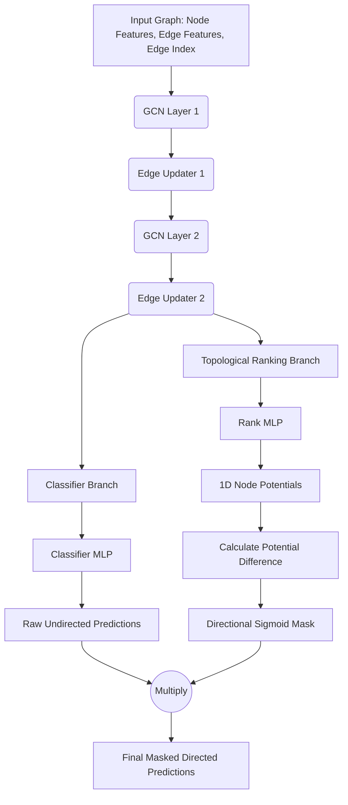

# Topological Potential GNN Architecture & Rank Masking

This document explains the architecture and tensor operations used to enforce acyclic, directed predictions on an inherently undirected biological graph using a Topological Potential approach.

## Model Architecture

The network processes the input graph through standard GCN message passing, then splits into two parallel branches. The **Classifier Branch** predicts the base probability of an edge existing, while the **Topological Ranking Branch** predicts a 1D scalar potential for each node to break symmetry and guarantee a strict directional, acyclic flow (a DAG).

---

## Detailed Step-by-Step Breakdown: Topological Ranking & Masking

The final block of the `forward` pass mathematically prevents the network from outputting cycles (loops) by treating the graph like a topographical map with heights (potentials).

### Step 1: Predict 1D Node Potentials

**Goal:** Assign a single continuous value to every node representing its position or "rank" in the chain.

* **Input:** `x` (Shape: `[Total_Nodes, F]`), representing the final node embeddings.
* **Operation:** Pass the embeddings through `rank_mlp` to condense `F` features down to `1`.
* **Output:** `node_potentials` (Shape: `[Total_Nodes]`)

### Step 2: Directional Masking (Guaranteeing a DAG)

**Goal:** Break the symmetry of the original undirected predictions to guarantee an acyclic structure. If an edge flows from a lower potential to a higher potential, keep it. If it flows backwards, suppress it.

* **Input:** `node_potentials` (Shape: `[Total_Nodes]`), `raw_pred` (Shape: `[Total_Edges]`)
* **Operation:**
    1. Calculate the potential difference across every edge in the graph: `Target Potential - Source Potential`.
    2. Divide by `temperature` (to control steepness) and pass through a `Sigmoid`.
        * If Target > Source, difference is highly positive $\rightarrow$ Sigmoid nears `1.0`.
        * If Target < Source, difference is highly negative $\rightarrow$ Sigmoid nears `0.0`.
    3. Multiply this directional mask against the symmetric `raw_pred`.
* **Output:**
  * `directional_mask` (Shape: `[Total_Edges]`)
  * `masked_pred` (Shape: `[Total_Edges]`): The final directed, acyclic edge probabilities.
