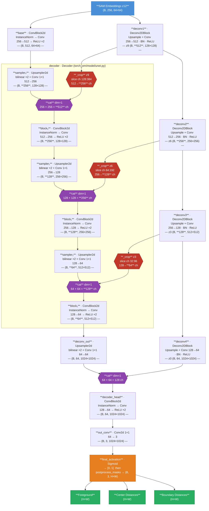

# MicroSAM AIS Decoder Architecture

The `DecoderAdapter` converts SAM's compact patch embeddings `(B, 256, 64, 64)` into three full-resolution dense prediction maps via progressive upsampling. The three output channels — **foreground**, **center distances**, and **boundary distances** — are all sigmoid-bounded to `[0, 1]` and are used downstream by the instance segmentation post-processing step.



## Two-Branch Design Rationale

The decoder has two structurally separate branches that are only merged at the very end, just before `decoder_head`. Understanding why requires thinking about what SAM embeddings are and what information they lack.

### The problem: ViT embeddings are semantically rich but spatially coarse

SAM's ViT encoder produces a single `64×64` patch embedding. Each position in this grid summarises a `16×16` patch of the original image through many layers of global self-attention. The embedding therefore captures strong global semantic context — it "knows" what is in the image and roughly where — but the spatial precision is limited by the patch grid, and fine local boundary detail is compressed away.

To produce accurate per-pixel predictions (foreground mask, cell centre heatmap, boundary distance map), the decoder must recover both:

- **Semantic context** — which regions are cells, where are the centres, what constitutes a boundary.
- **Spatial precision** — exact pixel locations of those structures.

A single upsampling chain cannot do both well simultaneously. Progressive upsampling from `64×64` preserves spatial layout but smears out fine detail. Heavily processing the embedding for semantic richness risks discarding spatial structure. The two-branch design separates these concerns.

### Branch 1: the deconv chain — direct spatial upsampling (z12 → z9 → z6 → z3 → z0)

This branch progressively doubles the spatial resolution at each step through four `Deconv2DBlock`s (`deconv1`–`deconv4`). Each block applies an upsampler followed by a single convolution, BatchNorm, and ReLU. The processing per block is intentionally shallow — the goal is not semantic enrichment but a straightforward spatial unfolding of the embedding at each scale.

The intermediate outputs (z9, z6, z3) serve as spatial anchors at 128×128, 256×256, and 512×512 respectively. The final output z0 at `1024×1024` is the direct high-resolution projection of the embedding — it carries strong positional information about where structures are, but with limited semantic depth.

### Branch 2: the semantic path — multi-scale context integration (base → decoder → deconv_out)

This branch starts by processing z12 through `base`, expanding to 512 channels at the same 64×64 resolution. The `decoder` module then integrates information across scales by receiving z9, z6, z3 from the deconv chain as skip connections. At each decoder stage, the skip input from the corresponding scale is merged into the processing stream before the channel-reduction convolution. This gives the semantic path access to how the embedding looks at every intermediate resolution, not just the 64×64 bottleneck. `deconv_out` upsamples the result one final step to full resolution.

The output of this branch is semantically rich — it encodes the contextual understanding of the full image built up across scales — but it reaches full resolution through many processing stages that have smoothed local spatial precision.

### How z9/z6/z3 are wired into the `decoder` — the `_crop` mechanism

**Reference:** `torch_em/model/unet.py:363–373` — `Decoder._crop` and `_concat`

The channel dimensions of the deconv outputs and the `decoder`'s sampler outputs do not naively match, and the wiring is non-obvious:

| Step | sampler output | deconv skip | block input |
| --- | --- | --- | --- |
| 1 | z9 `(B, 256, 128×128)` after sampler₀ | z9 `(B, 512, 128×128)` | block₀ `(512→256)` |
| 2 | `(B, 128, 256×256)` after sampler₁ | z6 `(B, 256, 256×256)` | block₁ `(256→128)` |
| 3 | `(B,  64, 512×512)` after sampler₂ | z3 `(B, 128, 512×512)` | block₂ `(128→64)` |

Each deconv output has exactly **2× the channels** of the corresponding sampler output. The `Decoder._concat` method calls `_crop` before concatenating:

```python
def _crop(self, x, shape):
    shape_diff = [(xsh - sh) // 2 for xsh, sh in zip(x.shape, shape)]
    crop = tuple([slice(sd, xsh - sd) for sd, xsh in zip(shape_diff, x.shape)])
    return x[crop]

def _concat(self, x1, x2):
    return torch.cat([x1, self._crop(x2, x1.shape)], dim=1)
```

`_crop` operates over **all tensor dimensions** including the channel axis. When called as `_crop(from_encoder, sampler_out.shape)`, the channel mismatch is handled the same way as a spatial mismatch — center-slicing:

- z9 (512ch) vs sampler₀ output (256ch): `sd = (512−256)//2 = 128` → `slice(128, 384)` → selects the **middle 256 channels** of z9
- After crop: both tensors are 256ch → `concat` → 512ch → matches block₀ input ✓

The same pattern holds at every step, always selecting the middle 50% of the deconv output's channels.

`_crop` was designed for **spatial** alignment: in a standard U-Net, encoder and decoder feature maps at the same level can differ by a few pixels due to padding, and the center crop discards the invalid border. The channel-dimension cropping is a **side effect** of the function being dimension-agnostic. It works here because the deconv chain is constructed so that every deconv output is exactly 2× wider in channels than its corresponding sampler output — making the 50% channel crop always produce an exact fit.

### What happens to the discarded channels

The outer 50% of channels in z9, z6, z3 are dropped from the skip path — but they are not lost from the overall computation. They flow forward through the deconv chain and eventually reach z0:

```
z12 → deconv1 → z9 (all 512ch)
                  ├── [128:384]  →  _crop  →  decoder step 1   (256ch used as skip)
                  └── all 512ch  →  deconv2  →  z6  →  deconv3  →  z3  →  deconv4  →  z0
```

z0 is concatenated into `decoder_head` **without any cropping**, so the complete channel information from the entire deconv chain does ultimately contribute to the output — just via z0 rather than via the skip connections.

The practical consequence is that the skip connections are weaker than they could be: they carry only half the channel information at each scale. A 1×1 projection convolution instead of a crop would use all channels without discarding anything. However, the model was fine-tuned on microscopy data **with this behaviour already in place**, so the `Deconv2DBlock` weights have implicitly adapted: because only channels `[128:384]` of z9 ever receive gradient from the skip path during training, those channels learn to carry the most useful skip information, while the outer channels serve the forward deconv chain. The model has compensated for the constraint rather than being broken by it.

### Merging at `decoder_head`

```python
# DecoderAdapter._forward_impl  (micro_sam/instance_segmentation.py:751)
x = torch.cat([x, z0], dim=1)   # semantic path (64ch) + direct upsampling (64ch) → 128ch
x = self.decoder_head(x)
```

By concatenating the two 64-channel outputs along the channel dimension before `decoder_head`, the model gives the final convolutions access to both information types simultaneously. `decoder_head` then learns to fuse them: using the direct branch to pin predictions to precise pixel locations, and the semantic branch to decide *what* to predict at those locations.

This is the same principle behind standard U-Net skip connections — combining a high-resolution spatially precise signal with a low-resolution semantically processed signal — but restructured around a ViT bottleneck where both signals are derived from the same patch embedding rather than from different encoder depths.

## Notes on Normalization

The decoder uses two normalization strategies reflecting which layers were pre-trained vs. fine-tuned on microscopy data:

| Layers | Normalization | Meaning |
|---|---|---|
| `base`, `decoder` blocks, `decoder_head` | **InstanceNorm** | Pre-trained UNETR backbone; no tracked statistics |
| `deconv1–4` | **BatchNorm** | Fine-tuned on microscopy; running stats tracked |

## Upsampling Strategy

Each `Deconv2DBlock` (`deconv1`–`4`) can use one of two upsampling implementations. The choice is baked into the checkpoint weights and is detected automatically by `get_unetr` in `micro_sam/instance_segmentation.py:797` by inspecting the parameter key pattern inside `decoder.samplers`:

| Key pattern | Implementation | Behaviour |
| --- | --- | --- |
| `decoder.samplers.N.conv.weight` | `Upsampler2d` — bilinear interpolation + 1×1 `Conv2d` | Fixed mathematical interpolation; no learned upsampling weights |
| `decoder.samplers.N.block.weight` | `SingleDeconv2DBlock` — `ConvTranspose2d` (stride 2) | Learned upsampling kernel; spatial interpolation has trainable parameters |

**The `vit_l_lm` checkpoint uses bilinear interpolation.** Inspecting `decoder.samplers` keys from the checkpoint at `~/Projects/C_Albicans Thesis Project/7. Data/model_checkpoints/micro_sam/models/vit_l_lm_decoder`:

```
decoder.samplers.0.conv.weight
decoder.samplers.0.conv.bias
decoder.samplers.1.conv.weight
decoder.samplers.1.conv.bias
decoder.samplers.2.conv.weight
decoder.samplers.2.conv.bias
```

All three sampler stages carry `.conv.`, so `get_unetr` sets `use_conv_transpose=False` and builds every `Deconv2DBlock` with `Upsampler2d`. The upsampling displayed in the [architecture diagram](#micrsoam-ais-decoder-architecture) reflects this: each deconv block doubles spatial resolution via bilinear resize followed by a 1×1 channel-adjustment convolution, then a 3×3 convolution, BatchNorm, and ReLU.

## Spatial Resolution Progression

```
SAM encoder output  →  64×64   (16× compressed from 1024×1024)
deconv1             →  128×128
deconv2             →  256×256
deconv3             →  512×512
deconv4             →  1024×1024  (original SAM input resolution)
```

The decoder then produces outputs at the original image resolution `H×W` (which may differ from 1024×1024 if the image was padded/resized).