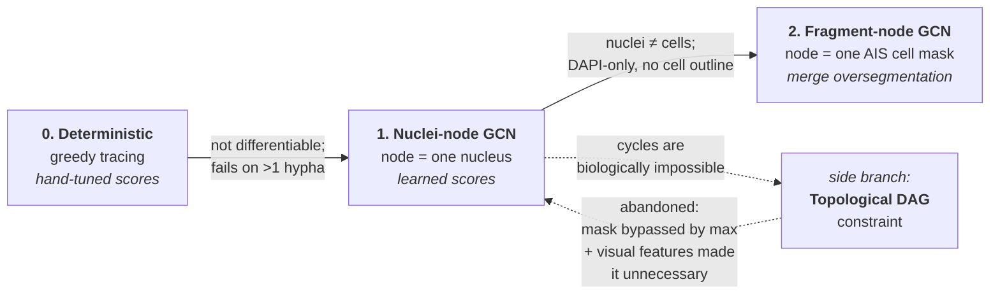

# Approach History

Why the pipeline looks the way it does. Three generations of approach, each motivated by the previous one's failure:

**deterministic greedy tracing → nuclei-node GCN → cell-fragment-node GCN.**

| Stage | Node | Segmentation needed | Status | Doc |
| --- | --- | --- | --- | --- |
| 0 | *(none — pixels + nuclei)* | Otsu / RF nuclei | **Deprecated** | [Deterministic Hyphal Tracing](C_Albicans%20Thesis%20Project/5.%20Results/4.%20GCN%20Design%20and%20Training/Deterministic%20Hyphal%20Tracing%20(Deprecated).md) |
| 1 | one DAPI nucleus | Otsu + watershed / RF | **Historical** | [GCN Data Flow](C_Albicans%20Thesis%20Project/5.%20Results/4.%20GCN%20Design%20and%20Training/GCN%20Data%20Flow.md) |
| 1b | *(side branch)* | — | **Abandoned** | [Topological DAG Constraint](C_Albicans%20Thesis%20Project/5.%20Results/4.%20GCN%20Design%20and%20Training/Topological%20DAG%20Constraint%20(Abandoned).md) |
| 2 | one AIS cell-mask fragment | fine-tuned micro-SAM AIS | **Live** | [Cell Mask Graph Data Flow](C_Albicans%20Thesis%20Project/5.%20Results/4.%20GCN%20Design%20and%20Training/Cell%20Mask%20Graph%20Data%20Flow.md) |

---

## Stage 0 → 1: why learn the scoring function?

The deterministic tracer scored every nucleus pair with a hand-written formula (path intensity × orientation alignment × a distance prior), then selected edges greedily under degree and acyclicity constraints. It worked on single, well-separated hyphae and **failed as soon as an image contained more than one hypha**.

The failure was structural, not a tuning problem:

- **Nothing was learned.** Every constant — the "expected" 5-nucleus-length spacing, the 90° angle cut-off, the 0.85 linearity floor — was hand-set and image-specific.
- **Decisions could not be revised.** Greedy acceptance plus union-find is irrevocable: one wrong high-scoring edge permanently consumes a node's degree budget and blocks the correct one.
- **Pairs were scored in isolation.** The score of `(i, j)` knew nothing about `(i, k)` competing for the same nucleus. Structure was imposed *afterwards* as hard constraints rather than reasoned about jointly.

The GCN answers each of these directly: the scoring function is **learned** from the same evidence, attention makes candidate edges **compete** during message passing, and the degree penalty turns the hard degree cap into a **soft, differentiable** objective. The lineage is literal — the tracer's three ingredients (path intensity, normalized distance, orientation alignment) became the nuclei pipeline's edge features almost one-for-one.

## Stage 1: why nuclei first?

**Because nuclei were free to segment.** DAPI nuclei are small, round, high-contrast and well-separated — `threshold_otsu` plus an optional watershed (or a small random forest) segments them adequately with no deep model at all, and no fine-tuning. That made it possible to build and validate the *entire* graph pipeline — feature extraction, PyG data flow, the GCN, cross-validation, the visual branch, interpretation — while the segmentation problem stayed a solved, cheap prerequisite.

The trade-off is that **a nucleus is not a cell**. Nuclei are proxies: a hypha is inferred from the *chain* of nuclei running through it, and the connection evidence is whatever DAPI signal happens to lie between two nuclei. The cell body itself is never segmented, so the model reasons about cells it cannot see.

## Stage 1 → 2: why move to cell-mask fragments?

Fine-tuning micro-SAM's AIS decoder made whole-cell masks available from the DIC channel (see the micro-SAM fine-tuning reference), which changes the question from "which nuclei belong to one cell?" to "which mask fragments belong to one cell?" — the cell body is now directly observed rather than inferred.

That move brought its own problem, which is the reason the current pipeline exists: **AIS oversegments long hyphae**, splitting one cell into several fragments (partly a tile-seam artifact in the reassembled decoder distance maps, partly genuine hyphal length). Rather than fight the segmentation, the graph network was re-pointed at the fragments: node = fragment, edge = "same biological cell?", inference = group the predicted-positive edges into cells and read back each cell's fragment **chain order** (which encodes the direction of growth) — see [Inference merge](C_Albicans%20Thesis%20Project/5.%20Results/4.%20GCN%20Design%20and%20Training/Cell%20Mask%20Graph%20Data%20Flow.md#Inference%20merge).

Crucially this was an **extension, not a rewrite**. The model, trainer, loss, cross-validation and visual branch carried over unchanged; only graph construction and the RoI box source are new. See [Nuclei vs. cell-fragment — what carries over](C_Albicans%20Thesis%20Project/5.%20Results/4.%20GCN%20Design%20and%20Training/Cell%20Mask%20Graph%20Data%20Flow.md#Nuclei%20vs.%20cell-fragment%20—%20what%20carries%20over).

## The side branch: enforcing a DAG

Along the way, stage 1 exposed a real weakness: **edge predictions are independent of one another, so nothing stops the model from predicting a cycle** — biologically impossible for a hyphal chain. A branch of work tried to make acyclicity *structural* by having the network learn a node ranking. It was abandoned: the mechanism was mathematically self-defeating, and the arrival of visual features made the problem largely moot by giving each edge much stronger independent evidence. The decision was to let the model learn acyclicity **implicitly** from the (always-acyclic) labels. See [Topological DAG Constraint](C_Albicans%20Thesis%20Project/5.%20Results/4.%20GCN%20Design%20and%20Training/Topological%20DAG%20Constraint%20(Abandoned).md).

---

## The through-line

Each generation kept the previous one's *evidence* and replaced its *decision rule*:

| | Evidence | Decision rule |
| --- | --- | --- |
| **Deterministic** | path intensity, distance, orientation | hand-tuned formula + greedy constrained selection |
| **Nuclei GCN** | the same three, as learned edge features (+ SAM visual features) | learned message passing; attention as soft competition; degree penalty as soft constraint |
| **Fragment GCN** | the same, re-anchored on mask boundaries, + contact/complementarity/continuity | unchanged from the nuclei GCN |

The direction of travel is consistent: **push structure out of hand-written rules and into learned representations**, and give the model better evidence rather than stronger constraints. The abandoned DAG branch is the one time that direction was reversed — and it is the one that failed.
