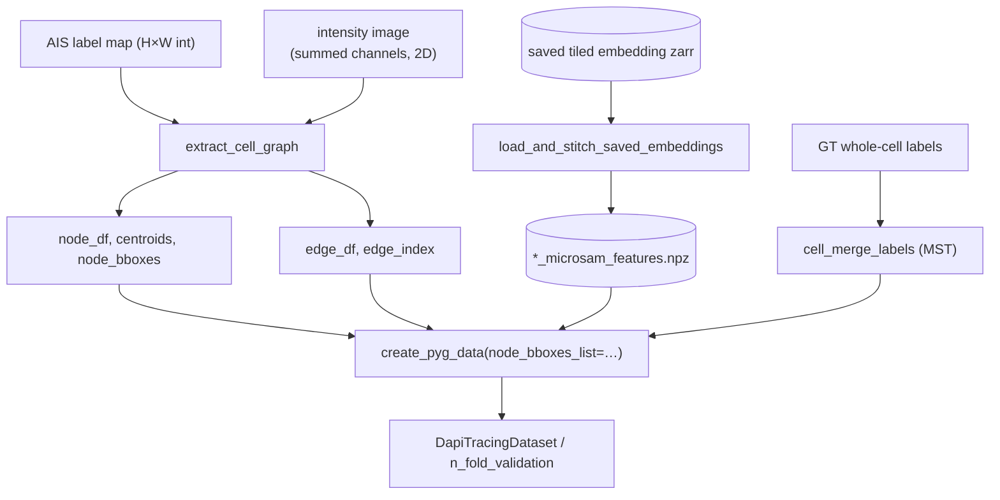

# Cell Mask Graph Data Flow

How the scene-graph network is extended from **nuclei nodes** to **cell-fragment nodes** for a *merge* task. The micro-SAM AIS model oversegments cells — long hyphae in particular are split into several fragment masks (partly a tile-seam artifact in the decoder distance maps, partly genuine hyphal length). Instead of fixing the segmentation, this pipeline learns to relink fragments that belong to the **same biological cell**.

- **Node** = one AIS instance-segmentation fragment mask.
- **Candidate edge** = a pair of nearby fragments (kNN by minimum boundary distance).
- **Positive edge** = two *adjacent* fragments of one biological cell (a link in that cell's within-fragment minimum spanning tree — a chain/tree, not a clique).
- **Inference merge** = group the predicted-positive edges into whole cells and recover each cell's fragment **chain order** (see [Inference merge](#Inference%20merge)).

Everything downstream of graph construction reuses the existing `create_pyg_data` → `Model` → `n_fold_validation` machinery unchanged; only the graph-construction stage and a small part of the visual branch are new. Design spec: `docs/superpowers/specs/2026-07-03-cell-mask-graph-merge-design.md`; implementation plan: `docs/superpowers/plans/2026-07-03-cell-mask-graph-merge.md`.

Compare with the nuclei pipeline in [GCN Data Flow](C_Albicans%20Thesis%20Project/5.%20Results/4.%20GCN%20Design%20and%20Training/GCN%20Data%20Flow.md); the visual branch it shares is described in [GCN Visual Feature Data Flow](C_Albicans%20Thesis%20Project/5.%20Results/4.%20GCN%20Design%20and%20Training/GCN%20Visual%20Feature%20Data%20Flow.md).

---

## Nuclei vs. cell-fragment — what carries over

> The **nuclei** pipeline (node = one DAPI nucleus, link nuclei belonging to one cell) is **historical**: it is no longer run, and the live code's defaults are fragment-first (`node_feature_dim=8`, `edge_feature_dim=10`, grouped interpretation ordering, mask-bbox RoI with the centroid square only as a fallback). It is documented to explain what this pipeline inherited.
>
> For the full arc — deterministic greedy tracing → nuclei-node GCN → cell-fragment-node GCN, and *why* each step was taken — see [Approach History](C_Albicans%20Thesis%20Project/5.%20Results/4.%20GCN%20Design%20and%20Training/Approach%20History.md).

**One-line summary:** everything from `create_pyg_data` onward is shared and unchanged. Unique to the fragment pipeline is *how the graph is built* (nodes, candidate edges, labels), *two extra node features and four extra edge features*, and *where the visual branch gets its RoI boxes*.

### Graph construction — almost entirely unique

| Design | Nuclei (historical) | Cell fragment (live) | |
| --- | --- | --- | --- |
| Node | one nucleus mask (DAPI) | one AIS cell-fragment mask | Unique |
| Task | link nuclei belonging to one cell | merge fragments of one cell | Unique |
| Candidate edges | fully connected | kNN by min **boundary** distance | Unique |
| Long-edge control | `max_edge_length_neg` — trims long **negatives** after building | `dist_cap_factor` — caps at kNN build time | Unique |
| Labels | manual, in-notebook | per-cell **MST** over GT whole-cell masks | Unique |
| Inference | predicted edges (chain of nuclei) | grouping + **chain ordering** → merged whole-cell masks (`cell_merge_inference`) | Unique |

### Features — schema unique, normalization contract common

| | Nuclei (historical) | Cell fragment (live) | |
| --- | --- | --- | --- |
| `node_feature_dim` | **6** — `circ, ecc, area, int, maj, min` | **8** — same six, plus `sol` (solidity) and `ctx` (context-ring intensity) | Unique (superset) |
| `edge_feature_dim` | **6** — `e_int, e_len, ang1, ang2, min_ang, rel_ang` | **10** — same six roles, plus `contact`, `area_r`, `collin`, `cont` | Unique (superset) |
| Edge columns 0–5 | intensity, length, 4 angles | `gap` (intensity), `dist` (length), the same 4 angles | **Common** — role-identical *and in the same order* |
| Edge z-score contract | col 0 = the only raw intensity → z-scored; col 1 = normalized distance → skipped; rest pre-scaled | identical | **Common** — this is *why* `_apply_feature_zscore` needed no change |
| Node normalization | global z-score from the training fold | identical | **Common** |
| Angle normalization | ÷ `π/2` → [0,1] | identical | **Common** |
| Distance normalization | ÷ `avg_nucleus_length` | ÷ `mean-major-axis` | Common mechanism, different reference length |

The edge schema being a **positional superset** is the load-bearing design decision: because the fragment pipeline kept the nuclei column *roles* in columns 0–5 and appended its four new features after them, the trainer's hard-coded normalization contract (z-score col 0, skip col 1) carried over untouched.

### Visual branch — box source unique, everything else common

| | Nuclei (historical) | Cell fragment (live) | |
| --- | --- | --- | --- |
| Node RoI box | fixed square around the centroid (`node_box_size`) | **mask bbox**, padded by `node_bbox_pad_frac` | Unique — one code path; the centroid square is the fallback when `data.node_bboxes` is absent |
| Edge RoI box | bbox of the two endpoint centroids + margin | **union** of the endpoints' padded mask bboxes | Unique |
| Embedding source | `compute_microsam_features` (runs the encoder) | `load_and_stitch_saved_embeddings` (reuses AIS's saved tiled zarr) | Common core (`_stitch_embeddings`), different entry point |
| RoIAlign, `spatial_scale`, `VisualCNN`, `FusionMLP` | — | unchanged | **Common** |

### Model and training — mostly common

The trunk is shared and unmodified. **Two additions are now fragment-only**, so this is no longer the "identical `simple_gnn.py` plus different defaults" it once was. Verified by diffing the pipelines' `simple_gnn.py` — `dapi_tracing`'s has neither `NodeClassifier` nor `pair_key`.

| Component | |
| --- | --- |
| GCN layer — message `[x_j − x_i ‖ edge_attr]`, attention softmax over the neighborhood, sum aggregation, MLP update | **Common** |
| `EdgeUpdater`, GraphNorm skip connections | **Common** |
| Symmetric prediction (`P(A→B)`/`P(B→A)` averaged), no self-loops, `T.ToUndirected()` + the [per-direction angle swap](C_Albicans%20Thesis%20Project/5.%20Results/4.%20GCN%20Design%20and%20Training/GCN%20Data%20Flow.md#Data%20preprocessing) | **Common** |
| Loss — BCE with label smoothing; degree penalty **disabled** (`weight = 0`) | **Common** |
| Optimizers (Muon for 2D hidden weights + AdamW for the rest) | **Common** |
| `n_fold_validation`, `train_overfit_test`, per-fold z-score (no leakage) | **Common** |
| Graph-level (inductive) train/test split | **Common** |
| Dataset persistence (`save_pyg_dataset` / `DapiTracingDataset`) | **Common** |
| **[Node-type head](C_Albicans%20Thesis%20Project/5.%20Results/4.%20GCN%20Design%20and%20Training/GCN%20Design%20Choices.md#Node%20Classifier%20Head%20(optional))** + its CE loss and balanced node sampling | **Unique** — needs `data.node_type`, which only the fragment pipeline has |
| **[Edge RoI deduplication](C_Albicans%20Thesis%20Project/5.%20Results/4.%20GCN%20Design%20and%20Training/GCN%20Visual%20Feature%20Data%20Flow.md#Edge%20RoI%20deduplication)** | **Unique** — a pure optimisation; applies equally to nuclei and was simply not ported |

The two differ in kind. The **node head is off by default** (`predict_node_type=False`), so a fragment model built without it is architecturally the nuclei model. The **dedup is unconditional** and changes no architecture — but it is not bit-identical to the un-deduplicated path (~3e-8, see its section), so the two pipelines will not reproduce each other's numbers exactly even on identical input.

---

## Modules

| File | Responsibility |
| --- | --- |
| `cell_mask_graph.py` | `extract_cell_graph` — fragment nodes, kNN edges, node/edge features. |
| `cell_merge_labels.py` | `assign_fragments_to_gt` + `cell_merge_labels` — GT-overlap assignment and per-cell MST true edges. |
| `cell_merge_inference.py` | `merge_fragments` — the inverse at inference: predicted edges → subnetworks → merged whole-cell masks + chain order. |
| `build_cell_dataset.py` | `build_cell_graph_data` — glue chaining the above into one PyG `Data`. |
| `precompute_microsam_feats.py` | `load_and_stitch_saved_embeddings` — reuse micro-sam's saved tiled embedding store for the visual branch. |
| `gnn_data.py` | `create_pyg_data(node_bboxes_list=…)` — attach per-node mask bboxes. |
| `simple_gnn.py` | mask-bbox RoIAlign box helpers; `Model` defaults `node_feature_dim=8`, `edge_feature_dim=10`, `node_bbox_pad_frac`. |



---

## Which channel the intensity features read

`extract_cell_graph` takes **one 2D `intensity_image`** and reads every intensity feature from it — node `interior_intensity` / `context_intensity`, edge `gap_intensity` / `intensity_continuity`. It does not select or combine channels itself; that happens upstream, and the function **rejects a non-2D array** rather than accepting a stack.

**Build it with `ImageContainer`, grouping the channels so they are reduced:**

```python
channels = [Path(p) for p in sample["image"].values()]   # {dic} or {dic, fluorescence, dapi}
config   = {"preprocessing": {"resize_image": False, "outlier_percentile": 0.35,
                              "quantization": "16bit", "correct_DIC_shift": shift}}

intensity = ImageContainer([channels], config).merge()   # grouped -> summed  -> (H, W)
display   = ImageContainer(channels,   config).merge()   # ungrouped -> kept  -> (H, W, C)
```

The nesting is what does the work. A **grouped** structure (`[[c1, c2]]`) makes the constructor run `_sum_channels`, which reduces the group to one channel; `merge()` then returns it as `(H, W)`. An **ungrouped** structure keeps the channels separate and `merge()` combines them into `(H, W, C)` — that is the display image, stored as `data.image` for the overlays and **never read by a feature**. `merge()` itself never reduces channels.

**Every channel listed is summed into the intensity image.** Each one is first percentile-clipped at 0.35 / 99.65 and stretched to `0..65535` (`_get_high_contrast_16bit`, reached because the config sets `quantization: "16bit"` + `resize_image: False`), then `_sum_and_stretch` sums them and stretches the result again.

| Config key | Why it is load-bearing |
| --- | --- |
| `resize_image: False` | Keeps the intensity image pixel-aligned with `ais_labels`, **and** routes `get_image_for_processing()` to `_get_high_contrast_16bit()`. The default `True` would resize to `max_dim` and desync it. |
| `quantization: "16bit"` | Same routing; selects the 16-bit high-contrast path. |
| `outlier_percentile: 0.35` | The clip. Without it a single hot pixel sets the max and compresses the real signal — measured at ~20% of range retained versus ~90% with the clip. |
| `correct_DIC_shift` | Per-sample (`[0,0]` or `[5,22]`); applied only to files with `DIC` in the name. |

Two consequences worth knowing:

- **Mono and multi-channel samples land on the same scale.** Summing one channel is the identity — it arrives already spanning `0..65535`, so the min-max is a no-op. A `{dic}` sample and a `{dic, fluorescence, dapi}` sample both produce a `0..65535` image, so `interior_intensity` means the same thing in every graph and the pooled training-fold z-score compares like with like.
- ⚠️ **Only list channels that carry signal.** Each channel is stretched to full contrast *before* the sum, so a signal-free channel has its noise amplified to full range and summed in at equal weight. Measured: correlation with the true signal drops from 0.9975 to 0.8664 when a junk channel is included.

> **Why the guard exists.** Passing a stack used to fail silently, not loudly: `profile_line` returns `(L, C)` for a 3D image, so `intensity_continuity`'s `corrcoef` stopped comparing the two fragments' profiles and instead correlated two sample points' channel vectors — which for two channels is **always exactly ±1**. The feature reported maximum continuity for every edge, with no error. The other intensity features silently became cross-channel means.

---

## Node features (8)

Computed by `regionprops` on the AIS label map plus the single 2D intensity channel described [above](#Which%20channel%20the%20intensity%20features%20read) — the sum of whichever channels the sample lists (DIC alone for a mono sample; DIC + fluorescence + DAPI where those exist). Node index `i` follows `regionprops` order (labels ascending) — the same invariant `cell_merge_labels` uses, so labels align.

| # | Feature | Definition |
| --- | --- | --- |
| 0 | `circularity` | `4π·area / perimeter²` |
| 1 | `eccentricity` | regionprops |
| 2 | `solidity` | `area / convex_area` (fragment convexity) |
| 3 | `area_norm` | `area / mean-fragment-area` |
| 4 | `major_axis_norm` | `major_axis / mean-fragment-major-axis` |
| 5 | `minor_axis_norm` | `minor_axis / mean-fragment-major-axis` |
| 6 | `interior_intensity` | mean intensity inside the mask |
| 7 | `context_intensity` | mean intensity in a dilated ring around the mask (the "area around it") |

All node features receive global Z-score normalization from the training fold (`gnn_train._apply_feature_zscore`), exactly as in the nuclei pipeline. Fragment `orientation` is consumed by the edge angle terms, not stored as a node feature (meaningless in isolation).

## Edge features (10)

Computed per kNN candidate pair. **The column order is load-bearing:** `gnn_train._apply_feature_zscore` Z-scores only edge **column 0** (the single raw-intensity feature), skips column 1 (a normalized distance), and treats the rest as pre-scaled. The schema is therefore ordered so col 0 is the only raw feature, col 1 is the normalized distance, and every other feature is already bounded — no trainer change needed.

All edge features anchor on the **nearest boundary-point pair** `(p_i, p_j)` and the min distance `d` produced by the kNN step, so each is defined at any separation (touching or gapped), not only for adjacent fragments.

| # | Feature | Family | Definition | Norm |
| --- | --- | --- | --- | --- |
| 0 | `gap_intensity` | contact | mean intensity along the connecting segment `p_i→p_j` over pixels between the masks (`profile_line`, small linewidth); for touching pairs (`d<~1px`) a thin dilation-contact band | **z** |
| 1 | `boundary_dist_norm` | geometry | `d / mean-major-axis` | skip |
| 2 | `node1_angle_diff` | geometry | angle(connecting dir, major-axis_i) → [0,1] | skip |
| 3 | `node2_angle_diff` | geometry | angle(connecting dir, major-axis_j) → [0,1] | skip |
| 4 | `min_diff_angle` | geometry | `min(#2, #3)` | skip |
| 5 | `relative_angle` | geometry | angle between the two major axes → [0,1] | skip |
| 6 | `contact_frac` | contact | fraction of the smaller mask's boundary abutting the other within `≤contact_tau` px → [0,1] | skip |
| 7 | `area_ratio` | complementarity | `min(area)/max(area)` → [0,1] | skip |
| 8 | `axis_collinearity` | complementarity | `|cos∠(major-axis_i, major-axis_j)|` → [0,1] | skip |
| 9 | `intensity_continuity` | continuity | Pearson corr of two intensity profiles sampled **inward** from `p_i` into i and from `p_j` into j (length `continuity_L`); 0 if under-defined → [-1,1] | skip |

Angles are normalized by `π/2` (bounded [0,1], as in the nuclei pipeline). `convex_completion` was considered and **dropped**: over a separated pair its union convex hull spans the empty gap, collapsing the feature into distance (already col 1). Result: **`node_feature_dim=8`, `edge_feature_dim=10`** — the only dims the model/trainer must be told about.

---

## kNN candidate-edge construction

Goal: each fragment's `k` nearest neighbours by **minimum boundary-to-boundary distance** (not centroid distance — a large fragment's centroid can be far while its edge touches), without O(N²) exact boundary comparisons.

1. **Fragment extraction** (`_extract_fragments`). `regionprops` gives per-fragment centroid/bbox/shape stats; `find_boundaries(ais_labels, mode='inner')` (run once) gives inner-boundary pixels tagged by fragment id, grouped into `boundary_pts[i]`; one `cKDTree` is built per fragment's boundary.
2. **Centroid prefilter.** A `cKDTree` over centroids returns each fragment's `m = min(N−1, prefilter_mult·k)` nearest centroids (default `prefilter_mult=3`) — a cheap superset of the boundary-nearest neighbours that bounds the exact work to `N·3k` pairs.
3. **Exact boundary distance** for prefiltered pairs only: `tree_j.query(boundary_pts[i])` → `min` is the exact mask-to-mask distance and its `argmin` gives the nearest boundary-point pair `(p_i, p_j)`. Both are reused downstream (distance → edge col 1; point pair → connecting direction for the angle features and anchor for the junction sampling), so they are free.
4. **Select / symmetrize / cap.** Keep the `k` smallest per fragment; take the union so `{i,j}` is a candidate if `j∈kNN(i)` **or** `i∈kNN(j)`; emit each unordered pair once (`i<j`) — the single-direction `edge_index` contract that `create_pyg_data`'s `T.ToUndirected()` then mirrors. An optional distance cap (`dist_cap_factor · mean-major-axis`) drops candidates across large voids so isolated fragments are not linked; this replaces the nuclei pipeline's `max_edge_length_neg`.

**Knobs:** `k`, `prefilter_mult`, `dist_cap_factor`. **Complexity:** `O(H·W) + O(N log N) + O(B log B) + N·3k` exact queries — no N² term.

**Transitive merge.** Two same-cell fragments outside each other's kNN get no *direct* edge, but they still merge transitively through intermediate fragments during message passing, and grouping the predicted-positive edges recovers the whole cell at inference (see [Inference merge](#Inference%20merge)). Raising `k` reduces the chance an adjacent link is missing from the candidate set.

---

## Training labels (per-cell MST)

`cell_merge_labels(ais_labels, gt_labels, min_overlap_frac=0.5)` produces the compact true-edge `(u,v)` list that `create_pyg_data._normalize_edge_labels` already accepts:

- **Assignment.** Each fragment is assigned to the GT cell it overlaps most; if that best overlap is `< min_overlap_frac` of the fragment's own area, it is **background** (`-1`).
- **MST per cell.** For each non-background GT cell, build a graph over its fragments weighted by min boundary distance and emit the edges of its **minimum spanning tree** (`scipy.sparse.csgraph.minimum_spanning_tree`). For a hypha split 1–2–3 this is `{1-2, 2-3}`, not the clique `{1-2, 1-3, 2-3}`; a branching cell yields its tree. The MST guarantees each cell's fragments form one connected component (whole cell always recoverable), is never a clique, and stays connected across seam/septum gaps via the shortest link — and it aligns the positive set with the contact/gap features instead of fighting them with implausible long-range positives.
- **Node ordering** follows `regionprops` order, matching `extract_cell_graph`.

### Correctly-segmented cells are singleton nodes

A GT cell represented by a single fragment (not oversegmented) has a one-node MST → **zero** true edges. Its fragment is still a node, but all its candidate edges are negative and it passes through inference unmerged (its own connected component). These singletons provide the bulk of the negative supervision — learning when *not* to merge adjacent but distinct cells.

### Not addressed: under-segmentation

If one AIS mask fuses two GT cells, majority overlap assigns it to one cell; the GNN only *merges* fragments, never splits them.

---

## Inference merge

`cell_merge_inference.merge_fragments` turns the predicted edges back into whole cells. It runs automatically at the end of training — `_log_figures` calls it after the best-AUC snapshot is restored, in both cross-validation and the overfit test — and does **two** jobs:

1. **Grouping — which fragments are one cell.** The predicted-true edges are assembled into an `nx.Graph`, one node per fragment. Each connected subnetwork is one cell; every fragment in it is relabelled to that network's id, and isolated fragments stay singletons.
2. **Chain ordering — in what order the fragments run along the cell.** Fragments are consecutive pieces of one hyphal cell, so their **connection order encodes the direction of growth** — a wanted output, not an implementation detail. This is why the training labels are a per-cell **MST over adjacent fragments rather than a clique** ([Training labels](#Training%20labels%20(per-cell%20MST))): the positives describe a *chain*, and the prediction is read back as one.

> ⚠️ **Grouping is decided by the edge graph, never by pixel adjacency.** Fragments of one hypha are frequently **not** physically touching — that is the whole reason the model exists. `skimage.label()` on the mask would only ever merge fragments that already touch, which is precisely the wrong answer. The subnetworks come from the predicted edges alone.

### Reading the chain order

Building a real graph is what makes the order recoverable: it falls out of the same subnetwork used for grouping. Each cell reports a `topology`:

| `topology` | Meaning | Order emitted |
| --- | --- | --- |
| `singleton` | one fragment, no edges | that fragment |
| `path` | every node degree ≤ 2, acyclic, two endpoints | endpoint-to-endpoint traversal — **the growth-direction chain** |
| `branched` | a tree with a node of degree ≥ 3 | the diameter path, **flagged** |
| `cyclic` | contains a cycle | none — no endpoint to start from; the cell still merges |

Only `path` and `singleton` are biologically well-formed. **`branched` and `cyclic` are prediction defects, not merge failures** — a hyphal chain is unbranched and acyclic, so they mean the model predicted a topology biology forbids. They are reported rather than silently repaired: `summarize_cells` tallies them and the count is logged to `Merge/Graph_<id>_summary` and printed in the merge figure's title. This makes the long-standing acyclicity concern ([Acyclicity](C_Albicans%20Thesis%20Project/5.%20Results/4.%20GCN%20Design%20and%20Training/GCN%20Model%20Experiments.md#7.%20Acyclicity)) **measurable for the first time**: cycles are harmless to grouping and corrupting to ordering, and now you can see how many there are.

### Outputs

| Output | Where |
| --- | --- |
| `merged_labels` — `(H, W)` map, fragments of one cell sharing an id | `Merge/Graph_<id>` figure |
| `cells` — per cell: `label`, `nodes`, `fragments` (AIS labels **in chain order**), `topology` | `Merge/Graph_<id>_summary` tally |
| the `nx.Graph` itself, nodes carrying `ais_label` / `cell` / centroid and edges carrying `prob` / `true_label` / `edge_class` / `a1` / `a2` | `<log_dir>/prediction_graph_<id>.graphml` |

The graph is written as **GraphML**, not a pickle: it is readable by igraph, Cytoscape and Gephi for downstream analysis, and networkx removed `write_gpickle` in 3.0 in any case.

### Still open

- **Cycles are reported, not prevented or repaired.** A structural decode (maximum spanning tree per component, or a degree-capped path cover — both survive the symmetric read-out) or a repair pass (prune the weakest cycle-closing edge) remains a design choice. The tally now gives the evidence to decide whether it is worth it.
- **Branched cells** emit the diameter path, which is a defensible "longest chain" but discards the side branches. What a branched cell *should* emit is unresolved.

Any structural pressure belongs in the **decode**, not the loss: the [node degree loss](C_Albicans%20Thesis%20Project/5.%20Results/4.%20GCN%20Design%20and%20Training/GCN%20Model%20Experiments.md#5.%20Node%20degree%20loss) is disabled and is not a candidate — the model can satisfy it by predicting all-near-zero probabilities, a cheat that was never eliminated, and it measurably hurt AUC.

---

## Visual branch — mask-bbox RoIAlign

The SAM-embedding visual branch (see [GCN Visual Feature Data Flow](C_Albicans%20Thesis%20Project/5.%20Results/4.%20GCN%20Design%20and%20Training/GCN%20Visual%20Feature%20Data%20Flow.md)) is reused with one change: the RoIAlign **box source**.

- **Node boxes** = each fragment's `regionprops` bbox (`x1,y1,x2,y2`), padded by `node_bbox_pad_frac` (default `0.1`), instead of a fixed square around the centroid. `extract_cell_graph` returns these as `node_bboxes` `(N,4)`; `create_pyg_data(node_bboxes_list=…)` attaches them as `data.node_bboxes` (a light `(N,4)` float tensor that cats along dim 0 like `centroids`). When `data.node_bboxes` is absent (the nuclei pipeline), the branch falls back to the centroid-square behaviour, so both pipelines share one code path.
- **Edge boxes** = the union of the two endpoints' (padded) mask bboxes, instead of the bbox of the two centroids.
- Everything after box construction — batch-index prepend, `spatial_scale = 1/pixels_per_feature`, the `VisualCNN`, and the `FusionMLP` — is unchanged.

> ⚠️ **The crop is still a rectangle — the mask outline is *not* used to gate pixels.** "Mask bbox" changes **where the box sits and how big it is**, nothing more. `_extract_visual` passes `[batch_idx, x1, y1, x2, y2]` to torchvision's `roi_align`, which samples an **axis-aligned rectangle**; there is no mask multiplication anywhere in the visual branch. Each `(256, 7, 7)` patch therefore contains the fragment **plus** the background in its bounding rectangle **plus** any neighbouring fragment that overlaps it.
>
> This matters more for fragments than it ever did for nuclei. A nucleus is small and roughly convex, so its bbox is mostly nucleus. A hyphal fragment is **long, thin and often diagonal**, and an axis-aligned bbox around it can be many times its own area — a diagonal fragment occupies only a thin band across the full square. Two consequences pull in opposite directions:
>
> - **Dilution:** the node descriptor summarizes a patch in which the fragment may be a minority of the content, and a neighbour inside the same rectangle leaks into it.
> - **Context:** that surplus is largely *the point* — whether the cell body continues past the fragment's edge is the merge signal, and a mask-tight crop would delete it. The tabular branch already carries mask-only information (`interior_intensity`); the visual branch's value is partly that it is **not** mask-limited (`context_intensity` samples a ring for the same reason).
>
> True mask-limited features would require either multiplying the embedding by a rasterized mask before pooling (Mask R-CNN style) or masked average pooling over mask pixels (which discards spatial layout). Neither is implemented, and neither is in the spec.

### Where the mask outline *is* used

The outline is load-bearing — just in the **tabular** branch, never the visual one:

| Consumer | How the outline is used |
| --- | --- |
| `circularity` (node #0) | via `perimeter` — `4π·area / perimeter²` |
| `solidity` (node #2) | via the convex hull — `area / convex_area` |
| `context_intensity` (node #7) | the mask is dilated by `ring_width` and the mask itself subtracted, so the ring is defined by the outline |
| **kNN candidate edges** | `find_boundaries(ais_labels, mode="inner")` gives per-fragment boundary pixels; a `cKDTree` per fragment yields the exact **boundary-to-boundary** distance (not centroid distance) |
| `gap_intensity` (edge #0), all four angle features, `intensity_continuity` (edge #9) | all anchor on the **nearest boundary-point pair** `(p_i, p_j)` returned by that kNN query |
| `boundary_dist_norm` (edge #1) | the minimum boundary-to-boundary distance itself |
| `contact_frac` (edge #6) | the fraction of the smaller fragment's **boundary pixels** lying within `contact_tau` of the other |

So the split is clean: **the outline defines the geometry the handcrafted features measure, and the bounding box the visual branch samples.** The two branches see the fragment through different apertures, which is arguably why they complement each other.

### Embedding source — reuse micro-sam's saved tiled store

The AIS run already writes a tiled embedding zarr when it precomputes embeddings, so the GNN reuses it rather than recomputing. `load_and_stitch_saved_embeddings(embedding_path, save_path=None)`:

- opens the zarr container (`zarr.open`), reads the `features` group of per-tile `(1,256,64,64)` datasets and its `shape`/`tile_shape`/`halo` attrs;
- reuses the existing `_stitch_embeddings` to produce the whole-image `(256, H_f, W_f)` feature map and `pixels_per_feature` (no reimplementation of the stitching);
- optionally writes the same `*_microsam_features.npz` contract `create_pyg_data(microsam_paths_list=…)` consumes.

No SAM model, predictor, or image re-prep is needed at GNN-feature time — this decouples GNN feature prep from the encoder and guarantees the GNN sees exactly the embeddings AIS used. The AIS label map and the stitched feature map share the same `shape` frame (both from one `precompute_image_embeddings` call), so image-pixel centroids and mask bboxes map into feature-map locations via `spatial_scale = 1/pixels_per_feature`, exactly as the RoIAlign branch already expects. `micro_sam` is imported lazily inside `precompute_microsam_feats.py`, so this loader runs in an environment without micro_sam installed (only zarr + nifty + torch are needed).

---

## Assembling a dataset

`build_cell_graph_data(ais_labels, intensity_image, gt_labels=None, microsam_npz_path=None, **extract_kwargs)` chains `extract_cell_graph` → `cell_merge_labels` (when `gt_labels` is given) → `create_pyg_data(node_bboxes_list=…)` and returns one PyG `Data` per image. Collect a list of these and pass it to `save_pyg_dataset` to build a `DapiTracingDataset`. Without `gt_labels`, the compact label list is empty and every candidate edge is labeled 0 (inference-only graphs). Training then proceeds through the existing `n_fold_validation` / `train_overfit_test` with `model_params` carrying `node_feature_dim=8, edge_feature_dim=10`.

## Key dimension reference

| Stage | Object | Shape / value (example) |
| --- | --- | --- |
| Node feature table | `node_df` (minus `node_id`) | `(N, 8)` |
| Edge feature table | `edge_df` (minus `source_node`/`target_node`) | `(E, 10)` |
| Node mask bboxes | `data.node_bboxes` | `(N, 4)` xyxy float |
| Candidate edges | `edge_index` (pre-undirected) | `[src, tgt]`, `E` pairs `i<j` |
| Stitched feature map | `data.microsam_embedding` | `(256, H_f, W_f)` |
| Node RoI patch | — | `(N, 256, 7, 7)` |
| Edge RoI patch | — | `(E, 256, 7, 7)` |