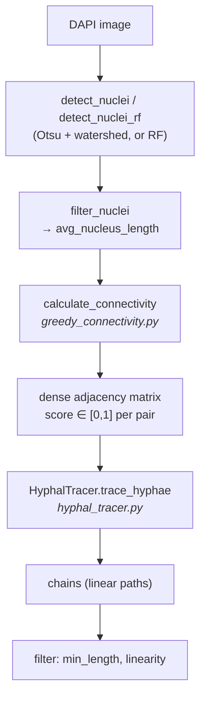

# Deterministic Hyphal Tracing (Deprecated)

> **Scope — deprecated, pre-dates the GCN.** This documents the original **deterministic** approach to tracing hyphal chains: a hand-tuned pairwise scoring function followed by greedy constrained edge selection. It is **superseded by the nuclei-node GCN** and must not be used in the GNN pipeline. It is documented because it *motivated* the GCN — the GCN's edge features and its attention/degree-penalty design are direct answers to this approach's failures. See [Approach History](C_Albicans%20Thesis%20Project/5.%20Results/4.%20GCN%20Design%20and%20Training/Approach%20History.md).
>
> Code (do not import): `dapi_tracing/deprecated/greedy_connectivity.py`, `dapi_tracing/deprecated/hyphal_tracer.py`.

Like the nuclei GCN that replaced it, this approach works on **nuclei** detected from DAPI by classical segmentation (`nuclei_detection.detect_nuclei` — Otsu + optional watershed — or `detect_nuclei_rf`). No deep model and no micro-SAM fine-tuning are involved anywhere.

The pipeline has two stages: **score every pair**, then **greedily select** a subset of pairs that satisfies the biological constraints.

---

## Stage 1 — pairwise scoring (`calculate_connectivity`)

For every unordered pair of nuclei `(i, j)`, three ingredients are combined:

| Ingredient | How | Intent |
| --- | --- | --- |
| **Path intensity** | `profile_line` between the two centroids on the **nuclei-masked** intensity image (`linewidth = w`, default 3), then the mean of the non-zero samples, scaled by `w` | is there a fluorescent "bridge" between them? |
| **Orientation alignment** | `cos θ_ij`, where `θ_ij` is the smaller of the acute angles between the connecting path and each nucleus's major axis; multiplied into the intensity score | a hypha runs *along* its nuclei's long axes |
| **Distance prior** | a Gaussian in the pair's separation, peaked at a characteristic spacing (below) | nuclei in one hypha sit at a characteristic spacing |

The intensity scores are then **min-max normalized across all pairs in the image**, and the final score is:

$$
S_{ij} \;=\; \underbrace{\frac{R_{ij} - \min_{pq} R_{pq}}{\max_{pq} R_{pq} - \min_{pq} R_{pq}}}_{\text{intensity, min-maxed over the image}} \;\times\; \underbrace{\exp\!\left(-\frac{\left(\tfrac{d_{ij}}{L} - \mu\right)^{2}}{2\sigma^{2}}\right)}_{\text{distance prior (Gaussian)}}
$$

where the **raw intensity score** for a pair is

$$
R_{ij} \;=\; \bar{I}_{ij} \cdot w \cdot \cos\theta_{ij}
$$

### What the symbols are

| Symbol | Meaning | Set by |
| --- | --- | --- |
| $S_{ij}$ | final connectivity score for the pair $(i, j)$; the adjacency-matrix entry, in $[0, 1]$ | — |
| $R_{ij}$ | raw (un-normalized) intensity score for the pair | — |
| $\bar{I}_{ij}$ | mean of the **non-zero** samples of the intensity profile drawn between the two centroids, on the nuclei-masked image | data |
| $w$ | profile line width, in pixels — the `path_width` argument | **parameter**, default `3` |
| $\theta_{ij}$ | the smaller of the two acute angles between the connecting path and each nucleus's major axis | data |
| $\min_{pq}, \max_{pq}$ | taken over **all candidate pairs in the image** — this is what makes the intensity term image-relative | data |
| $d_{ij}$ | Euclidean distance between the two centroids, in pixels | data |
| $L$ | `avg_nucleus_length` — the "biological ruler" that converts pixels into nucleus-lengths | data (per image) |
| $\mu$ | **centre** of the Gaussian: the assumed ideal spacing, in nucleus-lengths. The score peaks at exactly $1$ when $d_{ij}/L = \mu$ | **hard-coded**, `5.0` |
| $\sigma$ | **standard deviation** of the Gaussian: the tolerance around $\mu$. At $d_{ij}/L = \mu \pm \sigma$ the prior has fallen to $e^{-1/2} \approx 0.607$ of its peak | **hard-coded**, `sigma = 2.5` |

**On the Gaussian's denominator.** $\exp\!\big(-(x-\mu)^2 / (2\sigma^2)\big)$ is the standard normal kernel. The $2$ is part of that functional form, and it is what makes $\sigma$ *mean* "standard deviation" — remove it and $\sigma$ becomes an arbitrary width knob with no statistical reading. With $\sigma = 2.5$ the denominator evaluates to $2\sigma^2 = 12.5$.

Note there is **no** $1/(\sigma\sqrt{2\pi})$ prefactor: this is a deliberately *unnormalized* Gaussian, because what is wanted is a multiplier peaking at exactly $1$, not a probability density integrating to $1$. That is what keeps the term in $(0, 1]$ so it can multiply cleanly against the min-maxed intensity.

| $d_{ij}/L$ | distance prior | |
| --- | --- | --- |
| $0$ (touching) | $0.135$ | |
| $\mu - \sigma = 2.5$ | $0.607$ | one $\sigma$ below |
| $\mu = 5.0$ | $1.000$ | peak |
| $\mu + \sigma = 7.5$ | $0.607$ | one $\sigma$ above |
| $10.0$ | $0.135$ | |

$\mu$ was not guessed — it came from `hyphal_tracer.calculate_hyphal_spacing_ratio`, which measures the real internuclear-distance-to-nucleus-length ratio. But note $\sigma = \mu/2$ makes the bell very wide relative to its centre, and it is **symmetric in $d_{ij}/L$**, so it penalizes "too close" exactly as hard as "too far": a pair at $2$ nucleus-lengths scores $0.487$, about half credit, despite being *more* plausibly adjacent in a chain than a pair at $8$. That is a biological claim asserted by a constant rather than learned — see the limitations below.

The result is a symmetric adjacency matrix with entries in $[0, 1]$.

### Why cosine for the alignment factor?

A hypha is a tube, and the nuclei inside it are elongated **along** that tube. So a genuine connection between two nuclei of one hypha should run roughly *parallel* to their major axes; a candidate path crossing a nucleus **sideways** is almost certainly not a hyphal connection but two unrelated structures that happen to lie near each other. The factor $\cos\theta_{ij}$ turns that intuition into a number, and it is doing three jobs at once.

**1. It *is* the projection.** $\cos\theta$ is exactly the normalized dot product of the two unit vectors — the path direction and the nucleus's major axis:

$$\cos\theta_{ij} = \left| \hat{u}_{\text{path}} \cdot \hat{u}_{\text{axis}} \right|$$

So it is not an arbitrary decreasing function of the angle; it is the **component of the connecting path that runs along the direction the nucleus is elongated**. That is the geometrically meaningful quantity the intuition above is actually asking for.

**2. It maps the range correctly for a multiplier.** Because $\theta_{ij}$ is folded into $[0, \pi/2]$ (below), $\cos\theta_{ij}$ lands in $[0, 1]$ — exactly the range needed to attenuate the intensity score, with no rescaling:

| $\theta_{ij}$ | $\cos\theta_{ij}$ | |
| --- | --- | --- |
| $0°$ | $1.000$ | path runs straight along the axis — no penalty |
| $30°$ | $0.866$ | |
| $45°$ | $0.707$ | |
| $60°$ | $0.500$ | half credit |
| $90°$ | $0.000$ | path crosses the nucleus sideways — score annihilated |

**3. Its curvature encodes the right tolerance.** This is the part a plain ramp would miss. Near $\theta = 0$, $\cos\theta \approx 1 - \theta^2/2$ — *flat*, so small misalignments cost almost nothing. That matters because `orientation` is itself a noisy `regionprops` estimate, and a nearly-round nucleus has a nearly-arbitrary major axis; a response that punished a few degrees of wobble would be reacting to measurement noise. Near $\theta = \pi/2$ the cosine falls with slope $-1$ — decisive about perpendicularity. A linear ramp $1 - \theta/(\pi/2)$ spans the same endpoints but penalizes the first 10° exactly as hard as the last 10°, which is the wrong shape for this problem.

> **Why the angle must be folded first — and why the fold is load-bearing.** An axis has **no direction**: a nucleus whose major axis points at $10°$ is the same nucleus as one pointing at $190°$. `get_acute_diff` therefore folds the raw difference into $[0, \pi/2]$ (`diff = |a₁ − a₂| mod π`, then `π − diff` if it exceeds $\pi/2$).
>
> That fold is not cosmetic. Without it $\theta$ could exceed $\pi/2$ and $\cos\theta$ would go **negative**, flipping the *sign* of the whole intensity score — turning an anti-aligned pair into a large negative number rather than a weak positive one. Folding guarantees $\cos\theta \in [0, 1]$, so the factor can only ever attenuate, never invert.

**Why the *minimum* of the two angles** ($\theta_{ij} = \min(\theta_i, \theta_j)$) rather than the mean or max: it is deliberately forgiving — the pair is judged by its *better-aligned* endpoint. When a hypha is straight both nuclei share roughly the same orientation and the choice is moot; but **when the hypha turns**, the nucleus on the inside of the bend is misaligned with the connecting path while the other still points along it. Taking the minimum lets one well-aligned endpoint carry the pair, so genuine connections around a bend survive. This idea outlived the tracer: it is exactly the nuclei pipeline's `min_ang` feature ([Adding angle-based edge features](C_Albicans%20Thesis%20Project/5.%20Results/4.%20GCN%20Design%20and%20Training/GCN%20Model%20Experiments.md#Adding%20angle-based%20edge%20features)).

> **What the GCN kept and what it dropped.** It kept the *geometry* — the same folded angles, including `min_ang` — but **dropped the cosine**: `extract_graph.py` normalizes linearly (`min(θ_i, θ_j) / (π/2)`) and hands the result to the model as a bounded feature. The tracer *asserts* that the response to misalignment is a cosine; the GCN supplies the angle and lets the model **learn** the response curve. Same evidence, hand-written rule replaced by a learned one — the pattern that runs through every transition in [Approach History](C_Albicans%20Thesis%20Project/5.%20Results/4.%20GCN%20Design%20and%20Training/Approach%20History.md).

### Why normalize at all?

Pixel intensity (`0–255`) and distance (`0–1000+` px) are **apples and oranges** — they share no common scale. Multiplying them raw would let whichever term happens to carry the larger numeric range dominate the product regardless of what it *means*: a 600-pixel distance would swamp a 200-grey-level intensity for arithmetic reasons alone. Both terms therefore have to be brought onto a common **`0.0`–`1.0`** range before they can be combined into one score.

They get there by **two different routes**, which is worth being precise about:

| Term | Route to `[0, 1]` | Where |
| --- | --- | --- |
| **Intensity** | **Min-max across the image** — take the brightest and dimmest connections among *all* candidate pairs in the frame and rescale linearly: `(x − min) / (max − min)`. | `greedy_connectivity.py:98–102` |
| **Distance** | **Not min-maxed.** Pixel distance $d_{ij}$ is divided by the ruler $L$ into "nuclei units", then passed through the Gaussian — which is bounded to $(0, 1]$ **by construction**, peaking at exactly $1$ when $d_{ij}/L = \mu$ and decaying toward $0$ either side. No image-wide min/max is ever taken over distances. | `greedy_connectivity.py:61–63` |

That asymmetry matters for the critique below: **the fragility of image-relative scaling applies only to the intensity term.** The distance term gets its bound from the Gaussian's shape, so it is stable across images and magnifications — but it pays for that stability by hard-coding *where the peak sits* ($\mu$), which is its own failure mode.

> `avg_nucleus_length` is the "biological ruler" — dividing pixel distance by it makes the score magnification-independent. **This idea survived**: it is exactly the nuclei pipeline's `e_len` normalization, and its descendant in the fragment pipeline is `boundary_dist_norm` (÷ mean major axis). Note the GCN keeps the *ruler* but drops the *Gaussian*: `e_len` is handed to the model as a bounded feature so it can learn the spacing distribution, rather than having one asserted for it.

## Stage 2 — greedy constrained selection (`HyphalTracer.trace_hyphae`)

Signature: `trace_hyphae(min_length=3, linearity_threshold=0.85, connectivity_threshold=0.0, angle_threshold_deg=90)`.

1. **Drop** edges scoring below `connectivity_threshold`.
2. **Sort** the survivors by score, descending — this is the greedy part.
3. **Accept** each edge in turn only if all three constraints hold:
   - **Degree ≤ 2** at both endpoints — a nucleus in an unbranched chain has at most two neighbours.
   - **Acyclicity** — `_find(u) != _find(v)` via **union-find**; endpoints already in the same component are rejected.
   - **Local angle** — if an endpoint already has a neighbour, the angle formed at it must be ≥ `angle_threshold_deg` (default 90°), rejecting sharp turns.
4. **Connected components** of the accepted edges give the chains.
5. **Filter** chains: keep those with `≥ min_length` nuclei and `linearity ≥ linearity_threshold`, where `linearity = euclidean_distance(endpoints) / path_distance` — a straightness test.

Algorithmically this is **Kruskal's maximum-weight spanning forest with a degree-2 cap**: degree ≤ 2 plus acyclicity forces every component to be a simple path, so the output is a greedy path cover of the nuclei.

---

## Why it was abandoned

The approach worked on a single, well-separated hypha and **failed on images containing more than one hypha**. The reasons are structural, not tuning:

1. **Not differentiable, nothing learned.** Every constant is hand-set: the expected spacing $\mu = 5.0$ nucleus-lengths, the tolerance $\sigma = 2.5$, the profile width $w = 3$, the 90° angle floor, the 0.85 linearity floor, `min_length = 3`. Apart from $\mu$ (measured, see below) they were tuned by eye against particular images and do not transfer.
2. **The distance prior is a hard-coded belief.** The Gaussian peaks at exactly 5 nucleus-lengths; a genuinely-connected pair at 2 or 9 lengths is penalized no matter how strong the intensity evidence. The model cannot be told otherwise — the belief is in the source code, not in the data.
3. **Image-relative normalization is fragile.** Min-max normalizing intensity *across the pairs of one image* means a single bright artifact defines the maximum and compresses every real connection toward zero. Every score depends on the worst outlier in the frame. (The GCN docs record the same failure mode being rediscovered later as [within-graph normalization](C_Albicans%20Thesis%20Project/5.%20Results/4.%20GCN%20Design%20and%20Training/GCN%20Data%20Flow.md#Node%20features) and rejected for the same reason — global z-scoring from the training fold is the fix.)
4. **Greedy decisions are irrevocable.** A wrong edge accepted early consumes both endpoints' degree budget *and* unions their components, permanently blocking the correct edges that would have used them. There is no backtracking and no notion of a globally better assignment.
5. **Pairs are scored in isolation.** `score(i, j)` knows nothing about `(i, k)` competing for the same nucleus. Structure is imposed *after* scoring, as hard rejections, rather than informing the score itself — which is precisely why multiple hyphae in one frame break it: the greedy pass cannot represent "these two chains are separate."
6. **Unbranched chains only.** The degree ≤ 2 cap cannot express a branching cell.

> `dapi_tracing/CLAUDE.md` states the operational rule bluntly: *"Since a greedy algorithm is not differentiable and has been shown to fail for images containing multiple hypha cells, these functions must never be used in the GNN approach."*

## What it contributed to the GCN

The approach was not wasted — the GCN is best read as its learned counterpart. Each failure above has a matching design decision:

| Deterministic tracer | Nuclei GCN answer |
| --- | --- |
| Hand-tuned score formula | **Learned** edge scoring — and the tracer's three ingredients became the edge features almost one-for-one: path intensity → `e_int`, `d / avg_nucleus_length` → `e_len`, `min_diff` orientation → `min_ang` (plus `ang1`, `ang2`, `rel_ang`) |
| Hard-coded 5-nucleus distance prior | `e_len` supplied as a *feature*, letting the model learn the spacing distribution from data |
| Image min-max normalization | Global z-score computed **strictly on the training fold** ([Batching](C_Albicans%20Thesis%20Project/5.%20Results/4.%20GCN%20Design%20and%20Training/GCN%20Data%20Flow.md#Batching)) |
| Pairs scored in isolation | **Attention** in the GCN layer — a softmax over each node's incident edges makes candidates *compete* before aggregation ([Attention Mechanism](C_Albicans%20Thesis%20Project/5.%20Results/4.%20GCN%20Design%20and%20Training/GCN%20Design%20Choices.md#2.%20Attention%20Mechanism%20(Attn-MLP))) |
| Hard degree ≤ 2 cap, applied post-hoc | **Soft, differentiable** top-k degree penalty in the loss ([Loss](C_Albicans%20Thesis%20Project/5.%20Results/4.%20GCN%20Design%20and%20Training/GCN%20Training%20Choices.md#Loss)) |
| Union-find acyclicity | Initially attempted explicitly ([Topological DAG Constraint](C_Albicans%20Thesis%20Project/5.%20Results/4.%20GCN%20Design%20and%20Training/Topological%20DAG%20Constraint%20(Abandoned).md)), then deliberately left **implicit** — the labels are always acyclic, and visual features made cycles rare |

## Other functions in these modules

- `greedy_connectivity.plot_nuclei_analysis` — multi-panel figure of the segmentation and the scored network.
- `greedy_connectivity.extract_and_plot_nuclei_axis` — the end-to-end driver for the greedy pipeline.
- `hyphal_tracer.plot_hyphal_reconstruction` — draws accepted chains and rejected chains over the image.
- `hyphal_tracer.calculate_hyphal_spacing_ratio` — measures internuclear distance ÷ nucleus length over the traced chains, i.e. the empirical distribution of $d_{ij}/L$. This is the **measurement that justified $\mu$** in the distance prior; it remains useful as a descriptive statistic of the data independent of the tracer.
