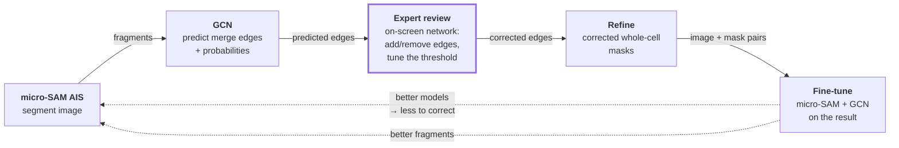

# Future Directions

> **Status: none of this is being done.** The project was wrapped on **2026-07-17** against a deadline, with the pipeline working end to end. This page exists so that whoever picks it up starts from the evidence rather than from the ideas, and knows which ideas the evidence already constrains.

---

## The binding constraint is data, not architecture

Every result in [GCN Model Experiments](C_Albicans%20Thesis%20Project/5.%20Results/4.%20GCN%20Design%20and%20Training/GCN%20Model%20Experiments.md) points the same way, and [§11](C_Albicans%20Thesis%20Project/5.%20Results/4.%20GCN%20Design%20and%20Training/GCN%20Model%20Experiments.md#11.%20Node%20type%20classification) states it most sharply:

| | node accuracy |
| --- | --- |
| Overfitting one graph | **0.9952** |
| Leave-one-out across six | **0.7503** |

**The capacity is there, the loss is fine, the labels are fine.** What fails is generalisation from one image to another. The same shape appears in §1's five-graph CV (fits all five together, predicts implausible structure held out) and §10's fold 4 (a structural generalisation failure, not an implementation artifact).

### Why six images is worse than it sounds

They are not six samples from one distribution. They are six *different pictures*:

| | |
| --- | --- |
| **Channels** | five images are **DIC-only**; image 2 alone carries DIC + fluorescence + DAPI |
| **Composition** | images 0–1 are **hyphae-only**; 2–5 are **coculture** with epithelial cells |
| **Magnification** | a hypha in images 0/1 has a `mean_width` of ~17.5–23.4 px; in the coculture images the epithelial/hyphal boundary sits at **100.6–159.8 px**. A hypha in image 0 is thinner than *anything* in image 5 |
| **Segmentation quality** | background fragments run **2.5% (img 1) to 35.6% (img 2)** — an order of magnitude |
| **Class coverage** | images 0 and 1 contain **no epithelial nodes at all**; images 3 and 4 hold **74%** of all epithelial↔hyphal negatives |

The magnification spread is why the node-type labels need a [per-image threshold](C_Albicans%20Thesis%20Project/5.%20Results/4.%20GCN%20Design%20and%20Training/Node%20Type%20Label%20Construction.md#3.%20Epithelial%20vs%20hyphal). That is a real limit on what "generalise" can even mean here: the target's *definition* is not globally consistent, so under leave-one-out the model is asked to transfer a rule whose calibration it was never shown.

Add to this the **variety of oversegmentation shapes**: AIS splits a hypha differently depending on tile seams and cell length, so a fragment's own shape carries little information about what it belongs to — which is exactly why node types are derived from the *assigned GT cell* and not the fragment.

---

## 1. Synthetic re-oversegmentation of the GT masks

**The idea.** The GT whole-cell masks exist. Any GT cell can be cut into fragments in **arbitrarily many ways**, and each cutting yields a new graph with known-correct merge labels and node types. Training data becomes effectively unbounded without new microscopy.

**Why this is the strongest lever available.** It attacks the exact failure: the model has seen six fragmentations of six images and must generalise to a seventh. It could see thousands. And the labels are *free and exact* — the MST and the node types both fall out of the GT masks that generated the cut, with no `min_overlap_frac` judgement call at all.

**The hard part — the cut must imitate AIS's failure modes, not just be a cut.** Random slicing teaches the model to undo random slicing, which is not the task. The real distribution has structure:

- **tile-seam artifacts** in the reassembled decoder distance maps (splits align to the tiling grid)
- **length-driven splits** of long hyphae
- **fragments that are not cells at all** — the background class has no GT cell to cut from, so it must be synthesised separately or the model will never see one

If the synthetic distribution is wrong, the model learns a fake task and CV on real AIS output will not improve. **The honest test is unchanged: train on synthetic, evaluate on real held-out AIS fragments.**

**What it does not fix.** It multiplies fragmentations, not *imagery*. The six images, their six magnifications and their one-vs-three channel split remain six. If the failure is "this looks like a kind of picture I have never seen", synthetic re-cutting will not touch it.

## 2. Augment the source images, re-run micro-SAM, rebuild the graphs

**The idea.** Rotate/flip the source images, run micro-SAM AIS on each variant, take the masks it produces, and build additional graphs.

⚠️ **The augmentation must go *through* the segmenter — that is the entire value.** The tabular features are invariant to 90° rotations and flips **by design**, and this is not speculative: see [Rotation and translation invariance](C_Albicans%20Thesis%20Project/5.%20Results/4.%20GCN%20Design%20and%20Training/Cell%20Mask%20Graph%20Data%20Flow.md#Rotation%20and%20translation%20invariance%20of%20the%20six%20added%20features) and [§1](C_Albicans%20Thesis%20Project/5.%20Results/4.%20GCN%20Design%20and%20Training/GCN%20Model%20Experiments.md#Rotation%20augmentations). Rotating the image and rebuilding the graph from the *same* masks gives the tabular branch a **byte-identical** input. Zero signal.

The signal comes from three places, in descending order:

1. **micro-SAM is not rotation-equivariant.** Segment the rotated image and you get a **genuinely different fragmentation** — different splits, different background calls. This is new data, and it is the same mechanism as §1 (a new fragmentation) obtained for free rather than synthesised.
2. **The visual branch is not invariant.** It reads **axis-aligned** RoI boxes, so a diagonal filament's crop differs substantially from the same filament laid flat.
3. **Arbitrary-angle rotations resample the raster**, perturbing intensity-derived features — but this is *resampling noise*, not biology, and is the weakest of the three.

**Why it is attractive.** It samples micro-SAM's *own* error distribution rather than a guess at it — sidestepping §1's central risk. **Why it is limited:** four rotations × two flips is 8× at most, and the variants are far from independent. It cannot manufacture a magnification or a channel the dataset does not have.

## 3. More model parameters

**The idea.** `hidden_channels = 64` (CV) / `128` (the visual experiments). A larger trunk may learn more.

**The evidence says this is not the bottleneck, and should not be first.** The current model **overfits a single graph to AUC 1.0000 and node accuracy 0.9952**. A model that can already fit the training data perfectly is not capacity-limited — it is data-limited, and adding parameters to a data-limited model widens the train/test gap rather than closing it. §2's hidden-size experiments and §10's whole arc (label smoothing, GraphNorm — all *regularisation*) point the same way.

**When it becomes worth doing:** *after* §1 or §2 has grown the dataset by an order of magnitude. Then capacity plausibly binds and this is the natural next knob.

## 4. More data

The direct answer, and the one everything else approximates. Two distinct goals, requiring different data:

- **A specialised network** — more images *of the same kind*. Fewer confounds, a genuinely learnable per-modality rule, and `mean_width` thresholds that might stop being per-image.
- **A generalised network** — more *diverse* images. Harder, needs far more, and needs the label definition to become scale-free first (see the caveat below).

⚠️ **Before chasing generality, fix the label definition.** `mean_width` is in **pixels** ([why it was still chosen](C_Albicans%20Thesis%20Project/5.%20Results/4.%20GCN%20Design%20and%20Training/Node%20Type%20Label%20Construction.md#3.%20Epithelial%20vs%20hyphal)). A generalised model cannot be trained against a target that needs a hand-set threshold per image. Either calibrate to a physical scale (µm/px from the microscope metadata — the cleanest fix, and it makes `mean_width` transfer directly) or find a dimensionless metric that beats it. Every dimensionless candidate tried lost: `extent` and `solidity` call spiky epithelial cells filaments, `axis_ratio`'s cutoff lands inside the hyphal population, `eccentricity` saturates.

## 5. The human-in-the-loop self-improving pipeline

**The loop, with the expert inside it:**



Each stage already works except the review step. The proposal is to **close the loop through a human**: the GCN proposes, an expert corrects, and the corrected result trains both models — so each round improves the other's input **and reduces the correction burden of the next round**.

**The expert's two controls, in increasing effort:**

1. **Move the probability threshold.** One slider over the whole graph. Most images will be mostly right at *some* cut, and the [probability violins](C_Albicans%20Thesis%20Project/5.%20Results/4.%20GCN%20Design%20and%20Training/GCN%20Model%20Interpretation.md#Predicted-probability%20violins) already show that the separation exists but the cut point varies — which is exactly the thing a human reads off a picture in a second and a fold-fitted constant cannot.
2. **Edit individual edges.** Add a merge the model missed, drop one it invented. This is where the remaining labour is, and it is what should shrink over rounds.

**This is the answer to error accumulation.** The risk with a fully unsupervised loop is that training on your own predictions reinforces your own mistakes, and the current predictions are **not clean enough to trust**: edge AUC 0.88 but PR-AUC 0.41, and the merge tally still reports structurally impossible cells (`branched` and `cyclic` are [counted, not prevented](C_Albicans%20Thesis%20Project/5.%20Results/4.%20GCN%20Design%20and%20Training/Cell%20Mask%20Graph%20Data%20Flow.md#Inference%20merge)):

> `Merge/Graph_0_summary` — **75 cells: 51 singleton, 17 path, 2 branched, 5 cyclic**
> `Merge/Graph_1_summary` — **12 cells: 6 singleton, 4 path, 2 cyclic**
>
> *Source: `cv_experiment/nodetype/nodetype_cv_k10_minFrac0_1_visual/fold_{1,2}/events*`.*

**7 of 75** and **2 of 12** predicted cells cannot exist biologically. Recycling those unsupervised would teach micro-SAM to produce them. **With an expert in the loop the data entering fine-tuning is corrected, not predicted** — so it is ground truth, and the accumulation problem does not arise. The confidence gate and the topology check stop being safety mechanisms and become **triage**: surface the low-probability and structurally-impossible cells *first*, because those are where the expert's attention is worth most.

### Better segmentation removes failures the GCN cannot fix

The loop is usually argued for as *more training data*. The stronger argument is that **fine-tuning micro-SAM attacks the GCN's input**, and two of the three AIS failure modes are ones the merge network cannot properly address at all:

| AIS failure | Can the GCN fix it? |
| --- | --- |
| **Oversegmentation** — one cell split into fragments | **Yes.** This is precisely its job, and it does it: edge AUC 0.88. |
| **Background called a cell** | **Barely.** The node head was built for this and reaches only **background F1 0.41** ([§11](C_Albicans%20Thesis%20Project/5.%20Results/4.%20GCN%20Design%20and%20Training/GCN%20Model%20Experiments.md#11.%20Node%20type%20classification)). It flags some, unreliably. |
| **Undersegmentation** — one mask fusing two GT cells | **No — structurally impossible.** |

**Undersegmentation is the important one.** The GCN only ever *merges* fragments; it has no operation that splits one. A mask fusing two cells cannot be repaired by any edge prediction, however good the model gets. Worse, it is not merely unhandled — **it silently corrupts the labels**: majority overlap assigns the fused mask to one of the two cells ([Not addressed: under-segmentation](C_Albicans%20Thesis%20Project/5.%20Results/4.%20GCN%20Design%20and%20Training/Cell%20Mask%20Graph%20Data%20Flow.md#Not%20addressed:%20under-segmentation)), so the other cell's supervision is quietly wrong and nothing downstream can detect it.

**Only a better segmenter fixes that.** This reframes the loop's payoff: each round of fine-tuning does not just hand the GCN more examples, it hands it a **cleaner problem** — fewer background fragments to reject, fewer fused masks poisoning the labels, and a candidate graph whose nodes are more often real cells. The GCN's task gets easier as the segmenter improves, which is a different and more durable mechanism than simply training the GCN harder.

It also means the two models improve on **different** axes rather than competing: micro-SAM removes the failures the GCN cannot express, and the GCN supplies the whole-cell targets micro-SAM needs to learn from. That mutual dependency is the actual argument for closing the loop, and it does not depend on the GCN ever getting much better than it is now.

### The export already exists; the editor does not

Every CV/overfit run already writes the review surface as a sidecar:

```
prediction_graph_<id>.graphml
  nodes: ais_label  (maps back to the AIS mask)
         x, y       (centroid — an on-screen layout for free)
         cell       (the merged cell it was assigned to)
  edges: prob       (the threshold slider)
         edge_class (TP/FP/FN/TN), true_label, a1, a2
```

*Example: `fold_1/prediction_graph_0.graphml` — 141 nodes, 76 predicted edges.*

**GraphML was chosen precisely so igraph / Cytoscape / Gephi can open it**, which makes those a viable zeroth iteration of the review UI — no code needed to start. What is missing is the round trip: an edited graph coming *back* as labels, and `ais_label` is the join key that makes that possible. A purpose-built tool would beat Cytoscape by showing the **microscopy image underneath** the network, which is the context the decision actually needs — and `plot_edge_predictions` already renders exactly that view, minus interactivity.

### What to measure

The point of the loop is that **human effort per image falls over rounds**. That is the success metric, and it is more informative than AUC here: track **edits per image** (and time per image) across rounds. A round that improves AUC but not the edit count has not made the pipeline cheaper to run.

⚠️ Still required: **a held-out set with real GT that never enters the loop**. Expert-corrected data is training data, not evaluation data — an expert who has seen the model's proposal is anchored by it, so measuring on their corrections would flatter the model. Without an untouched held-out set, improvement cannot be distinguished from drift.

**Wiring this up is itself the future work** — the models are in place, the export is in place, the review tool and the round trip are not.

## 6. Mixture of experts, routed by modality

**The idea.** Route each image to an expert trained on its modality — coculture / DIC / fluorescence / smFISH — instead of asking one model to span all of them. Attractive precisely because the current dataset's heterogeneity is the diagnosed problem.

⚠️ **It needs *more* data than a single model, not less.** An MoE partitions the data among experts; each expert then trains on a **subset**. With six images the partition is roughly one image per expert, which is strictly worse than the current situation. **This is the last item on the list, not the first** — it only makes sense once each modality independently has enough images to train on, at which point the interesting question is whether a shared trunk with per-modality heads beats separate models outright.

**What makes it worth keeping in view:** it is the honest structural answer to "the modalities are too distinct." If they really are too distinct to share one representation, forcing them to is the mistake — but the fix costs data.

---

## What would make any of this measurable

The current evaluation cannot resolve small effects, and that limits every proposal above:

- **n = 6, one repeat.** §11's headline (AUC +0.036 on 6/6) has no seed-variance estimate, and the folds share five-sixths of their training data, so they are not independent.
- **Restore repeats.** The visual experiments ran **3 × 6**; the node-type comparison ran **1 × 6**. Three repeats is the minimum for separating an effect from a seed.
- **Beware the fitted threshold.** F1's threshold is chosen on the held-out graph itself ([§11](C_Albicans%20Thesis%20Project/5.%20Results/4.%20GCN%20Design%20and%20Training/GCN%20Model%20Experiments.md#11.%20Node%20type%20classification)), so F1 flatters. **Judge on AUC and PR-AUC.**
- **Know the ceiling.** At `k=10`, 6/483 true merges (1.2%) are not candidate edges at all, so **merge recall caps at 98.8%** regardless of the model.

## Recommended order

1. **§2 (augment → re-segment → rebuild)** — cheapest, samples micro-SAM's real error distribution, needs no new microscopy. Restore 3 repeats at the same time.
2. **§5 (the human-in-the-loop review tool)** — the highest-leverage build. It is the only item that **produces new ground truth** rather than recycling what exists, and every other item benefits from more of it. The export already exists; Cytoscape is a zero-code first iteration. It also makes §4 affordable, because labelling a new image stops being a from-scratch job and becomes a correction pass.
3. **§1 (synthetic re-oversegmentation)** — the biggest multiplier, but only pays if the cut imitates AIS's real failure modes; validate against §2's distribution.
4. **§4 (more data)** — the real answer; fix the pixel-scale label definition first. Much cheaper once §5 exists.
5. **§3 (more parameters)** — only once the data has grown.
6. **§6 (mixture of experts)** — only once each modality has its own dataset.

> §5 moved up on reflection: it was originally listed behind "close the loop safely", but with an expert inside the loop the safety problem is solved by construction, and what remains is a tooling job whose output is **labelled data** — the one thing every other item on this page is trying to work around.
