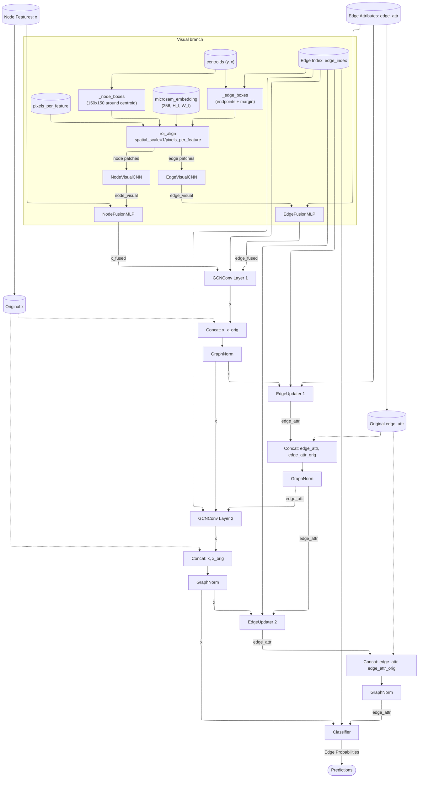
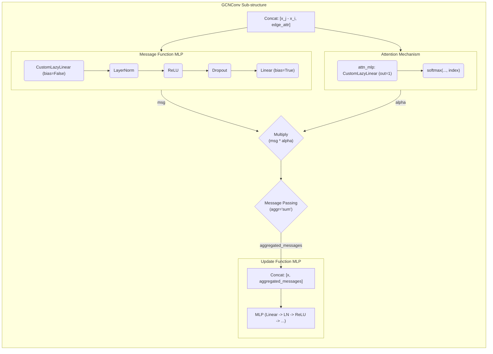
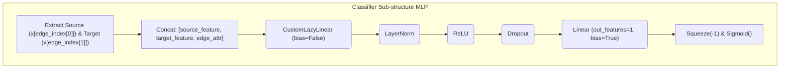
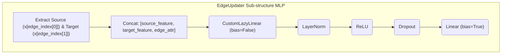

# GCN Model Mermaid Diagram

The following diagrams visualize the overall data flow and the internal sub-structures of the `Model` defined in `simple_gnn.py`.

> **Scope — applies to both pipelines.** The architecture drawn here is **shared and live**: identical for the historical **nuclei** pipeline and the current **cell-fragment merge** pipeline. Only the input dimensions differ — `node_feature_dim=8`, `edge_feature_dim=10` for fragments (historically 6 / 6) — along with the RoI box source feeding the visual branch. Full breakdown: [Nuclei vs. cell-fragment](C_Albicans%20Thesis%20Project/5.%20Results/4.%20GCN%20Design%20and%20Training/Cell%20Mask%20Graph%20Data%20Flow.md#Nuclei%20vs.%20cell-fragment%20—%20what%20carries%20over).

## 1. Overall Model Architecture

The diagram shows the full flow with the optional [Visual branch](C_Albicans%20Thesis%20Project/5.%20Results/4.%20GCN%20Design%20and%20Training/GCN%20Design%20Choices.md#Visual%20branch) enabled. When `use_visual_features=False`, the two `FusionMLP` nodes and everything feeding into them are skipped and `x` / `edge_attr` flow directly into the first GCN layer.

  

## 2. GCN Layer Architecture

  

  

## 3. Classifier Architecture

  

  

## 4. EdgeUpdater Architecture

  

