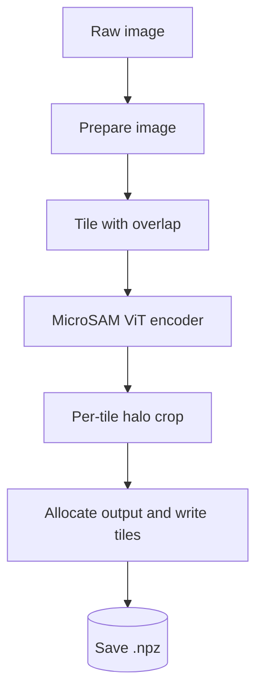
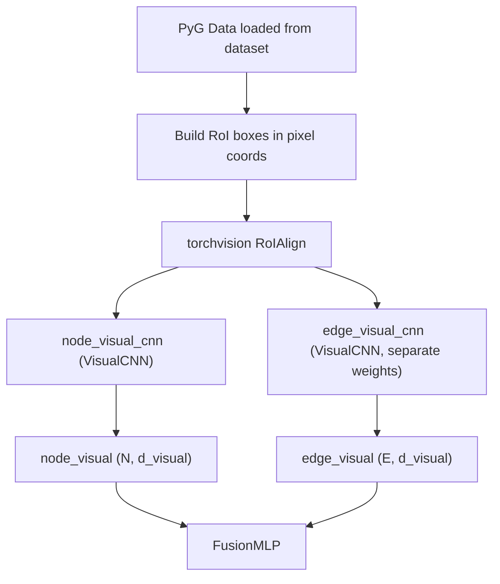

# GCN Visual Feature Data Flow

End-to-end data flow from raw fluorescence image to the per-node and per-edge visual feature vectors fed into the [Visual branch](C_Albicans%20Thesis%20Project/5.%20Results/4.%20GCN%20Design%20and%20Training/GCN%20Design%20Choices.md#Visual%20branch).
Dimensions use a concrete example: **2304×2304 px image**, `tile_shape=(512,512)`, `halo=(64,64)`, `d_visual=16`, `roi_output_size=7`, `node_box_size=150`, two channels (DAPI + DIC).

> **Scope — shared and live; the worked example is nuclei-era.** The branch itself is **common to both pipelines** — only the RoI **box source** differs. The step-by-step example below uses the historical **nuclei** pipeline, where node RoI boxes are fixed squares around centroids (`node_box_size=150`) and edge boxes span the two centroids.
>
> In the live **cell-fragment** pipeline, node boxes are each fragment's **mask bbox** (padded by `node_bbox_pad_frac`) and edge boxes the **union of endpoint mask bboxes** — see [Build RoI boxes](#Build%20RoI%20boxes). It also sources the feature map from micro-sam's saved tiled embedding store via `load_and_stitch_saved_embeddings` rather than recomputing it. Everything after box construction — `roi_align`, `spatial_scale`, `VisualCNN`, `FusionMLP` — is identical, so the shapes below hold for both.
>
> See [Cell Mask Graph Data Flow](C_Albicans%20Thesis%20Project/5.%20Results/4.%20GCN%20Design%20and%20Training/Cell%20Mask%20Graph%20Data%20Flow.md) and the full breakdown in [Nuclei vs. cell-fragment](C_Albicans%20Thesis%20Project/5.%20Results/4.%20GCN%20Design%20and%20Training/Cell%20Mask%20Graph%20Data%20Flow.md#Nuclei%20vs.%20cell-fragment%20—%20what%20carries%20over).

---

## Precomputation (offline — MicroSAM conda env)



### Prepare image

`_prepare_image` averages the two input channels and triplicates the result to produce an RGB tensor (SAM expects three channels; duplicating the channel mean preserves the intensity distribution at the pretrained ViT input — zero-padding would distort statistics). Spatial dimensions are then zero-padded up to a multiple of `tile_shape` so that the full padded image tiles evenly.

Padding is applied only to the **bottom and right** edges (`np.pad(img, ((0, pad_h), (0, pad_w), (0, 0)))`), not symmetrically on all four sides. The top-left origin is kept fixed so that centroid pixel coordinates from the unpadded image remain valid in the padded image without any offset correction. A consequence is that the top and left image-boundary tiles still have no halo on those sides — the asymmetry is handled at crop time (see [Per-tile halo crop](#Per-tile%20halo%20crop)).

With the example inputs: `2304 % 512 = 256`, so 256 px of padding are added on the bottom and on the right. The result is `(2560, 2560, 3)`.

### Tile with overlap

The padded image is split into `5 × 5 = 25` inner tiles of `512 × 512`. Each inner tile is expanded by the halo of 64 px per side, so the encoder receives `640 × 640` outer tiles. Tiles on the image boundary have asymmetric halos (the halo is clipped on the outside edge).

### MicroSAM ViT encoder

The SAM image encoder internally resizes every input to a fixed `1024 × 1024` regardless of the input tile size. The ViT uses a patch size of `16 × 16` px, producing `1024 / 16 = 64` patches per side. Each patch is projected to a 256-dimensional token, so the output for each tile is a feature grid of shape `(256, 64, 64)` — 256 channels, 64 × 64 spatial locations.

### Per-tile halo crop

The `(256, 64, 64)` grid covers the full outer tile (`640 × 640` px), so the halo region needs to be cropped back out before stitching. The crop boundaries in feature coordinates scale proportionally with the halo in pixel coordinates:

$$
\text{feat\_beg} = \text{round}\!\left(\frac{\text{halo\_px} \cdot 64}{\text{outer\_px}}\right), \qquad \text{feat\_end} = \text{round}\!\left(\frac{(\text{halo\_px} + \text{inner\_px}) \cdot 64}{\text{outer\_px}}\right)
$$

For a non-edge tile: `feat_beg = round(64 · 64 / 640) = 6`, `feat_end = round(576 · 64 / 640) = 58`, giving a cropped grid of `(256, 52, 52)`.

**Edge tiles.** Image-boundary tiles have asymmetric halos: the halo is clipped at the outside edge by `nifty_blocking.getBlockWithHalo`, which returns the actual clipped `outer` block rather than a uniform `tile + 2·halo` box. The crop formula above stays correct because it divides by *this tile's* `outer_h` / `outer_w` rather than a fixed constant — and because the SAM encoder resizes every tile (regardless of outer size) to a fixed 1024×1024 internally, so its output is always a 64×64 feature grid covering the clipped outer block. For each boundary tile, the crop therefore only removes halo on the sides that actually carry halo:

- **Top-left corner tile.** `outer_h = outer_w = 576` (halo only on the bottom/right side), `halo_offset_h = halo_offset_w = 0`. So `feat_beg_h = feat_beg_w = 0` (no crop on the top/left) and `feat_end_h = feat_end_w = round(512 · 64 / 576) = 57`, giving a `(256, 57, 57)` crop.
- **Bottom-right corner tile.** The bottom/right halo regions sit entirely inside the zero-padded region added in [Prepare image](#Prepare%20image), so cropping them out discards the padding, not real image content.

**Bilinear resize to match the target slot.** After cropping, the number of feature slots in the crop rarely matches the target slot count in the stitched output exactly — for a non-edge tile the crop is 52 slots wide but the target is 51 (`inner_px / pixels_per_feature = 512 / 10 = 51.2` → 51), and for edge tiles the proportional rounding in the crop formula yields similar ±1 mismatches. The code therefore calls `F.interpolate(..., mode='bilinear', align_corners=False)` to resize the crop to the exact target slot size before writing it into the output.

Bilinear interpolation maps a 2D grid to a new `(H, W)` by, at each output location, taking a weighted average of the 4 surrounding input cells, with weights proportional to how close the output-cell center sits to each input-cell center. It is smooth, continuous, and introduces no new blockiness at tile seams. It is chosen over the alternatives because:

1. **Nearest-neighbour** would produce hard discontinuities at every tile boundary, which is visible in downstream feature gradients.
2. **Bicubic** is more expensive and, because its kernel has negative lobes, can overshoot and produce values outside the range of the input features — undesirable for a learned embedding where linear combinations are the natural structure.
3. Bilinear matches the same interpolation assumption that `torchvision.roi_align` later uses when sampling this feature map, so the two stages are consistent.

### Allocate output and write tiles

One feature-map location spans

$$
\text{pixels\_per\_feature} = \frac{\text{tile} + 2 \cdot \text{halo}}{64} = \frac{512 + 128}{64} = 10 \text{ px/feat}.
$$

The full output array has spatial size

$$
\left\lceil \frac{\text{padded\_image\_px}}{\text{pixels\_per\_feature}} \right\rceil = \lceil 2560 / 10 \rceil = 256 \text{ feature locations per side},
$$

so the allocated array is `(256, 256, 256)` — the first 256 is the channel dimension from the ViT, the last two are the stitched spatial dimensions. Each cropped (and resized) tile is written into the corresponding row/column slot.

### Save .npz

The output file stores `feature_map` as `float32 (256, 256, 256)` and `pixels_per_feature` as `float32 = 10.0`.

---

## Training-time (GPU)



### PyG Data

Each batch provides `data.microsam_embedding` `(B, 256, 256, 256)`, `data.pixels_per_feature` `(B,)`, `data.centroids` `(total_nodes, 2)` in `(y, x)` pixel coordinates, and `data.edge_index` `(2, E)`.

### Build RoI boxes

Node boxes are squares of side `node_box_size = 150` px centered on each centroid (centroid ± 75 px), producing `(N, 4)` boxes in `xyxy` format. Edge boxes are the bounding box of the two endpoint centroids, padded by `max(edge_box_margin_frac · max(w, h), edge_box_margin_floor)` — with the defaults `0.15` and `20 px` — producing `(E, 4)` boxes. A batch-index column is prepended to each, giving the `(N, 5)` and `(E, 5)` tensors torchvision's `roi_align` expects.

**Mask-bbox variant.** `_node_boxes` / `_edge_boxes` take an optional `node_bboxes` argument. When `data.node_bboxes` `(N,4)` is present (the cell-fragment pipeline), node boxes are each fragment's mask bbox padded by `node_bbox_pad_frac`, and edge boxes are the union of the two endpoints' padded bboxes — replacing the centroid-square / centroid-bbox defaults. When it is absent (the nuclei pipeline) the behaviour above is used, so a single code path serves both.

**Every edge box is computed twice.** `_edge_boxes` takes the min/max union of its two endpoints' boxes, which is **order-independent** — so the `A → B` and `B → A` rows of an undirected pair produce *identical* boxes. Since `T.ToUndirected()` emits both directions, **half of the edge RoIs are duplicates**. See [Edge RoI deduplication](#Edge%20RoI%20deduplication) for what is done about it.

Note the asymmetry with the tabular features: `edge_attr` rows for the two directions are **not** identical (`node1_angle_diff` / `node2_angle_diff` swap — see [GCN Data Flow](C_Albicans%20Thesis%20Project/5.%20Results/4.%20GCN%20Design%20and%20Training/GCN%20Data%20Flow.md#Data%20preprocessing)), but the visual box genuinely is. The visual branch has no notion of direction — it crops a region of the image, and the region does not care which way you traverse it.

### RoIAlign

`spatial_scale = 1 / pixels_per_feature = 0.1` maps pixel-coordinate boxes into the `(256, 256, 256)` feature map. For each RoI, torchvision:

1. **Divides the RoI into a `7 × 7` grid of bins** (output_size). No quantization of the RoI to integer feature coordinates is performed; with `aligned=True` the RoI is shifted by half a pixel so sampling locations line up with feature-cell centers.
2. **Samples `2 × 2 = 4` points per bin** at fixed sub-pixel locations (the default `sampling_ratio` yields roughly `ceil(bin_size)` samples per axis; for typical box sizes this is 2).
3. **Bilinearly interpolates** the feature map at each sample point, using the four surrounding feature-grid values. This is what distinguishes RoIAlign from RoIPool — no hard coordinate quantization and no discretization artifacts.
4. **Average-pools the 4 sampled values per bin** to produce one activation per bin.

The result is `(K, 256, 7, 7)` — `(N, 256, 7, 7)` for node patches and `(E, 256, 7, 7)` for edge patches.

### Edge RoI deduplication

Because an edge's box is order-independent, the two directions of each pair crop the **same** region and push the **same** patch through the same CNN. Half the edge-branch work was redundant. `_visual_features` now crops and encodes each undirected pair **once**, then scatters the result back to both directions (`simple_gnn.py:397-413`):

```python
u, v = edge_index[0], edge_index[1]
# centroids.size(0) is the batch's total node count, so node ids never
# collide across graphs -- this key is unique per undirected pair in the batch.
pair_key = torch.minimum(u, v) * centroids.size(0) + torch.maximum(u, v)
_, inverse, = torch.unique(pair_key, return_inverse=True)[:2]

# One representative row per pair. Any occurrence will do -- they share a box.
n_pairs = int(inverse.max().item()) + 1 if inverse.numel() else 0
rep = torch.zeros(n_pairs, dtype=torch.long, device=inverse.device)
rep.scatter_(0, inverse, torch.arange(inverse.numel(), device=inverse.device))

edge_patches = roi_align(feat, edge_rois[rep], ...)   # E/2 rows, not E
edge_visual  = self.edge_visual_cnn(edge_patches)[inverse]   # scattered back to E
```

**Why the key is safe:** `pair_key` multiplies by the **batch's total node count**, not a per-graph count, so ids from different graphs in the batch cannot collide. `rep` picks an arbitrary occurrence of each pair — legitimate precisely because both occurrences share a box.

⚠️ **This is not bit-identical to the pre-dedup path.** Halving the batch changes the offsets at which patches sit in the batched convolution, and float32 addition is not associative, so identical patches reduce in a different order and results drift by **~3e-8**. That is far below the feature scale and below anything the downstream LayerNorm'd fusion could notice, but it is not zero: `tests/scene_graph_network/test_edge_visual_dedup.py` pins the tolerance at `atol=1e-6` rather than asserting equality. Runs before and after will not reproduce each other exactly.

### VisualCNN

Applied independently to node and edge patches (separate weights, identical architecture):

```
Input               (K, 256, 7, 7)
Conv2d 256→64, kernel 3×3, padding 1, ReLU   →  (K, 64, 7, 7)
Conv2d 64→32,  kernel 3×3, padding 1, ReLU   →  (K, 32, 7, 7)
AdaptiveAvgPool2d(1)                         →  (K, 32, 1, 1) → flatten (K, 32)
Linear 32 → d_visual                         →  (K, 16)
```

The `padding=1` on the 3×3 convs keeps the spatial dimension fixed at 7×7 until the global average pool collapses it.

### FusionMLP

`cat(tabular, visual) → LazyLinear → LazyBatchNorm1d → ReLU → Dropout → Linear`, outputting `(N, hidden_channels)` for nodes and `(E, hidden_channels)` for edges. Node and edge streams have separate `FusionMLP` instances.

---

## Key dimension reference

| Stage | Tensor | Shape (example) |
| --- | --- | --- |
| Raw image | `image` | `(2304, 2304, 2)` |
| Padded RGB for SAM | `img_padded` | `(2560, 2560, 3)` |
| Per-tile SAM output | `tile_features` | `(256, 64, 64)` per tile |
| Stitched feature map | `data.microsam_embedding` | `(256, 256, 256)` |
| pixels_per_feature | `data.pixels_per_feature` | `10.0` |
| spatial_scale for RoIAlign | — | `0.1` |
| Node RoI patch | — | `(N, 256, 7, 7)` |
| Edge RoI patch | — | `(E, 256, 7, 7)` |
| After Conv2d stack + pool | — | `(K, 32)` |
| Visual feature vector | `node_visual` / `edge_visual` | `(N, 16)` / `(E, 16)` |