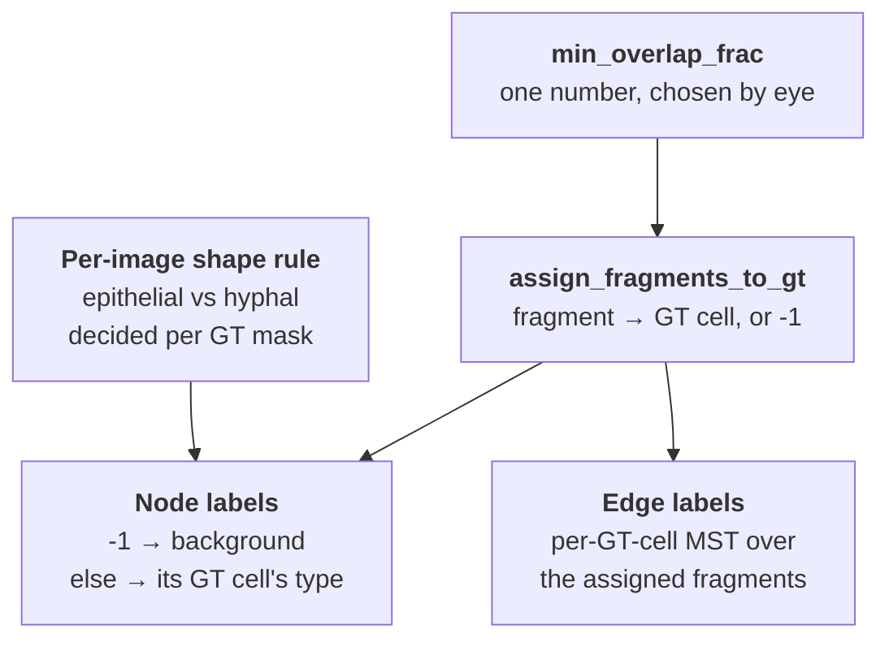

# Node Type Label Construction

How the ground-truth **node-type** targets (`background` / `epithelial` / `hyphal`) are built for the node-type head, and how the same decision produces the **edge** labels. The interactive build is `notebooks/3. GNN/11_Node Type Classification.ipynb`, which inspects labels and **does not train**; training is `12_Node Type GNN.ipynb`.

For why a node head exists at all and what it bought, see [GCN Model Experiments §11](C_Albicans%20Thesis%20Project/5.%20Results/4.%20GCN%20Design%20and%20Training/GCN%20Model%20Experiments.md). For the graph these labels attach to, see [Cell Mask Graph Data Flow](C_Albicans%20Thesis%20Project/5.%20Results/4.%20GCN%20Design%20and%20Training/Cell%20Mask%20Graph%20Data%20Flow.md).

---

## The one decision everything hangs off

Both label sets come off a single choice — the **background / cell split**, `min_overlap_frac`:



Raising the threshold moves a fragment out of its GT cell, which **both** relabels it background **and** deletes the true merge edges it had to its cell-mates. The two label sets cannot be tuned independently, and the value used for one must be the value used for the other — `node_type_labels` says so in its docstring (`cell_type_labels.py:73`).

**Settled value: `min_overlap_frac = 0.1`.**

## Where these numbers come from

Every table below is reproduced from a source you can re-run or read:

| Numbers | Source |
| --- | --- |
| Background sweep, overlap histogram | `11_Node Type Classification.ipynb` §2 (cell 5) |
| `mean_width` percentiles, 2-means suggestions | `11_Node Type Classification.ipynb` §3 (cell 11) |
| GT cells per class | `11_Node Type Classification.ipynb` §3 (cell 13) |
| Node-label distribution | `11_Node Type Classification.ipynb` §4 (cell 15) |
| Edge counts, endpoint-type pairs, recall ceiling | `11_Node Type Classification.ipynb` §4 (cell 17) |

> ⚠️ **The notebook's outputs are not in git.** `nbstripout` strips them on commit, so **the tables below are the durable record** — the notebook carries the code that regenerates them, not the numbers themselves. Re-run it to reproduce. Every figure quoted here was read off an actual execution, not recalled.

---

## 1. Inputs

Per sample in `notebooks/3. GNN/merge_oversegmentation_data.json`:

- `image` — the channel paths. Summed to one 2D intensity image via `ImageContainer([channels], config).merge()`; this is what the intensity features read and the figures' grayscale backdrop.
- `ais` — the micro-SAM AIS instance map. **The node set.**
- `label` — the GT whole-cell instance map. **The supervision.**
- `cell_type` — the per-image shape rule (§3).

Six images, 771 fragments, 214 GT cells. Preprocessing mirrors notebooks 10 and 12 exactly (`outlier_percentile 0.35`, `16bit`, per-sample `correct_DIC_shift`) so the fragments carrying labels are the same objects the merge GNN trains on.

## 2. The background / cell split

`assign_fragments_to_gt(ais, gt, min_overlap_frac)` assigns each fragment to the GT cell it overlaps most, returning `-1` when that overlap is below `min_overlap_frac` **of the fragment's own area**. The `-1` nodes are background; the rest are cell fragments that carry a type and form edges.

**Why the fragment's own area, not the GT cell's:** fragments are pieces. A correct fragment of a long hypha covers a small share of that GT cell but nearly all of *itself* — normalising by the GT cell's area would call every fragment of a large cell background.

### Background share by threshold

| `frac` | img0 | img1 | img2 | img3 | img4 | img5 | **ALL** |
| --- | --- | --- | --- | --- | --- | --- | --- |
| 0.01 | 6.4% | 1.9% | 35.6% | 6.8% | 3.5% | 32.3% | 9.5% |
| 0.05 | 7.1% | 2.5% | 35.6% | 8.2% | 4.2% | 32.3% | 10.2% |
| **0.1** | **7.1%** | **2.5%** | **35.6%** | **9.7%** | **5.6%** | **32.3%** | **10.9%** |
| 0.2 | 7.1% | 2.5% | 39.0% | 15.0% | 8.5% | 33.8% | 13.2% |
| 0.3 | 7.8% | 2.5% | 44.1% | 17.9% | 16.9% | 33.8% | 16.1% |
| 0.5 | 9.9% | 3.2% | 54.2% | 35.7% | 40.1% | 41.5% | 27.1% |
| 0.7 | 18.4% | 16.6% | 64.4% | 70.5% | 68.3% | 64.6% | 48.6% |

*Source: notebook 11 cell 5.*

**Images 2 and 5 are the badly segmented ones** — a third of their fragments are background at any threshold, against 2–10% elsewhere. That is AIS's failure, not the threshold's, and it survives into the results: those two images are where the node head does most of its work (see [§11](C_Albicans%20Thesis%20Project/5.%20Results/4.%20GCN%20Design%20and%20Training/GCN%20Model%20Experiments.md)).

### Why 0.1

Each fragment's overlap with its best GT cell (n=771; 71 sit at exactly 0.0):

```
  0.0-0.1 | ######################                        84
  0.1-0.2 | ####                                          18
  0.2-0.3 | ######                                        23
  0.3-0.4 | #######                                       29
  0.4-0.5 | ##############                                55
  0.5-0.6 | ####################                          78
  0.6-0.7 | #######################                       88
  0.7-0.8 | #####################                         81
  0.8-0.9 | #######################################       147
  0.9-1.0 | ############################################# 168
```

*Source: notebook 11 cell 5.*

The distribution is **bimodal**: a spike at 0.0–0.1 (fragments on nothing — 84, of which 71 touch no GT pixel at all) and a mass above 0.4 (fragments squarely inside a cell), separated by a **valley across 0.1–0.4** holding 70 fragments in total (18 + 23 + 29). The floor of that valley is the 0.1–0.2 bin, with **18 fragments** — the emptiest bin in the histogram. `0.1` sits at the near edge of that floor, so it separates the two populations while moving the fewest ambiguous fragments.

**Why not higher.** A threshold in the dense region is a coin flip for many fragments, and every fragment it moves also loses its true edges. At 0.5 the background share nearly triples (10.9% → 27.1%) — that is not AIS getting worse, it is the threshold reclassifying good fragments and deleting their merges.

The choice was made by **looking at the overlay** (notebook 11 §2), not from the table: green = assigned to a GT cell, red = background, over the grayscale image. A red fragment sitting on a real cell is one the cutoff is discarding wrongly. Cell 9 crops to exactly the fragments two thresholds disagree about, which is what makes the judgement tractable.

## 3. Epithelial vs hyphal

**The type is decided once per GT mask, then propagated to that mask's fragments.** This is the load-bearing decision in the whole scheme.

**Why not from the fragment's own shape:** a fragment of a hypha is often round on its own — that is precisely what oversegmentation does to a filament. Only the **whole GT cell** carries the shape that separates the classes. Labelling from fragment shape would make the target a restatement of the existing node features (`circ`, `ecc`, `maj`, `min`, `sol` are all already inputs) and the head would learn nothing but a lookup. Labelling from the assigned GT cell forces the model to infer a property of an object **it cannot see** from a piece of it plus its neighbourhood — which is what makes it a learning problem, and why the head needs the visual branch and message passing to do it at all.

### Why the rule is per image

Magnification differs across the dataset. `mean_width` (px) over every GT cell:

| img | n | min | p10 | p25 | p50 | p75 | p90 | max | 2-means suggestion |
| --- | --- | --- | --- | --- | --- | --- | --- | --- | --- |
| 0 | 26 | 10.49 | 11.19 | 13.46 | **17.50** | 22.66 | 25.24 | 29.68 | — hyphae only |
| 1 | 49 | 15.70 | 18.61 | 20.42 | **23.39** | 28.13 | 36.46 | 53.27 | — hyphae only |
| 2 | 16 | 29.77 | 49.12 | 84.05 | 179.88 | 222.97 | 243.52 | 262.37 | 137.49 |
| 3 | 60 | 26.29 | 33.33 | 37.60 | 45.24 | 53.00 | 137.13 | 236.71 | 100.97 |
| 4 | 50 | 19.69 | 27.30 | 30.37 | 41.06 | 50.55 | 151.76 | 269.46 | 119.56 |
| 5 | 13 | 32.12 | 33.40 | 34.92 | 46.89 | 272.16 | 324.11 | 329.07 | 159.78 |

*Source: notebook 11 cell 11.*

Hyphae in images 0/1 have a median `mean_width` of **17.5 / 23.4 px**; the coculture images split at **100–160 px**. A hypha in image 0 is thinner than *anything* in image 5. **No global cutoff survives that** — hence one rule per image, and hence the network's job is to learn the general distinction that the labels encode per-image.

### Images 0 and 1 are never thresholded

They contain **no epithelial cells**, so they carry `{"all": "hyphal"}`. Any cutoff computed inside them would slice the single hyphal population in half — and a 2-means split returns two clusters whether or not two populations exist ([2-means is a seed, not an answer](#2-means%20is%20a%20seed,%20not%20an%20answer)). Image 1 contains a GT mask at circularity 0.90 — as round as any epithelial cell — and it is still a hypha.

### Metrics on offer

Each metric declares **which side is hyphal**, so a rule carries only a number and switching metric cannot silently invert the classes (`CELL_TYPE_METRICS`, `cell_type_labels.py:25`).

| metric | hyphal when | scale | verdict |
| --- | --- | --- | --- |
| **`mean_width`** | **low** | px | `area / major_axis`. **Chosen.** |
| `minor_axis` | low | px | The other way to measure width; sensitive to a single bulge. |
| `extent` | low | — | `area / bbox area`. Good, but calls large *spiky* epithelial cells hyphal. |
| `axis_ratio` | high | — | The obvious reading of "elongated", but hyphal axis-ratio spans 1.2–16, so a cutoff lands *inside* the hyphal population. |
| `solidity` | low | — | Best 2-means separation, and visibly wrong. |
| `circularity` | low | — | `4πA/P²`. |
| `eccentricity` | high | — | Saturates near 1.0 for anything elongated; median 0.97 across all GT cells. Weakest. |

**Why `mean_width` wins.** Every other metric measures **elongation** or **convexity**, and a spread-out epithelial cell scores like a filament on both — that is exactly how `extent` and `solidity` mislabel the large spiky cells in images 3 and 4. What makes a hypha a hypha is being **thin everywhere**, and `mean_width` measures thickness directly.

**Its one weakness:** it is in pixels, so it is scale-dependent — the metric *most* sensitive to magnification. That is tolerable only because the threshold is per-image. A generalised model would need a dimensionless replacement.

### 2-means is a seed, not an answer

`suggest_threshold` runs `kmeans2(k=2)` on the metric and returns the midpoint of the two centroids. It is a **starting point**: the split is unsupervised and has no idea what a cell is. On this data it ranks **`solidity` best**, which then visibly mislabels filaments in image 3. Read the figure; do not trust the separation score.

### The settled rule

Seeded from the suggestions, then corrected by reading the GT-type overlay. **Image 4 needed tightening from the suggested 119.6 to 100.6; the rest stand as suggested.**

```python
CELL_TYPE_RULE = {
    0: {"all": "hyphal"},
    1: {"all": "hyphal"},
    2: {"metric": "mean_width", "threshold": 137.5},
    3: {"metric": "mean_width", "threshold": 101.0},
    4: {"metric": "mean_width", "threshold": 100.6},
    5: {"metric": "mean_width", "threshold": 159.8},
}
```

Yielding, per image (GT cells, not fragments):

| img | epithelial | hyphal |
| --- | --- | --- |
| 0 | 0 | 26 |
| 1 | 0 | 49 |
| 2 | 10 | 6 |
| 3 | 9 | 51 |
| 4 | 7 | 43 |
| 5 | 5 | 8 |
| **ALL** | **31** | **183** |

*Source: notebook 11 cell 13.*

## 4. Node labels

Combine the two decisions (`node_type_labels`, `cell_type_labels.py:65`):

- background fragment (`assign == -1`) → **`background` (0)**
- otherwise → the type of the GT cell it was assigned to → **`epithelial` (1)** or **`hyphal` (2)**

Background is class **0** so it remains the "reject" class. Labels are emitted in `regionprops` order, which is label-ascending and therefore matches the graph's node order — the same invariant the overlay LUTs rely on.

| img | background | epithelial | hyphal | total |
| --- | --- | --- | --- | --- |
| 0 | 10 | 0 | 131 | 141 |
| 1 | 4 | 0 | 153 | 157 |
| 2 | 21 | 24 | 14 | 59 |
| 3 | 20 | 25 | 162 | 207 |
| 4 | 8 | 31 | 103 | 142 |
| 5 | 21 | 21 | 23 | 65 |
| **ALL** | **84** | **101** | **586** | **771** |
| | **10.9%** | **13.1%** | **76.0%** | |

*Source: notebook 11 cell 15.*

**The class balance is the headline problem.** Hyphal is 76.0% of all nodes; background is 10.9% and epithelial 13.1%. Consequences that show up directly in the results:

- **Accuracy is uninformative.** Always predicting `hyphal` scores 76.0% overall, and 92.9% / 97.5% on images 0 / 1. Read per-class F1 instead — see [GCN Model Experiments §11](C_Albicans%20Thesis%20Project/5.%20Results/4.%20GCN%20Design%20and%20Training/GCN%20Model%20Experiments.md).
- **Under leave-one-out CV a class can be absent from a fold entirely.** Images 0 and 1 have **no epithelial nodes**, so the two folds holding them out have no epithelial support and report no epithelial F1. This is why `node_metrics` reports only the classes present in each fold.
- **The node loss samples classes balanced** rather than fighting this with weights — see [GCN Training Choices](C_Albicans%20Thesis%20Project/5.%20Results/4.%20GCN%20Design%20and%20Training/GCN%20Training%20Choices.md).

## 5. Edge labels from the same split

`cell_merge_labels(ais, gt, min_overlap_frac=0.1)` takes the **same** background split and returns the per-GT-cell **MST over the assigned fragments** — a chain or tree per cell, never a clique (see [Training labels](C_Albicans%20Thesis%20Project/5.%20Results/4.%20GCN%20Design%20and%20Training/Cell%20Mask%20Graph%20Data%20Flow.md#Training%20labels%20(per-cell%20MST))). Those pairs are the positives; every other candidate edge is negative.

Candidates come from `extract_cell_graph(..., k=10)`, kNN by boundary-to-boundary distance over **every** fragment, background included — **nothing filters background out**. The candidate set does not depend on `min_overlap_frac`: the threshold moves labels, never candidates.

**That is what makes the joint task learnable — the graph already contains the counterexamples.**

### Candidate edges by endpoint type

Directed counts (each unordered pair appears in both directions, so these are exactly ×2 the pair counts and line up with what the model sees):

| img | edges | POS | bg-bg | bg-epi | bg-hyph | epi-epi | epi-hyph | hyph-hyph |
| --- | --- | --- | --- | --- | --- | --- | --- | --- |
| 0 | 1798 | 200 | 24 | 0 | 160 | 0 | 0 | 1414 |
| 1 | 1968 | 210 | 0 | 0 | 82 | 0 | 0 | 1676 |
| 2 | 718 | 46 | 132 | 154 | 52 | 140 | 136 | 58 |
| 3 | 2488 | 260 | 30 | 60 | 328 | 80 | 368 | 1362 |
| 4 | 1768 | 174 | 8 | 56 | 124 | 138 | 428 | 840 |
| 5 | 788 | 64 | 180 | 74 | 44 | 130 | 146 | 150 |
| **ALL** | **9528** | **954** | **374** | **344** | **790** | **488** | **1078** | **5500** |

*Source: notebook 11 cell 17, k=10, `min_overlap_frac=0.1`.*

Positives are 954 / 9528 = **10.0%** of directed candidate edges. The negatives backing the two constraints the node head is meant to internalise:

| constraint | directed negatives | share |
| --- | --- | --- |
| cell ↮ background (`bg-epi` + `bg-hyph`) | **1134** | 11.9% |
| epithelial ↮ hyphal (`epi-hyph`) | **1078** | 11.3% |

Both constraints have ample negatives, so neither is vacuous. But they are **concentrated in the coculture images**: images 0 and 1 contribute **zero** `epi-hyph` edges, and images 3 and 4 together hold 796 of the 1078 (74%). A leave-one-out fold holding out image 3 or 4 removes a large share of the epithelial↮hyphal evidence from *training* — one more way n=6 bites.

### Recall ceiling

An MST pair that is not a kNN candidate is not labelled negative — **it is not an edge at all**, so no model can ever predict that merge however good it gets.

| img | missed / total true merges |
| --- | --- |
| 0 | 5 / 105 |
| 1 | 1 / 106 |
| 2 | 0 / 23 |
| 3 | 0 / 130 |
| 4 | 0 / 87 |
| 5 | 0 / 32 |
| **ALL** | **6 / 483 (1.2%) → merge recall caps at 98.8%** |

*Source: notebook 11 cell 17, k=10.*

**Why k=10.** At `k=7` this ceiling was 22/483 (4.6%); k=10 cuts it to 1.2%. All 6 remaining misses are in images 0/1, the long-thin-hyphae images, where a cell's fragments can have many nearer non-cell-mates. Notebooks 10 and 12 both use `k=10` so the baseline and the node-head run share the same reachable set.

## 6. Where the rule lives in production

Notebook 11 is **exploratory** — it defines its own copies of `CELL_TYPE_METRICS`, `gt_cell_types` and `node_type_labels` so the metric and thresholds can be edited and re-run interactively. The values it settles on are then written into the data config, and training reads them from there:

| | Exploration | Production |
| --- | --- | --- |
| Rule | `CELL_TYPE_RULE` dict in notebook 11 cell 13 | `cell_type` key per sample in `merge_oversegmentation_data.json` |
| Threshold | `BACKGROUND_THRESH` in notebook 11 cell 7 | `BACKGROUND_THRESH` in notebook 12 cell 3 |
| Label code | in-notebook copies | `cell_type_labels.py` |
| Consumer | figures only | `build_cell_graph_data` → `data.node_type` |

> ⚠️ **The notebook's copies and `cell_type_labels.py` must agree.** They are duplicated deliberately — the notebook's exist to be edited — but nothing enforces the match. The rules in the JSON are currently identical to notebook 11's `CELL_TYPE_RULE`, and notebook 12 raises if any sample lacks a `cell_type` key.

The label reaches the model by one path:

```
notebook 12 §1        merge_oversegmentation_data.json → CELL_TYPE_RULE per sample
       ↓
cell_type_labels.node_type_labels(ais, gt, rule, min_overlap_frac=0.1)   → (N,) int64
       ↓
build_cell_dataset.build_cell_graph_data(..., node_types_list=…)
       ↓
gnn_data.create_pyg_data(..., node_types_list=…)   (gnn_data.py:110)
       ↓
data.node_type        (gnn_data.py:255) — torch.long, regionprops order
       ↓
the node head         (see GCN Design Choices)
```

> ⚠️ **Forgetting `node_types_list` fails silently.** `create_pyg_data` attaches `data.node_type` only when the list is passed, and `train_model` computes the node loss only `if want_nodes and node_type is not None` (`gnn_train.py:237`). So a dataset built without it, trained at `node_loss_weight=1.0` on a model that *does* have the head, trains happily with the node loss pinned at **0** — the run looks normal and the head learns nothing. Only the mirror case is guarded: `node_loss_weight > 0` against a model without `predict_node_type=True` raises (`gnn_train.py:173`).
>
> The tolerance is deliberate — the nuclei pipeline and every dataset built before this work have no `node_type`, and `evaluate_node_types` skips them by design (`gnn_train.py:388`) — but it means **the dataset, not the trainer, is what guarantees the head is trained**. If node metrics are absent or `Loss/Node_Train` is flat at zero, suspect the dataset first.

See [Cell Mask Graph Data Flow](C_Albicans%20Thesis%20Project/5.%20Results/4.%20GCN%20Design%20and%20Training/Cell%20Mask%20Graph%20Data%20Flow.md) and [GCN Design Choices](C_Albicans%20Thesis%20Project/5.%20Results/4.%20GCN%20Design%20and%20Training/GCN%20Design%20Choices.md).
