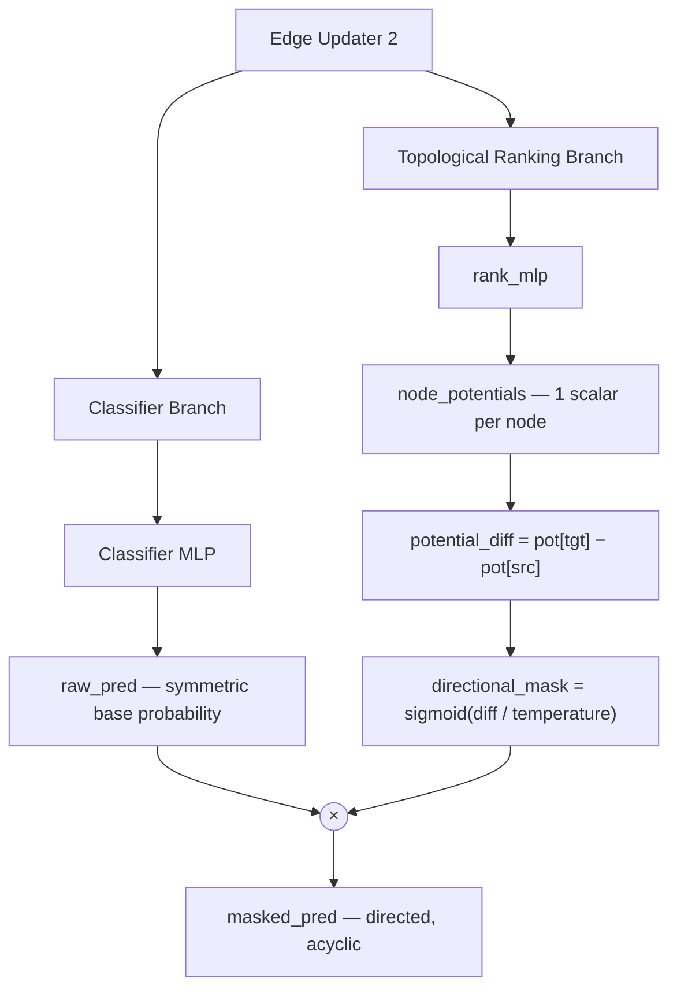

# Topological DAG Constraint (Abandoned)

> **Scope — abandoned; do not revisit.** A branch of the **nuclei-node** GCN that tried to make acyclicity *structural* — having the network learn a node ranking so its predicted edges could only ever form a DAG. It failed mathematically, and the arrival of visual features made the problem it solved largely moot. The live pipeline predicts edges without any explicit structural constraint. See [Approach History](C_Albicans%20Thesis%20Project/5.%20Results/4.%20GCN%20Design%20and%20Training/Approach%20History.md).
>
> Code (do not import): `dapi_tracing/deprecated/sinkhorn_gnn.py`, `dapi_tracing/deprecated/train_sinkhorn.py`, `dapi_tracing/deprecated/sinkhorn_architecture.md`.
>
> **Experimental basis:** [Acyclicity — what did not work](C_Albicans%20Thesis%20Project/5.%20Results/4.%20GCN%20Design%20and%20Training/GCN%20Model%20Experiments.md#7.%20Acyclicity), with the symmetrization background in [Symmetric predictions: average vs. max](C_Albicans%20Thesis%20Project/5.%20Results/4.%20GCN%20Design%20and%20Training/GCN%20Model%20Experiments.md#6.%20Symmetric%20predictions:%20average%20vs.%20max). This page is the long-form account; those sections are the primary record.

## The problem it was trying to solve

The GCN classifies each candidate edge **independently**. Nothing in the architecture couples one edge's prediction to another's, so the set of predicted edges can contain a **cycle** — a closed ring of nuclei. A hyphal chain is an unbranched, acyclic path, so a cycle is not merely wrong but *biologically impossible*.

The degree penalty was the first line of defence, but it is a **local** constraint and acyclicity is a **global** property. A hexagonal ring gives every node degree exactly 2 — perfectly satisfying the degree penalty while being exactly the structure it was meant to forbid. The penalty has no gradient against it.

## The idea: learn a ranking

If every node carries a scalar **rank**, and edges are only permitted to flow from lower rank to higher, then the predicted graph is a DAG **by construction** — a cycle would require a node to be above itself. So: add a branch that learns a node ordering, and use it to mask the edge predictions.

### Two variants — only one was implemented

**(a) Sinkhorn soft permutation — the idea the files are named after.** Learn a genuine ordering by producing an `N × N` doubly-stochastic matrix (a relaxed permutation) via Sinkhorn normalization. **Rejected as inflexible: an `N × N` permutation matrix assumes a fixed node count**, so the model would have to be built for a specific graph size (or padded to a maximum), while real images yield graphs of varying size — the dataset ranges from 3 to 6 nodes and fragment graphs vary far more. This is why **no Sinkhorn operator appears anywhere in the code**; the name is a fossil of the original plan.

**(b) Topological potential — what was actually built.** Sidestep fixed `N` by predicting a *continuous scalar potential per node* instead of a permutation. A per-node MLP works at any graph size. This is `AcyclicModel` in `sinkhorn_gnn.py`.

## The implemented model (`AcyclicModel`)

Identical message passing to the baseline (two `GCNConv` layers with `EdgeUpdater`s and skip connections), then a **split into two branches**:



```python
node_potentials  = self.rank_mlp(x).squeeze(-1)                      # [N]
potential_diff   = node_potentials[edge_index[1]] - node_potentials[edge_index[0]]
directional_mask = torch.sigmoid(potential_diff / self.temperature)  # [E]
masked_pred      = raw_pred * directional_mask
```

For an edge `u → v`: if `pot[v] > pot[u]` the mask ≈ 1 (edge kept); if `pot[v] < pot[u]` the mask ≈ 0 (edge suppressed). Since the graph is stored bidirectionally, exactly one of each pair's two directions survives — which was *intended* to guarantee the DAG.

> Read that last sentence carefully, because it is also the bug. "Exactly one direction of every pair always survives" is precisely what makes the mask useless once the pair is symmetrized back into a single undirected answer — see below.
>
> **Footnote — "mathematically guarantees" overstates it, even for the directed intermediate.** The original code comment (`sinkhorn_gnn.py:92`) reads *"This mathematically guarantees an acyclic graph (DAG)"*, and `sinkhorn_architecture.md` is titled around "Guaranteeing a DAG". With a **hard step** that would be exactly true: admitting only edges where `pot[tgt] > pot[src]` cannot produce a cycle, since a cycle would have to return to its start through strictly increasing potentials. But the mask is a **`sigmoid`**, not a step — a "suppressed" edge gets ≈0, *never exactly 0*, so it retains nonzero probability and even the directed intermediate is not strictly acyclic. Likewise "exactly one direction survives" is really "one direction ≈1, the other ≈0 but alive".
>
> The mask only hardens into a true DAG as `temperature → 0` — and that is precisely where the sigmoid saturates and its gradient vanishes, so the ranking branch stops learning. **The guarantee and trainability are in direct tension:** any temperature low enough to make the claim literally true is one at which the branch cannot train. What the mechanism actually provides is a soft, temperature-dependent *bias* toward acyclicity, not a guarantee — which is worth keeping in mind before trusting a similar "mathematically guarantees" claim about any relaxed constraint.

---

## Why it failed

### 1. The potential conflicts with the symmetric edge-prediction setting (the fatal one)

The failure is not a bug or a tuning problem — **the mechanism contradicts the task definition.** Our task is *undirected*: the answer to "are `u` and `v` connected?" is one number per unordered pair, so the two directed predictions are symmetrized. Symmetrization means, in effect, **one direction true ⇒ both true**.

Now consider what the potential guarantees. Any two nodes carry two potentials, so between them **one direction always runs downhill** (and its reverse always runs uphill) — there is no third option, short of an exact tie. The mask therefore keeps the downhill edge of *every* pair. And because symmetrization propagates that verdict to the reverse edge, the uphill edge the mask just suppressed is made true again.

**So the mask can never suppress a pair. It does nothing.** The acyclicity guarantee holds only on the *directed intermediate*, and is destroyed at the exact moment the undirected answer — the only output that matters — is produced.

Both symmetrizations fail, in opposite ways, and there is nothing in between:

| Symmetrization | Result | Verdict |
| --- | --- | --- |
| **Max** | `max(≈0, ≈1) = ≈1` — the kept direction restores the suppressed one. Final classification reduces to `raw_pred` alone. | the potential is **vacuous** |
| **Average** | `(0 + 1) / 2 = 0.5` for *every* true edge, whatever the classifier believes. | **no better than random guessing** the edge class |

`train_sinkhorn.py` used `enforce_symmetric_max`, whose docstring states the intent: *"Forces the topological mask to confidently pick a direction to minimize BCE loss."* Max was chosen because average is plainly unusable — but max is precisely what discards the suppression. No value of `temperature` escapes the pincer: it follows from combining a hard directional mask with a symmetric read-out.

> The deeper lesson: the potential encodes a **directed** notion (rank/flow) onto a task whose read-out is **symmetric by definition**. Any mechanism that expresses itself only as an asymmetry between `u→v` and `v→u` is erased by the symmetrization step.

### 2. The degree penalty could not cover the gap

With the mask neutralized, the only remaining structural pressure was the degree penalty — which is **blind to global rings**. Degree is a *local* constraint; acyclicity is *global*. A hexagon gives every node degree exactly 2, satisfying the penalty perfectly, so nothing in the objective penalizes it.

### 3. (For the Sinkhorn variant) fixed node count

The permutation formulation was rejected before implementation: an `N × N` doubly-stochastic matrix assumes a fixed node count, which variable graph sizes rule out.

## What replaced it: implicit learning + better evidence

The decision was to **drop explicit structural machinery and let the model learn acyclicity implicitly**, on two grounds:

- **The labels are always acyclic.** Every training target is an unbranched chain, so the model only ever sees acyclic structure as correct. The constraint is learnable from data rather than needing to be hard-wired.
- **Visual features made cycles rare.** Adding the micro-SAM RoIAlign branch gave each edge far stronger, more independent evidence about whether it is real ([Visual branch](C_Albicans%20Thesis%20Project/5.%20Results/4.%20GCN%20Design%20and%20Training/GCN%20Design%20Choices.md#Visual%20branch)). Cycles arise when edges are ambiguous and the model has to guess; with the visual stream the ambiguity that produced spurious ring-closing edges largely disappeared. A structural guarantee buys little once the per-edge evidence is decisive — and it costs the failure modes above.

The live pipeline therefore uses plain **average** symmetrization (`enforce_symmetric_predictions`), which is sound precisely because there is no directional mask to bypass: it enforces an "AND" over the two viewpoints and pushes the model toward viewpoint-agnostic features.

> **Residue in the live code:** `enforce_symmetric_max` still exists in `gnn_train.py` but is **never called** — it is dead code from this era. `enforce_symmetric_predictions` (average) is used at every call site.

## The standing rule

`dapi_tracing/CLAUDE.md` records the conclusion:

> *"Topological Sinks / Directed Constraints (Abandoned): Attempting to force an undirected acyclic graph purely through directed topological potentials (Sinkhorn/Acyclic models) failed mathematically. The local `max` symmetrization bypassed directional masks, and the degree penalty had a blind spot for global rings (such as hexagons). Do not go further down this path."*

If cycles ever become a practical problem again (e.g. on dense fragment graphs), the lesson is that the fix must survive symmetrization — a post-hoc decoding step over the undirected probabilities (maximum spanning forest, or a degree-capped path cover as the deterministic tracer did) is compatible with a symmetric read-out in a way that a directional mask is not.
